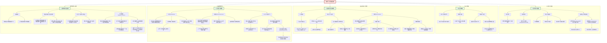

```mermaid
graph TD
    A[第七章：投资组合理论] --> B[1. 基本含义与奠基]
    A --> C[2. 组合的收益]
    A --> D[3. 组合的风险与分散化]
    A --> E[4. 可行集与有效集]
    A --> F[5. 最优投资组合选择]

    subgraph B1 ["基本含义与奠基"]
        B --> B01[核心思想]
        B01 --> B01a[不要把所有鸡蛋放在一只篮子里]
        B --> B02[理论奠基人]
        B02 --> B02a[哈里·马科维茨HarryMarkowitz1952年]
        B --> B03[核心决策变量]
        B03 --> B03a[预期收益率]
        B03 --> B03b[风险方差标准差]
        B03 --> B03c[相关性协方差相关系数]
        B --> B04[投资组合的构建决策]
        B04 --> B04a[资产配置AssetAllocation决定大类资产比例]
        B04a --> B04a1[例子股票60%债券30%]
        B04 --> B04b[证券选择SecuritySelection在大类下选择具体证券]
        B04b --> B04b1[例子巴菲特vs王亚伟的持仓]
    end

    subgraph C1 ["组合的收益"]
        C --> C01[计算方法加权平均]
        C01 --> C01a[Rp等于WA乘RA加WB乘RB]
        C --> C02[预期收益率]
        C02 --> C02a[ERp等于WA乘ERA加WB乘ERB]
        C --> C03[特殊情况卖空]
        C03 --> C03a[权重可为负数W小于0]
        C03 --> C03b[效果可极大增加收益范围]
        C03b --> C03b1[例子卖空后预期收益率从15%提升至36%]
    end

    subgraph D1 ["组合的风险与分散化"]
        D --> D01[风险衡量]
        D01 --> D01a[方差σp²标准差σp]
        D01a --> D01b[σp²等于WA²σA²加WB²σB²加2WAWB乘CovAB]
        D --> D02[核心在于相关性]
        D02 --> D02a[协方差Covariance度量变动方向]
        D02a --> D02a1[正同向负反向零不相关]
        D02 --> D02b[相关系数ρ标准化的协方差]
        D02b --> D02b1[取值范围负1到1]
        D02b --> D02b2[结论相关系数越小组合风险越低]
        D --> D03[分散化Diversification]
        D03 --> D03a[核心目的降低投资组合的整体风险]
        D03 --> D03b[风险的分解]
        D03b --> D03b1[总风险等于系统风险加非系统风险]
        D03b --> D03b2[系统风险无法分散如市场风险]
        D03b --> D03b3[非系统风险可分散如公司特有风险]
        D03 --> D03c[分散化的效果]
        D03c --> D03c1[随着证券数量增加非系统风险趋近于零]
        D03c --> D03c2[通常超过15只股票后风险降低效果减弱]
    end

    subgraph E1 ["可行集与有效集"]
        E --> E01[可行集FeasibleSet]
        E01 --> E01a[定义给定证券能构建出的所有风险收益组合的集合]
        E01 --> E01b[形状由相关系数ρ决定]
        E01b --> E01b1[ρ等于正1风险收益呈直线关系]
        E01b --> E01b2[ρ小于正1曲线向左弯曲产生分散化效益]
        E01 --> E01c[最小方差组合MVP可行集最左侧风险最小的点]
        E --> E02[有效集EfficientSetFrontier]
        E02 --> E02a[定义可行集中给定风险下收益最高给定收益下风险最低的组合]
        E02 --> E02b[位置可行集边界从MVP点开始向上的部分]
        E02 --> E02c[是所有理性投资者的选择域]
        E --> E03[引入无风险资产Rf]
        E03 --> E03a[组合Rf加单个风险资产A资本配置线CAL]
        E03a --> E03a1[斜率等于夏普比率等于ERA减Rf除以σA]
        E03 --> E03b[组合Rf加所有风险资产最优资本配置线]
        E03b --> E03b1[定义与风险资产有效边界相切的那条CAL]
        E03b --> E03b2[切点M最优风险组合OptimalRiskyPortfolio]
        E03b2 --> E03b3[特点拥有最高夏普比率对所有投资者都相同]
    end

    subgraph F1 ["最优投资组合选择"]
        F --> F01[决策基础]
        F01 --> F01a[客观因素有效集即最优CAL]
        F01 --> F01b[主观因素投资者的风险偏好]
        F --> F02[衡量主观偏好无差异曲线]
        F02 --> F02a[定义能给投资者带来相同效用满足感的风险收益组合连线]
        F02 --> F02b[效用函数U等于ER减0点5乘A乘σ²A为风险厌恶系数]
        F --> F03[确定个人最优投资组合]
        F03 --> F03a[方法找到投资者的无差异曲线与最优CAL的切点]
        F03 --> F03b[结论此切点因人而异是主观最优选择]
        F --> F04[分离定理SeparationTheorem]
        F04 --> F04a[核心思想投资决策可分为两个相互分离的步骤]
        F04 --> F04b[第一步技术性客观识别最优风险组合M]
        F04b --> F04b1[所有投资者都面对同一个最优风险组合M]
        F04 --> F04c[第二步偏好性主观资本配置决策]
        F04c --> F04c1[根据个人风险偏好决定在M和无风险资产Rf之间如何分配资金]
    end

    %% 样式设置
    classDef mainNode fill:#FFE4E1,stroke:#8B0000,stroke-width:3px,color:#000
    classDef subgraphNode fill:#E8F5E8,stroke:#006400,stroke-width:2px,color:#000
    classDef conceptNode fill:#F0F8FF,stroke:#4682B4,stroke-width:1px,color:#000
    
    class A mainNode
    class B,C,D,E,F subgraphNode
```
