### 0.1.1 **内容总结与Mermaid图表转换 (第八章：风险定价理论 - 详细版)**
#### 0.1.1.1 **一、 核心问题与关联分析 (详细拆解)**
- **资本资产定价模型 (CAPM)** → 核心思想：**风险决定收益**
    - 理论基础? → **现代投资组合理论 (马科维茨)**
    - 模型前提假设? → **理性人/完美市场等**
    - 市场组合 (M) 是什么? → **所有风险资产的组合** → (实务中用**沪深300**等代替)
    - 资本市场线 (CML) 是什么? → **有效组合的风险与收益关系**
        - 风险衡量? → **标准差 (总风险)**
        - 定价对象? → **仅有效组合**
    - β (贝塔) 系数是什么? → **个股对市场的敏感度** → (核心作用：**衡量系统风险**)
    - 证券市场线 (SML) 是什么? → **所有资产的风险与收益关系**
        - 风险衡量? → **贝塔系数 (系统风险)**
        - 定价对象? → **所有单个资产**
    - α (阿尔法) 值是什么? → **超额收益的度量** → (核心作用：**判断资产估值**)
    - CAPM的缺陷? → **假设不现实 / β不稳定**
- **指数与多因素模型** → 核心思想：**因素解释收益**
    - 单因素/单指数模型是什么? → **单一市场因素解释收益** → (与CAPM关系：**是其简化实证**)
    - 多因素模型是什么? → **多个系统因素解释收益** → (与CAPM关系：**是其扩展改进**)
    - 三因子模型(FFM)包含哪些? → **市场因子 / 规模因子 / 价值因子**
- **套利定价理论 (APT)** → 核心思想：**无套利即均衡**
    - 套利是什么? → **赚取无风险利润**
    - 套利组合的特点? → **零投资 / 零风险 / 正收益**
    - APT模型是什么? → **基于多因子的风险定价**
    - APT与CAPM对比? → **基础不同 (无套利 vs. 均衡) / 因素不同 (多个 vs. 单一)**
#### 0.1.1.2 **二、 Obsidian Mermaid 图表 (详细版)**
您可以直接将下面的代码块复制到您的Obsidian笔记中。新版本极大地丰富了细节和层级关系，更符合深度学习和知识梳理的需求。

```mermaid
graph TD
    A[第八章：风险定价理论] --> B[第一部分：资本资产定价模型 CAPM]
    A --> C[第二部分：指数与多因素模型]
    A --> D[第三部分：套利定价理论 APT]
    
    subgraph CAPM["CAPM详解"]
        B --> B1[核心思想]
        B1 --> B1a[风险决定收益]
        
        B --> B2[理论基础]
        B2 --> B2a[现代投资组合理论]
        B2a --> B2a1[马科维茨]
        
        B --> B3[前提假设]
        B3 --> B3a[理性人/完美市场等]
        
        B --> B4[核心概念1: 市场组合M]
        B4 --> B4a[定义: 所有风险资产的加权组合]
        B4a --> B4a1[实务中用沪深300等指数代替]
        
        B --> B5[核心概念2: 资本市场线CML]
        B5 --> B5a[定义: 无风险资产与市场组合M的连线]
        B5 --> B5b[定价对象: 仅限有效投资组合]
        B5 --> B5c[风险衡量: 标准差σ]
        B5c --> B5c1[衡量总风险]
        
        B --> B6[核心概念3: β贝塔系数]
        B6 --> B6a[定义: 衡量资产收益对市场组合收益变化的敏感度]
        B6 --> B6b[作用: 度量系统风险不可分散风险]
        B6 --> B6c[取值含义]
        B6c --> B6c1[β > 1: 风险高于市场进攻型]
        B6c --> B6c2[β < 1: 风险低于市场防御型]
        B6c --> B6c3[β = 1: 风险等于市场]
        
        B --> B7[核心概念4: 证券市场线SML]
        B7 --> B7a[定义: 任何资产或组合的预期收益与系统风险的关系]
        B7a --> B7a1["公式: E(Ri) = Rf + βi × 市场风险溢价"]
        B7 --> B7b[定价对象: 所有单个资产和投资组合]
        B7 --> B7c[风险衡量: 贝塔系数β]
        B7c --> B7c1[衡量系统风险]
        
        B5 -.-> B7
        B7 -.-> B5
        
        B --> B8[CAPM的应用: 判断资产估值]
        B8 --> B8a[计算α阿尔法值]
        B8a --> B8a1["公式: α = 实际预期收益 - SML均衡收益"]
        B8a1 --> B8a2[α > 0: 资产被低估，应买入]
        B8a1 --> B8a3[α < 0: 资产被高估，应卖出]
        
        B --> B9[CAPM的缺陷]
        B9 --> B9a[前提假设过于严格，不现实]
        B9 --> B9b[市场组合难以确定和衡量]
        B9 --> B9c[贝塔值不稳定]
    end
    
    subgraph MULTI["指数与多因素模型详解"]
        C --> C1[核心思想]
        C1 --> C1a[因素解释收益]
        
        C --> C2[单因素/单指数模型]
        C2 --> C2a[定义: 资产收益率只受一个共同因素影响]
        C2 --> C2b[与CAPM关系: 是CAPM的简化和实证应用形式]
        C2b --> C2b1[用市场指数代替市场组合]
        
        C --> C3[多因素模型]
        C3 --> C3a[定义: 资产收益率由多个系统性风险因素共同决定]
        C3 --> C3b[与CAPM关系: 是CAPM的扩展和改进]
        C3 --> C3c[典型代表: Fama-French三因子模型]
        C3c --> C3c1[因子1: 市场风险因子]
        C3c --> C3c2[因子2: 规模因子SMB]
        C3c --> C3c3[因子3: 价值因子HML]
    end
    
    subgraph APT_DETAIL["APT详解"]
        D --> D1[核心思想]
        D1 --> D1a[无套利即均衡]
        
        D --> D2[理论基础: 套利]
        D2 --> D2a[定义: 利用定价错误，赚取无风险利润]
        
        D --> D3[套利组合的特征]
        D3 --> D3a[1. 零投资]
        D3 --> D3b[2. 零风险]
        D3 --> D3c[3. 正收益]
        
        D --> D4[APT模型]
        D4 --> D4a[特点: 允许多个未指明的系统性风险因子]
        D4 --> D4b["公式: E(R) = Rf + 各因子风险溢价之和"]
        
        D --> D5[APT vs CAPM]
        D5 --> D5a[基础不同: 无套利原则 vs 市场均衡假设]
        D5 --> D5b[因素不同: 多个 vs 单一市场因素]
        D5 --> D5c[适用性不同: 所有资产 vs 仅有效组合]
    end
    
    %% 样式定义
    classDef mainTitle fill:#FF5733,stroke:#333,stroke-width:4px,color:#fff
    classDef partTitle fill:#3498DB,stroke:#333,stroke-width:2px,color:#fff
    classDef conceptNode fill:#2ECC71,stroke:#333,stroke-width:2px,color:#fff
    classDef detailNode fill:#F39C12,stroke:#333,stroke-width:1px,color:#333
    classDef keyPoint fill:#E74C3C,stroke:#333,stroke-width:2px,color:#fff
    
    class A mainTitle
    class B,C,D partTitle
    class B1,B2,B3,B4,B5,B6,B7,B8,B9,C1,C2,C3,D1,D2,D3,D4,D5 conceptNode
    class B1a,B2a,B3a,B4a,B5a,B5b,B5c,B6a,B6b,B6c,B7a,B7b,B7c,B8a,B9a,B9b,B9c,C1a,C2a,C2b,C3a,C3b,C3c,D1a,D2a,D3a,D3b,D3c,D4a,D4b,D5a,D5b,D5c detailNode
    class B1a,B8a2,B8a3,C1a,D1a keyPoint
```

#### 0.1.1.3 **三、 使用说明**
这个新版本的图表在原有的基础上，增加了更多细节层次，例如：
1. **补充了理论基础**：如CAPM源于马科维茨的现代投资组合理论。
2. **细化了核心概念**：如将CML和SML的定义、公式、定价对象和风险衡量方式进行了详细对比。
3. **增加了应用和缺陷**：明确了CAPM的应用（计算alpha值）和其理论缺陷。
4. **厘清了模型关系**：更清晰地展示了指数/多因素模型与CAPM之间的“实证”和“扩展”关系。
5. **强化了理论对比**：将APT与CAPM的对比项逐条列出，便于区分。
希望这个更详细的版本能更好地满足您的需求！