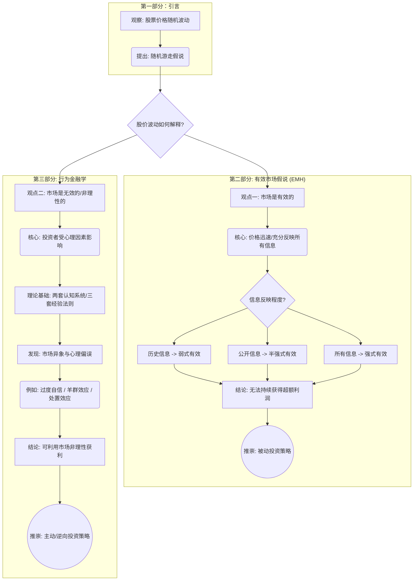

### 0.1.1 内容总结

这份演示文稿（PPT）主要围绕两大金融理论展开：有效市场假说（EMH）与行为金融学。它首先通过股价的随机波动现象引入“随机游走”假说。接着，详细阐述了有效市场假说的核心思想，即价格反映一切信息，并根据信息层次划分为弱式、半强式和强式三种形式，最终导向被动投资策略。作为对比，文稿介绍了行为金融学，该理论挑战了完全理性的假设，揭示了投资者由于认知偏差（如过度自信、羊群效应）而产生的非理性行为，并由此引出了主动投资和逆向思维策略的可能性。

### 0.1.2 Mermaid流程图

  
### 0.1.3 使用说明

您可以将上面的Mermaid代码块复制到Obsidian笔记中，即可自动渲染出反映整个PPT内容结构的流程图。这个图表清晰地展示了文档的论述逻辑。