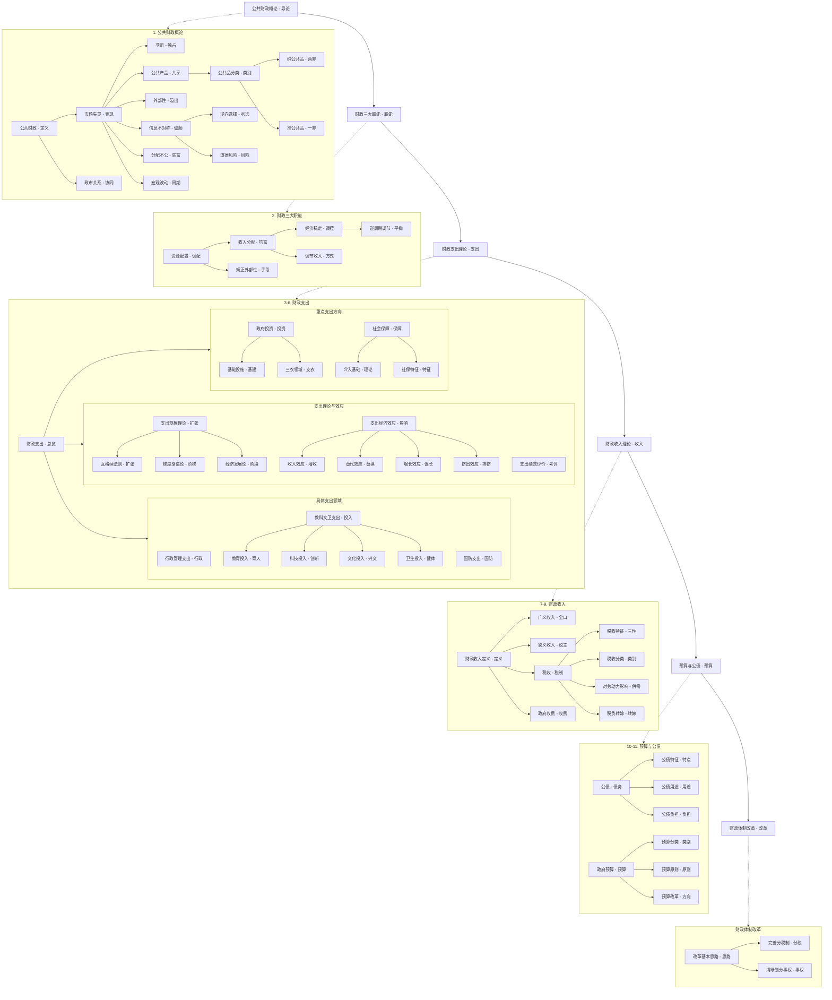

```mermaid
flowchart TD
    %% 主流程
    A[公共财政概论 - 导论] --> B[财政三大职能 - 职能]
    B --> C[财政支出理论 - 支出]
    C --> D[财政收入理论 - 收入]
    D --> E[预算与公债 - 预算]
    E --> F[财政体制改革 - 改革]
    
    %% 1. 公共财政概论
    subgraph SG1 [1. 公共财政概论]
        A1[公共财政 - 定义] --> A2[市场失灵 - 表现]
        A2 --> A3[垄断 - 独占]
        A2 --> A4[公共产品 - 共享]
        A2 --> A5[外部性 - 溢出]
        A2 --> A6[信息不对称 - 偏颇]
        A2 --> A7[分配不公 - 贫富]
        A2 --> A8[宏观波动 - 周期]
        
        A4 --> A41[公共品分类 - 类别]
        A41 --> A42[纯公共品 - 两非]
        A41 --> A43[准公共品 - 一非]
        
        A6 --> A61[逆向选择 - 劣选]
        A6 --> A62[道德风险 - 风险]
        
        A1 --> A9[政市关系 - 协同]
    end
    
    %% 2. 财政三大职能
    subgraph SG2 [2. 财政三大职能]
        B1[资源配置 - 调配] --> B2[收入分配 - 均富]
        B2 --> B3[经济稳定 - 调控]
        
        B1 --> B11[矫正外部性 - 手段]
        B2 --> B21[调节收入 - 方式]
        B3 --> B31[逆周期调节 - 平抑]
    end
    
    %% 3-6. 财政支出
    subgraph SG3 [3-6. 财政支出]
        C0[财政支出 - 总览]
        
        %% 支出理论
        subgraph SGC1 [支出理论与效应]
            C1[支出规模理论 - 扩张]
            C1 --> C11[瓦格纳法则 - 扩张]
            C1 --> C12[梯度渐进论 - 阶梯]
            C1 --> C13[经济发展论 - 阶段]
            
            C2[支出经济效应 - 影响]
            C2 --> C21[收入效应 - 增收]
            C2 --> C22[替代效应 - 替换]
            C2 --> C23[增长效应 - 促长]
            C2 --> C24[挤出效应 - 排挤]
            
            C3[支出绩效评价 - 考评]
        end
        
        %% 具体支出领域
        subgraph SGC2 [具体支出领域]
            C4[行政管理支出 - 行政]
            C5[国防支出 - 国防]
            C6[教科文卫支出 - 投入]
            C6 --> C61[教育投入 - 育人]
            C6 --> C62[科技投入 - 创新]
            C6 --> C63[文化投入 - 兴文]
            C6 --> C64[卫生投入 - 健体]
        end
        
        %% 重点支出方向
        subgraph SGC3 [重点支出方向]
            C7[政府投资 - 投资]
            C7 --> C71[基础设施 - 基建]
            C7 --> C72[三农领域 - 支农]
            
            C8[社会保障 - 保障]
            C8 --> C81[介入基础 - 理论]
            C8 --> C82[社保特征 - 特征]
        end
        
        C0 --> SGC1
        C0 --> SGC2
        C0 --> SGC3
    end
    
    %% 7-9. 财政收入
    subgraph SG4 [7-9. 财政收入]
        D1[财政收入定义 - 定义]
        D1 --> D11[广义收入 - 全口]
        D1 --> D12[狭义收入 - 税主]
        
        D2[税收 - 税制]
        D2 --> D21[税收特征 - 三性]
        D2 --> D22[税收分类 - 类别]
        D2 --> D23[对劳动力影响 - 供需]
        D2 --> D24[税负转嫁 - 转嫁]
        
        D3[政府收费 - 收费]
        
        D1 --> D2
        D1 --> D3
    end
    
    %% 10-11. 预算与公债
    subgraph SG5 [10-11. 预算与公债]
        E1[公债 - 债务]
        E1 --> E11[公债特征 - 特点]
        E1 --> E12[公债用途 - 用途]
        E1 --> E13[公债负担 - 负担]
        
        E2[政府预算 - 预算]
        E2 --> E21[预算分类 - 类别]
        E2 --> E22[预算原则 - 原则]
        E2 --> E23[预算改革 - 方向]
    end
    
    %% 财政体制改革
    subgraph SG6 [财政体制改革]
        F1[改革基本思路 - 思路]
        F1 --> F2[完善分税制 - 分税]
        F1 --> F3[清晰划分事权 - 事权]
    end
    
    %% 连接主流程和子图
    A -.-> SG1
    B -.-> SG2
    C -.-> SG3
    D -.-> SG4
    E -.-> SG5
    F -.-> SG6
```