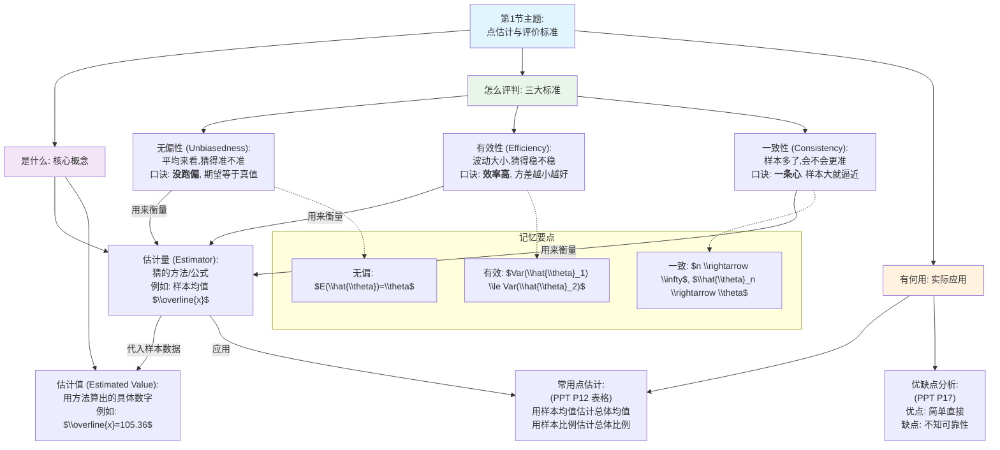

## 0.1 第1节：点估计的概念和评价标准
### 0.1.1 🧒 8岁小孩也能懂的概念解释
#### 0.1.1.1 本节核心问题
- **这一节要解决什么问题？**
    - 当我们想了解一个很大群体（比如全中国人的平均身高）的某个特点，但又不可能去测量每一个人时，我们该如何用一小部分人（样本）的信息，去“猜”出这个特点的大概数值？并且，我们怎么知道自己的“猜法”是好是坏？
- **用最简单的话说：**
    - 就像让你蒙着眼睛猜一个罐子里有多少糖果，你不能一颗一颗数，只能抓一把出来看看，然后报一个你认为最可能的数字。这一节就是教你如何“报数”，以及如何判断你“报数”的方法是不是足够聪明。
#### 0.1.1.2 基础概念白话解释
- **估计量 (Estimator) vs. 估计值 (Estimated Value)** (PPT P6)
    - **8岁小孩版解释**：
        - **估计量**：是你“猜糖果数量”的**方法**或**公式**。比如，你的方法是“抓一把出来，数数有几颗，然后乘以10”。这个“抓一把数数再乘以10”的**方法**就是估计量。
        - **估计值**：是你用这个方法**具体算出来的那个数字**。你真的抓了一把，数了数有15颗，乘以10得到150颗。这个“150”就是估计值。换个人再抓一把，可能就是16颗，估计值就变成了160。方法（估计量）不变，但结果（估计值）会因为你抓的“样本”不同而不同。
    - **PPT原文定义**：
        - 估计量：用于估计总体参数的统计量。
        - 估计值：对于任意取定的一个样本，把样本数据代入估计量的公式，就得到估计量的一个值。
    - **为什么要这样定义**：为了区分“解决问题的思想/工具”（估计量）和“思想/工具算出的具体答案”（估计值）。
- **评价估计量的三大标准** (PPT P7)
    - **无偏性 (Unbiasedness)** (PPT P8-9)
        - **8岁小孩版解释**：想象你在玩一个射击游戏，靶心就是那个我们想猜的真实值。如果你每次射击，子弹都落在靶心周围，虽然有上有下、有左有右，但平均下来，所有弹孔的中心正好就是靶心。那么你的射击方法就是“无偏”的。它没有系统性的“瞄高了”或者“瞄低了”。
        - **PPT原文定义**：若 E(θ^)=θ，则是无偏估计。含义是“没有系统偏差”。
    - **有效性 (Efficiency)** (PPT P10-11)
        - **8岁小孩版解释**：现在有两个射击手，他们的射击都是“无偏”的（平均位置都是靶心）。但是，A射手的子弹都紧紧地聚集在靶心周围，而B射手的子弹散得很开。我们肯定会说A射手更“有效”，因为他的方法更稳定、更精确。
        - **PPT原文定义**：对同一总体参数的两个无偏估计量，有更小方差的估计量更有效。
    - **一致性 (Consistency / 相合性)** (PPT P15)
        - **8岁小孩版解释**：这就像你做练习题。你做的题（样本量）越多，你对知识点（总体参数）的掌握就越准。一致性就是说，当你的样本量越来越大时，你的“猜测结果”会越来越逼近那个真实的答案。
        - **PPT原文定义**：随着样本容量的增大，估计量的值越来越逼近被估计的总体参数。
### 0.1.2 📊 本节详细思维导图

### 0.1.3 📚 本节知识点详细讲解
#### 0.1.3.1 知识点1：估计量与估计值 (PPT P6)
- **基础理解**
    - **8岁小孩版解释**：我们想知道全校同学的平均身高（总体均值μ），这是个秘密。我们的“估计量”（方法）是随机找10个同学，算他们的平均身高（样本均值 x）。这个公式 x=n∑xi​​ 就是**估计量**。我们实际找了10个人，算出来是170cm，这个170cm就是**估计值**。
- **核心要点**：估计量是随机变量（因为样本是随机抽的），而估计值是一个具体的数值。
#### 0.1.3.2 知识点2：无偏性 (Unbiasedness) (PPT P8-9)
- **基础理解**
    - **8岁小孩版解释**：虽然我们每次抽10个同学算出来的平均身高（估计值）可能不一样，有时高点，有时低点，但只要我们用的方法（估计量 x）是无偏的，就意味着我们不断重复这个抽样过程，所有估计值的平均，就等于那个神秘的全校真实平均身高。
    - **PPT原文定义**：E(θ^)=θ  
- **详细分析**
    - PPT P9的图非常直观：A图的分布中心就是真值θ，所以是无偏的；B图的分布中心偏离了真值θ，期望值 E(θ^) 和θ之间有个Bias（偏差），所以是有偏的。
    - **重点提示**：⭐ PPT P13的定理证明了样本均值 x 是总体均值 μ 的无偏估计 (E(x)=μ)，样本方差 s2 是总体方差 σ2 的无偏估计 (E(s2)=σ2)。**这两个结论是必考点！**
- **记忆技巧**：💡 **无偏** → **不偏心** → 我的期望就是你（E(θ^)=θ）。
#### 0.1.3.3 知识点3：有效性 (Efficiency) (PPT P10-11)
- **基础理解**
    - **8岁小孩版解释**：假设小明和小红都用无偏的方法猜身高。小明每次猜的结果都在168cm到172cm之间，很集中。小红猜的结果则在160cm到180cm之间，非常分散。我们说小明的方法更**有效**，因为他的猜测波动小。
    - **PPT原文定义**：Var(θ^1​)≤Var(θ^2​)，则 θ^1​ 比 θ^2​ 有效。
- **详细分析**
    - PPT P11的图显示，两个估计量的期望都是θ（都是无偏的），但 θ^1​ 的分布更高更瘦，说明其方差更小，数据更集中，因此更有效。
- **记忆技巧**：💡 **有效** → **效率高** → 办事稳，波动小，**方差小**。
#### 0.1.3.4 知识点4：一致性 (Consistency) (PPT P15-16)
- **基础理解**
    - **8岁小孩版解释**：你只问10个同学的身高来猜，可能不准。但如果你问100个、1000个、甚至10000个同学，你算出来的平均身高，肯定会越来越接近全校的真实平均身高。这就是一致性。
    - **PPT原文定义**：随着样本容量n的增大，估计量的值越来越逼近被估计的总体参数。
- **详细分析**
    - PPT P16给出了判断一致性的数学定理：只要一个估计量是**渐进无偏**的（当n→∞时，期望趋向于真值），并且其**方差趋向于0**，那么它就是一致估计量。
- **记忆技巧**：💡 **一致** → **人多力量大** → 样本n越大，估计越准（方差趋于0）。
### 0.1.4 🧠 本节记忆优化结构
#### 0.1.4.1 PPT内容分层记忆
- **第一层：PPT基础概念（必须会背）**
    - **点估计**：用样本统计量的一个具体取值去估计总体参数。
        - **8岁版**：用一个数去猜。
        - **考试要点**：理解其定义，知道它和区间估计的区别。
    - **无偏性**：估计量的数学期望等于被估计的总体参数。E(θ^)=θ。
        - **8岁版**：平均猜得准。
        - **记忆口诀**：“无偏”就是“期望不偏离”。
        - **考试要点**：选择题判断哪个估计量无偏，知道 x 和 s2 是无偏的。
    - **有效性**：方差更小的无偏估计量更有效。
        - **8岁版**：猜得稳。
        - **记忆口诀**：“有效”就是“方差小才高效”。
        - **考试要点**：选择题比较两个估计量的有效性。
    - **一致性**：当样本量n趋于无穷时，估计量的值趋于总体参数。
        - **8岁版**：人越多，猜得越准。
        - **记忆口诀**：“一致”就是“n大则稳”。
        - **考试要点**：理解概念，知道这是对估计量“大样本”性质的要求。
- **第二层：PPT逻辑关系（必须会用）**
    ```
    graph TD
        A["拿到样本数据"] --> B{"想找一个好的'猜法'(估计量)"}
        B --> C["标准1: 无偏性<br>(是不是平均准?)"]
        B --> D["标准2: 有效性<br>(在'准'的基础上, 稳不稳?)"]
        B --> E["标准3: 一致性<br>(样本多了会不会更好?)"]
    ```
    - **逻辑关系记忆口诀**：先看**偏不偏**（无偏性），再比**稳不稳**（有效性），最后想**多不多**（一致性）。
### 0.1.5 🎯 本节考试高分策略
#### 0.1.5.1 题型识别与应对
- 选择题/判断题高分技巧
- 
- 
>[!TIP] 选择题速胜法
| 题目特征 | PPT对应内容 | 快速判断方法 | 高分技巧 |
| :--- | :--- | :--- | :--- |
| 问“无偏性” | P8, P13 | 看到公式 E(θ^)=θ 就是无偏。记住 x 和 s2 是无偏的。 | 题目中若出现 E(θ^)=θ 或有系统偏差，就是有偏。 |
| 问“有效性” | P10-11 | 两个都是无偏时，选方差 Var 小的那个。 | 图形题中，选那个“又高又瘦”的分布曲线。 |
| 问“一致性” | P15-16 | 问大样本性质、n增大会怎样的，就是考一致性。 | 只要提到“样本量n增大”，基本就和一致性有关。 |
| 判断对错 | P65 | 见“无偏的两个估计量，方差越大越有效” → 错，方差小才有效。
“估计量与总体真值相等，则为无偏” → 错，是期望相等，不是值相等。 | 把8岁小孩版的解释在脑子里过一遍，就能判断对错。 |

- 论述题/简答题高分模板
    [!NOTE] 论述题拿高分
    - **题型**：“请简述评价估计量的标准”
    - **万能答题框架（基于PPT逻辑）：**
        1. **引言**：在参数估计中，为了评价一个估计量的好坏，我们通常有三个主要标准：无偏性、有效性和一致性。
        2. **无偏性**：首先是无偏性，它指的是估计量抽样分布的数学期望等于被估计的总体参数，即 E(θ^)=θ。这个标准衡量的是估计量是否存在系统性偏差。
        3. **有效性**：其次是有效性，它是在无偏性的基础上进行比较的。对于两个无偏估计量，方差更小的那个更有效。它衡量的是估计的精度和稳定性。
        4. **一致性**：最后是一致性，也叫相合性。它指的是随着样本容量n的增大，估计量的值会越来越逼近被估计的总体参数。这是一个大样本性质，衡量估计量在大样本下的表现。
        5. **总结**：一个好的估计量，我们希望它既是无偏的，又是有效的，并且具有一致性。
### 0.1.6 🧵 本节核心逻辑概括
- 本节完整思路：
    本节PPT的逻辑起点是“如何用样本信息去猜测总体的未知参数”。为了解决这个问题，首先引入了最直接的方法——点估计，即用一个具体的数值去“猜”，并明确区分了“猜的方法”（估计量）和“猜的结果”（估计值）。然而，任何猜测都需要有标准来评判好坏，否则就是瞎猜，于是PPT紧接着提出了评价估计量的三个核心标准。第一个标准是无偏性，它解决了“猜得准不准”的系统偏差问题，要求我们平均来看不能跑偏。在此基础上，如果多个方法都能做到“准”，我们就需要第二个标准——有效性，它通过比较方差解决了“猜得稳不稳”的波动性问题，告诉我们波动越小越好。最后，考虑到样本量的影响，PPT引出了第三个标准——一致性，它从动态的角度揭示了“样本越多会不会越好”的问题，确保我们的方法在信息充足时是可靠的。最终，通过这三个标准，我们就建立了一套完整的评价体系，从而为后续章节选择和使用具体的估计方法（如用样本均值估计总体均值）奠定了坚实的理论基础。
- 记忆主线口诀：
    想猜总体怎么办？点估计来当先锋。
    方法是估计量，结果是估计值要分清。
    好坏标准有三条：
    首先无偏不跑偏，（期望等于真值）
    然后有效求稳定，（方差越小越行）
    最后一致看样本，（n越大越逼近）。
    三条标准心中记，参数估计就搞定！
### 0.1.7 📋 本节内容完整性检查
- [x] PPT主题和核心观点
- [x] PPT中的所有重要概念（8岁版+原文版）
- [x] PPT中的所有公式（口诀+应用技巧）
- [x] PPT中的所有对比和分类（直观对比+辨析口诀）
- [x] PPT的逻辑展开过程（记忆链条）
- [x] PPT的结论和总结（考试要点）
- [x] PPT中需要精确记忆的理论表述（必考结论）
- [x] 整节内容的逻辑概括和记忆主线
### 0.1.8 ✅ 本节学习完成！
**下一步：**
- 输入 **"第2节"** 继续学习。
- 输入 **"整体框架"** 回到总体结构图。