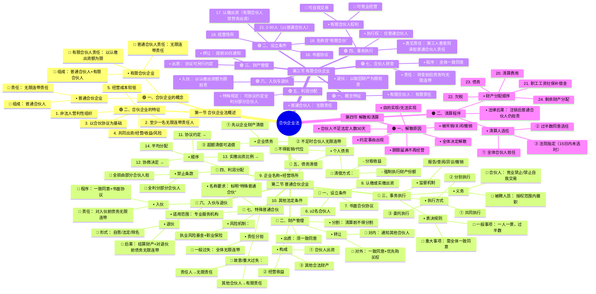

```mermaid
mindmap
  root((合伙企业法))
    第一节  合伙企业法概述
      🟢 一、合伙企业的概念
        ▪ 普通合伙企业
          □ 组成： 普通合伙人
          □ 责任： 无限连带责任
        ▪ 有限合伙企业
          □ 组成： 普通合伙人+有限合伙人
          □ 普通合伙人责任： 无限连带责任
          □ 有限合伙人责任： 以认缴出资额为限
      🟢 二、合伙企业的特征
        1. 非法人营利性组织
        2. 至少一名无限连带责任人
        3. 以合伙协议为基础
        4. 共同出资/经营/收益/风险
        5. 经营成本较低
    第二节  普通合伙企业
      🔵 一、设立条件
        6. ≥2名合伙人
        7. 书面合伙协议
        8. 认缴或实缴出资
        9. 企业名称+经营场所
        10. 其他法定条件
      🔵 二、财产管理
        ▪ 构成
          ① 合伙人出资
          ② 经营收益
          ③ 其他合法财产
        ▪ 分割： 清算前不得分割
        ▪ 转让
          □ 对内： 通知其他合伙人
          □ 对外： 一致同意+优先购买权
        ▪ 出质： 须一致同意
      🔵 三、事务执行
        ▪ 执行方式
          ① 共同执行
          ② 分别执行
          ③ 委托执行
        ▪ 监督机制
          报告/查阅/异议/撤销
        ▪ 表决规则
          □ 一般事项： 一人一票，过半数
          □ 重大事项： 需全体一致同意
        ▪ 义务
          □ 合伙人： 竞业禁止/禁止自我交易
          □ 被聘人员： 授权范围内履职
      🔵 四、利润分配
        ▪ 顺序
          11. 协议约定 → 
          12. 协商决定 → 
          13. 实缴出资比例 → 
          14. 平均分配
        ▪ 禁止条款
          □ 全利分部分合伙人
          □ 全损由部分合伙人担
      🔵 五、债务清偿
        ▪ 企业债务
          ① 先以企业财产清偿
          ② 不足时合伙人无限连带
          ③ 超额清偿可追偿
        ▪ 个人债务
          □ 不得抵销/代位
          □ 清偿方式： 
            - 分取收益
            - 强制执行财产份额
      🔵 六、入伙与退伙
        ▪ 入伙
          □ 程序： 一致同意+书面协议
          □ 责任： 对入伙前债务无限连带
        ▪ 退伙
          □ 形式： 自愿/法定/除名
          □ 后果： 结算财产+对退伙前债务无限连带
      🔵 七、特殊普通合伙
        ▪ 适用范围： 专业服务机构
        ▪ 名称要求： 标明“特殊普通合伙”
        ▪ 责任分担
          □ 故意/重大过失： 
            责任人→无限责任
            其他合伙人→有限责任
          □ 一般过失： 全体无限连带
        ▪ 风险机制： 
          执业风险基金+职业保险
    第三节  有限合伙企业
      🟣 一、概念特征
        ▪ 普通合伙人： 无限责任
        ▪ 有限合伙人： 有限责任
      🟣 二、设立条件
        15. 2-50人（≥1普通合伙人）
        16. 书面协议
        17. 认缴出资（有限合伙人禁劳务出资）
        18. 名称含“有限合伙”
        19. 经营场所
      🟣 三、财产管理
        ▪ 转让： 提前30日通知
        ▪ 出质： 协议可另行约定
      🟣 四、事务执行
        ▪ 执行权： 仅普通合伙人
        ▪ 有限合伙人权利
          □ 可竞业经营
          □ 可自我交易
        ▪ 表见责任： 第三人善意则承担普通合伙人责任
      🟣 五、利润分配
        ▪ 特殊规定： 可协议约定全利分部分合伙人
      🟣 六、入伙与退伙
        ▪ 入伙： 以认缴出资额为限担责
        ▪ 退伙： 以取回财产为限担责
      🟣 七、合伙人转变
        ▪ 程序： 全体一致同意
        ▪ 责任： 转变前后债务均无限连带
    第四节  解散和清算
      🟠 一、解散原因
        ▪ 期限届满不再经营
        ▪ 约定事由出现
        ▪ 全体决定解散
        ▪ 合伙人不足法定人数30天
        ▪ 目的实现/无法实现
        ▪ 被吊销/关闭/撤销
      🟠 二、清算程序
        ▪ 清算人选任
          ① 全体合伙人担任
          ② 过半数同意选任
          ③ 法院指定（15日内未选时）
        ▪ 财产分配顺序
          20. 清算费用
          21. 职工工资社保补偿金
          22. 欠税
          23. 债务
          24. 剩余财产分配
        ▪ 法律后果： 注销后普通合伙人仍担责
```

