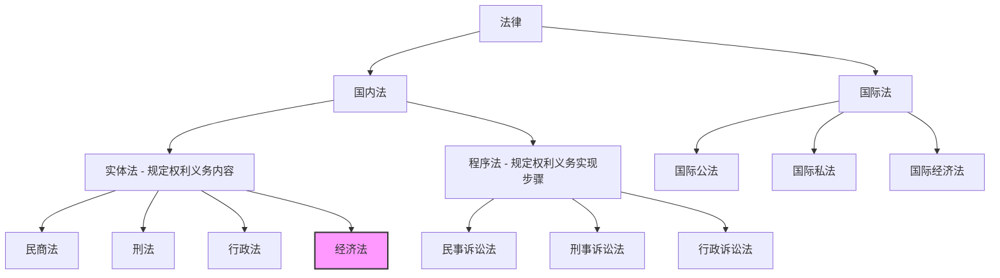
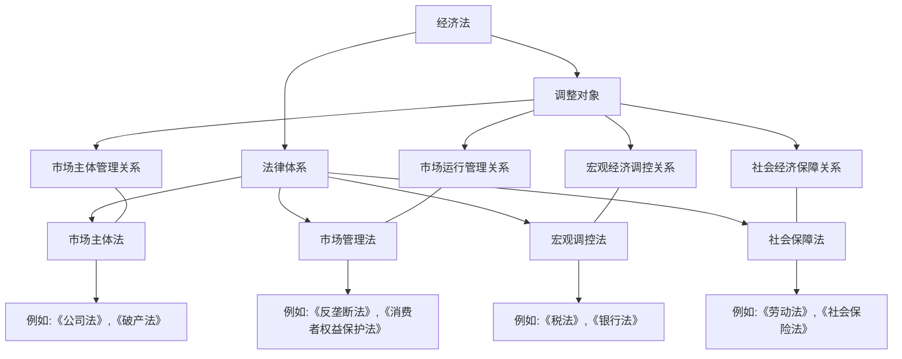
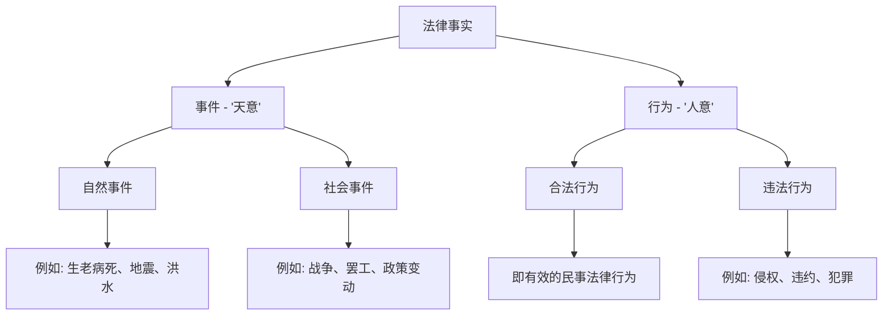
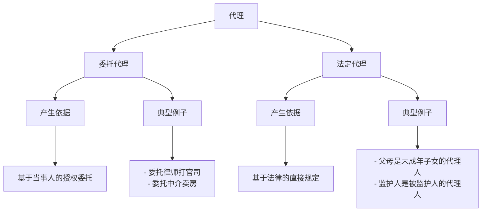
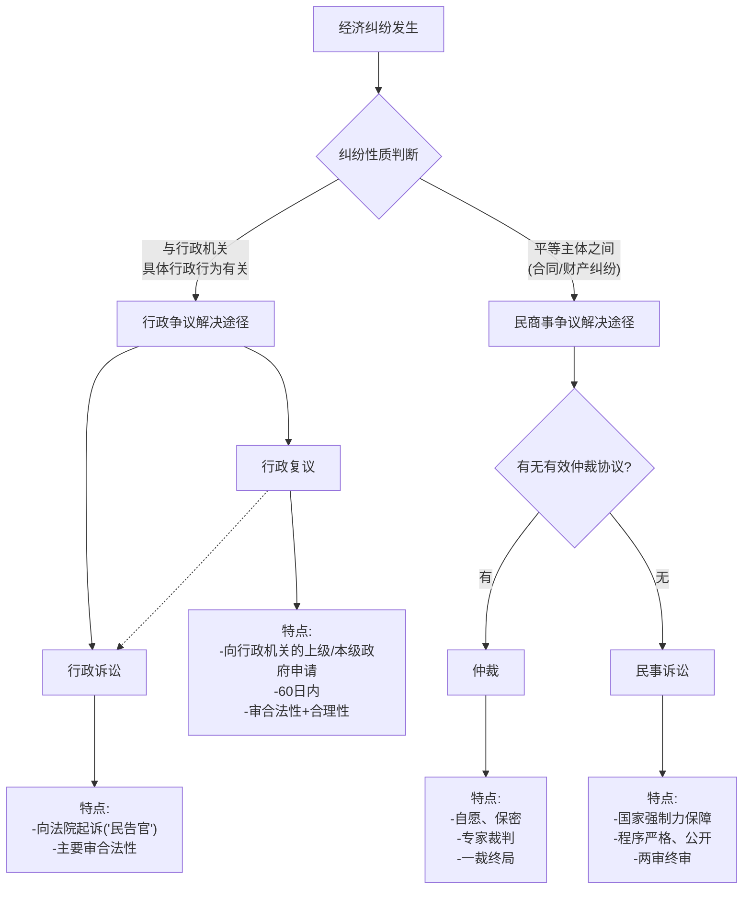

# 1 第一章 经济法基础知识

## 1.1 第一节 经济法概述

在我们正式进入经济法的世界前，首先要搞清楚，它在整个法律大家庭里，到底扮演一个什么样的角色。

### 1.1.1 知识框架 (Mermaid 图)



### 1.1.2 一、经济法的概念

> **一句话精髓：** 经济法就是国家为了让国家的经济“大轮船”平稳航行而制定的“交通规则”。

想象一下，国家的整个经济就像一艘巨大的轮船，上面有乘客（我们每个人、每个公司），有船长和船员（国家管理者）。为了让这艘船能够安全、快速、平稳地前进，就需要一套规则来管理大家的行为，协调彼此的关系。这套规则，就是 **经济法**。

官方定义：

经济法是调整国家在管理和协调国民经济运行过程中发生的经济关系的法律规范的总称。

**给小白的拆解：**

1. **“经济法律规范的总称”**： 这说明经济法不是一部单独的法典，比如《刑法》或《民法典》，而是一大堆相关法律的集合，像一个“法律工具箱”，里面装满了各种管理经济的法律工具。
    
2. **“调整经济关系的法律”**： 它的管理范围是和“钱”有关的事情，也就是经济活动中人与人、人与组织之间的关系。
    
3. **“国家在管理和协调经济运行过程中所发生的”**： 这是经济法最核心的特点！它调整的不是普通的买卖关系（那是民法管的），而是**带有国家干预色彩**的经济关系。就像交通警察（国家）指挥道路上的车辆（市场参与者）一样，国家需要站出来，当一个“裁判员”和“管理员”，确保经济活动有序进行。
    

### 1.1.3 二、经济法的调整对象及经济法体系

> **一句话精髓：** 经济法主要管理四件事：谁能玩（市场主体）、怎么玩（市场运行）、裁判怎么吹哨（宏观调控）和怎么保障大家玩得安心（社会保障）。

经济法这个“法律工具箱”里，具体有哪些工具呢？它们分别用来管什么事？



**给小白的讲解：**

1. **市场主体管理关系 (谁能上场玩游戏？)**
    
    - **内容：** 规定什么样的公司、企业可以进入市场这个“游乐场”，以及它们如果不遵守规则，该怎么退出（比如破产）。
        
    - **法律：** 《公司法》、《合伙企业法》、《破产法》等。
        
    - **例子：** 你想开个公司，就得按照《公司法》去注册登记，拿到“入场券”。
        
2. **市场运行管理关系 (游戏规则是什么？)**
    
    - **内容：** 保证市场这个“游乐场”里的游戏是公平的。禁止有人搞垄断（一个人霸占所有滑梯），欺负弱小（比如商家欺骗消费者）。
        
    - **法律：** 《反垄断法》、《消费者权益保护法》等。
        
    - **例子：** 如果一个大公司想通过不正当手段把其他竞争对手都挤走，自己独占市场，那《反垄断法》就要出来管它了。
        
3. **宏观经济调控关系 (裁判如何调控比赛节奏？)**
    
    - **内容：** 国家这个“裁判”从整体上把握经济的走向。比如经济太热了，就加点税，让大家冷静一下；经济太冷了，就降点息，鼓励大家多花钱。
        
    - **法律：** 《计划法》、《税法》、《银行法》等。
        
    - **例子：** 国家为了鼓励新能源汽车的发展，会给买新能源车的车主一些税收优惠，这就是一种宏观调控。
        
4. **社会经济保障关系 (怎么保障大家玩得没有后顾之忧？)**
    
    - **内容：** 为社会成员提供最基本的保障，比如工作、医疗、养老等，让大家能安心地参与经济活动。
        
    - **法律：** 《劳动法》、《社会保险法》等。
        
    - **例子：** 《劳动法》规定了最低工资标准和最长工作时间，确保劳动者不会被过度剥削。我们每个人交的“五险一金”就是依据《社会保险法》来的。
        

### 1.1.4 三、经济法的渊源

> **一句话精髓：** 经济法的“规矩”都写在从国家最高宪法到地方小规定的各种文件里。

“渊源”这个词听起来很高级，其实就是问“这些法律规定都从哪里来的？”

**从上到下，效力越来越低：**

1. **宪法：** 国家的根本大法，是所有法律的“老祖宗”，规定了最根本的经济制度。
    
2. **法律：** 由全国人民代表大会及其常委会制定的，比如《公司法》、《税法》，是经济法的主要形式。
    
3. **行政法规：** 由国务院（国家的“大管家”）制定的，比如《中华人民共和国公司登记管理条例》。
    
4. **地方性法规：** 由省、市级的人大制定的，只能在自己地盘上用。
    
5. **部门规章：** 由国务院下属的部委（比如财政部、商务部）制定的。
    
6. **地方政府规章：** 由省、市政府制定的。
    
7. **司法解释：** 由最高人民法院和最高人民检察院对法律的具体应用问题作出的解释，大家判案子都要参照。
    
8. **国际条约或协定：** 中国加入的国际条约，在国内也可能产生法律效力。
    

**对比总结：**

- **法律 vs. 法规 vs. 规章：** 制定机关的级别不同，法律效力也不同。人大制定的叫“法律”，国务院制定的叫“行政法规”，部委和地方政府制定的叫“规章”。效力上，法律 > 行政法规 > 规章。
    

## 1.2 第二节 经济法律关系

> **一句话精髓：** 经济法律关系就是国家当“裁判”时，参与经济活动的各方（包括国家自己）之间产生的权利和义务。

如果说经济法是“游戏规则”，那么经济法律关系就是大家按照这个规则玩游戏时，彼此之间形成的“权利”和“义务”的关系。

### 1.2.1 一、经济法律关系的概念

官方定义：

经济法律关系是经济法律规范所确认和保护的在国家参与、管理和协调经济运行中形成的权利义务关系。

**给小白的拆解：**

1. **只发生在经济领域：** 和钱、经济活动有关。你和朋友约饭，这不是经济法律关系。但你开的公司去税务局交税，这就是。
    
2. **以经济法律规范为前提：** 必须有“游戏规则”（法律）在那里，才会产生相应的关系。没有《税法》，就没有纳税关系。
    
3. **是权利义务关系：** 有人有权利做某事，就有人有义务配合或不干涉。比如，你有权要求商家提供合格产品，商家就有义务保证产品质量。
    
4. **具有强制性：** 这种关系是受国家力量保护的。如果你不履行义务，国家（法院）会强制你履行。
    

### 1.2.2 二、经济法律关系的构成要素

> **一句话精髓：** 任何一个法律关系，都离不开“谁和谁”（主体）、“能干嘛和必须干嘛”（内容）、“为了啥”（客体）这三个问题。

就像演一出戏，必须有演员（主体）、剧本（内容）和舞台道具（客体）。

```mermaid
graph TD;
    A[经济法律关系] --> B[主体];
    A --> C[内容];
    A --> D[客体];

    B --> B1[经济管理主体 - 管理者];
    B --> B2[经济活动主体 - 参与者];
    B1 --> B1a["国家机关<br/>(如:国务院、地方政府、税务局)"];
    B1 --> B1b["授权组织<br/>(如:证监会)"];
    B2 --> B2a["企业、事业单位、社会团体"];
    B2 --> B2b["个体工商户、农村承包经营户"];
    B2 --> B2c["公民个人"];

    C --> C1[权利];
    C --> C2[义务];
    C1 --> C1a[经济职权 - 管理者权力];
    C1 --> C1b[经济权利 - 参与者权利];
    C2 --> C2a[经济职责 - 管理者义务];
    C2 --> C2b[经济义务 - 参与者义务];

    D --> D1[物<br/>(有形的财产)"];
    D --> D2[行为<br/>(如:提供劳务)"];
    D --> D3[智力成果<br/>(如:专利、商标)"];
    D --> D4[权利<br/>(如:土地使用权)"];
```

**1. 经济法律关系的主体 (谁来参与？)**

主体就是参加经济法律关系的人或组织。

- **经济管理的主体：** 扮演“裁判员”和“管理员”角色的。
    
    - **国务院、地方政府及其机构：** 比如市场监督管理局、税务局。
        
    - **各级权力机关：** 人民代表大会。
        
    - **法律授权的其他组织：** 比如中国证券监督管理委员会。
        
- **经济活动的主体：** 市场上的“运动员”。
    
    - **各类企业：** 国有企业、私营企业、外资企业。
        
    - **事业单位、社会团体：** 学校、医院、协会等。
        
    - **农村承包经营户、个体工商户：** 村里包地种田的农户、路边开小卖部的老板。
        
    - **公民个人：** 每个买东西、存钱、炒股的我们。
        

> **特别注意：** 在特定情况下，公司内部的部门（比如财务部）也可以成为主体，比如在代表公司处理税务事宜时。

**2. 经济法律关系的内容 (能做什么和必须做什么？)**

内容就是主体享有的**权利**和承担的**义务**。

- **权利 (可以做的事)：**
    
    - **经济职权：** 管理者才有的权力。比如市场监督管理局有权对违法商家进行罚款。
        
    - **经济权利：** 普通参与者的权利。比如消费者有权购买到安全的商品。
        
    - **请求权：** 要求别人做或不做某件事的权利。比如你借钱给朋友，就有权要求他还钱。
        
- **义务 (必须做的事)：**
    
    - **经济职责：** 管理者的义务。比如税务局有义务按照法律规定征税，不能乱收。
        
    - **经济义务：** 普通参与者的义务。比如公司有义务依法纳税。
        

> **核心思想：** 权利和义务是相对的，像一枚硬币的两面。你有权利，就意味着别人有义务；你承担义务，就意味着别人享有权利。

**3. 经济法律关系的客体 (大家争的是什么？)**

客体就是权利和义务共同指向的对象。

- **物：** 看得见、摸得着、有经济价值的东西。比如一台机器、一栋房子。
    
- **行为：** 某种动作或服务。
    
    - **经济管理行为：** 比如税务局的征税行为。
        
    - **完成一定工作的行为：** 比如建筑公司盖房子的行为。
        
    - **提供一定劳务的行为：** 比如理发师剪头发的行为。
        
- **智力成果：** 脑力劳动创造出来的有价值的东西。比如专利技术、一本书的版权、一个商标。
    
- **权利：** 有时候，一种权利本身也可以成为被转让或交易的对象。
    
    - **例子：** 张三有一块地的“土地使用权”，他可以把这个“权利”转让给李四。在这里，“土地使用权”这个权利就成了他们交易的客体。
        

## 1.3 第三节 法律行为与法律事实

> **一句话精髓：** 法律关系发生改变，要么是人“有意为之”（法律行为），要么是发生了“意料之外”的事（法律事实）。

### 1.3.1 一、法律行为（民事法律行为）

> **一句话精髓：** 法律行为就是你通过表达自己的想法，来产生、改变或消灭某种法律效果的行为。

#### 1.3.1.1 概念

你签一份合同、立一份遗嘱、去商店买瓶水，这些都是法律行为。

官方定义：

法律行为是指以意思表示为要素，设立、变更或终止权利义务的行为。

**给小白的拆解：**

- **“人的意识参与是前提”**： 你必须是自己想这么做的，是清醒的。梦游时签的合同不算。
    
- **“以设立、变更、终止权利义务为目的”**： 你做这个行为，就是为了达到某种法律上的效果。买东西就是为了获得东西的所有权。
    
- **“包括合法行为，也包括违法行为”**： 这是一个学术上的分类，虽然我们通常关注合法的，但从行为本身来看，欺诈、胁迫等也是一种（无效或可撤销的）法律行为。
    

#### 1.3.1.2 分类

就像给动物分类一样，法律行为也有不同的分法。

- **单方 vs. 多方：**
    
    - **单方法律行为：** 一个人就能搞定。比如立遗嘱，不需要别人同意。
        
    - **多方法律行为：** 需要两个人或更多人达成一致。比如签合同。
        
- **有偿 vs. 无偿：**
    
    - **有偿法律行为：** 一方获得利益，要向对方支付相应的代价。比如买卖。
        
    - **无偿法律行为：** 一方获得利益，不需要支付代价。比如赠与。
        
- **要式 vs. 不要式：**
    
    - **要式法律行为：** 法律规定必须采用特定形式。比如成立公司必须书面章程。
        
    - **不要式法律行为：** 法律没规定形式，口头、书面都行。比如在小卖部买东西。
        
- **主 vs. 从：**
    
    - **主法律行为：** 可以独立存在的。比如借款合同。
        
    - **从法律行为：** 依附于主法律行为的。比如为那笔借款设立的抵押合同。主合同无效，从合同也跟着无效。
        

#### 1.3.1.3 法律行为的有效要件

> **一句话精髓：** 一个行为要被法律承认有效，做事的人得“行”，想法得“真”，内容得“合法”，形式有时也得“对”。

一个法律行为要“有效”，就像一道菜要“好吃”，需要满足几个条件。

- **实质有效要件（核心内容）：**
    
    1. **行为人具有相应的民事行为能力：**
        
        - **给8岁小朋友听：** 小朋友不能自己随便卖掉家里的房子，因为他们还不能完全明白这么做意味着什么。只有大人才能做重要决定。
            
        - **详细分类：**
            
            - **无民事行为能力人：** 不满8周岁的，或者完全不能辨认自己行为的成年人。他们做的法律行为是无效的（除非是接受奖励这种纯粹的好事）。
                
            - **限制民事行为能力人：** 8周岁以上不满18周岁的，或者不能完全辨认自己行为的成年人。他们只能做和自己年龄、智力相适应的事（比如买文具），或者纯粹得到好处的事。做大事需要爸爸妈妈同意。
                
            - **完全民事行为能力人：** 18周岁以上的成年人。另外，16周岁以上，如果能靠自己劳动挣钱养活自己，也算。他们可以独立做任何合法的法律行为。
                
    2. **意思表示真实：**
        
        - **给8岁小朋友听：** 你必须是真心想这么做，而不是被骗了或者被吓唬了。
            
        - **例子：** 别人用枪指着你让你签合同，你签了，但那不是你真实的想法，这个合同就不是有效的。
            
    3. **不违反法律、行政法规的强制性规定，不违背公序良俗：**
        
        - **给8岁小朋友听：** 你做的事情不能是法律禁止的坏事，也不能是大家公认的不道德的事。
            
        - **例子：** 签订一份买卖毒品的合同，这是违法的，所以无效。签订一份“你给我100万，我就不和你老婆结婚”的合同，这违背了公序良俗（公共秩序和善良风俗），也无效。
            
- **形式有效要件（外在形式）：**
    
    - 如果法律规定了必须用书面形式，你就不能只口头约定。比如房产买卖，法律要求必须签订书面合同并登记。
        

#### 1.3.1.4 无效的法律行为

> **一句话精髓：** 从一开始就完全不被法律承认的行为。

无效的行为，就像一张废纸，自始至终都没有法律效力。

1. **无民事行为能力人实施的。**（比如一个5岁小孩把家里的金条送人）
    
2. **限制民事行为能力人实施的超出其能力范围，且法定代理人不同意的。**（比如一个10岁小孩自己决定把家里的汽车卖掉，爸妈不同意）
    
3. **虚假意思表示。**（比如张三和李四为了骗银行贷款，假装签了一份买卖合同）
    
4. **违反法律、行政法规的强制性规定。**（比如赌博协议）
    
5. **违背公序良俗。**
    
6. **恶意串通，损害他人合法权益。**（比如债务人为了躲债，和朋友假装把财产都卖给了朋友）
    

#### 1.3.1.5 可撤销的法律行为

> **一句话精髓：** 行为本身有点“毛病”，法律给你一个“后悔权”，你可以选择让它算数，也可以选择去法院申请撤销它。

可撤销的行为，在被撤销前是有效的。

1. **重大误解：** 你对行为的关键内容理解错了。比如你想买A手机，结果错买成了B手机。
    
2. **欺诈：** 对方故意骗你，让你做出了错误决定。比如商家把假货说成真货卖给你。
    
3. **第三人欺诈：** 不是合同对方骗你，是第三人骗你，并且合同对方是知道这个情况的。
    
4. **胁迫：** 对方或第三人用威胁、恐吓的手段，强迫你做事。
    
5. **显失公平：** 对方利用你的困境或缺乏判断力，让合同条款对你极不公平。比如在你急需用钱救命时，他用极低的价格买你的传家宝。
    

后悔权（撤销权）不是永久的：

这个“后悔权”是有时间限制的，过期作废！

- 一般情况下，从你知道或应当知道可以撤销那天起，1年内要行使。
    
- 如果是重大误解，是90天内。
    
- 如果是被胁迫，从胁迫行为结束那天起，1年内。
    
- 最长保护期：不管你知不知道，从行为发生那天起，超过5年，就不能再撤销了。
    

#### 1.3.1.6 附条件和附期限的法律行为

> **一句话精髓：** 给法律行为的生效或失效，加上一个“时间”或“事件”开关。

- **附条件的法律行为：**
    
    - **例子：** 爸爸对儿子说：“如果你考上大学，我就给你买一台电脑。” “考上大学”就是**条件**，这个条件实现了，买电脑的赠与行为才**生效**。
        
- **附期限的法律行为：**
    
    - **例子：** 房东和租客签合同，约定“合同自下个月1号起生效”。“下个月1号”就是**期限**，期限一到，合同自动生效。
        

### 1.3.2 二、法律事实

> **一句话精髓：** 那些能够引起法律关系变化，但又不以人的意志为转移的客观情况。

法律事实是法律关系产生、变更、消灭的“扳机”。



1. 事件（天意）

不以人的意志为转移。

- **自然事件：** 刮风下雨、生老病死。比如，张三立遗嘱把财产给儿子，他去世这个“事件”就导致了继承关系的产生。
    
- **社会事件：** 战争爆发、政策变动。
    

2. 行为（人意）

以人的意志为转移。这其实就是我们上面详细讲过的法律行为（合法行为）和违法行为。

**对比总结：法律行为 vs. 法律事实中的行为**

- 法律行为强调的是以“意思表示”为核心，目的是追求一定的法律效果。
    
- 法律事实中的“行为”范畴更广，它只看这个行为是否是人做的，是否引起了法律后果，不一定有明确的“意思表示”。比如侵权行为（打伤人），这也是一种行为，它引起了赔偿关系，但行为人追求的不是这个法律后果。
    

## 1.4 第四节 代理法律制度

> **一句话精髓：** 我授权你，你用我的名义去办事，办完事的结果由我来承担。

### 1.4.1 一、代理的概念

代理就像是你的“分身”，帮你处理事务。

官方定义：

代理是指代理人在代理权限内，以被代理人的名义与第三人实施法律行为，由此产生的法律后果直接由被代理人承担的一种法律制度。

**给小白的拆解：**

- **“以被代理人名义”**： 代理人办事时，要亮出被代理人的身份。比如，律师代表你去法庭，他会说“我是原告张三的代理律师”。
    
- **“在代理权限内独立为意思表示”**： 代理人不是一个简单的传话筒，他在授权范围内有权自己做决定。比如你委托中介卖房，授权他可以在100万到110万之间决定价格，他就可以自己和买家谈。
    
- **“法律效果直接归属于被代理人”**： 代理人办的事，无论是好事还是坏事，都算在被代理人头上。中介帮你把房子卖了105万，这105万是你的；中介签的合同，你要负责履行。
    

### 1.4.2 二、代理的种类




1. **委托代理**
    
    - **来源：** 基于被代理人的自愿授权。最常见，比如你委托律师、委托中介、公司的销售员代表公司签合同。
        
    - **终止情形：**
        
        - 代理期限到了或事情办完了。
            
        - 被代理人取消委托，或者代理人不想干了。
            
        - 代理人丧失民事行为能力（比如疯了）。
            
        - 代理人或被代理人死亡。
            
        - 作为代理人或被代理人的公司倒闭了。
            
2. **法定代理**
    
    - **来源：** 基于法律的直接规定，不是当事人自己选的。
        
    - **适用情况：** 主要用于保护无民事行为能力人或限制民事行为能力人。比如，父母是未成年子女的法定代理人。
        
    - **终止情形：**
        
        - 被代理人长大了，有完全民事行为能力了。
            
        - 代理人丧失民事行为能力。
            
        - 代理人或被代理人死亡。
            
        - 其他法律规定的情况。
            

### 1.4.3 三、代理权行使的限制

> **一句话精髓：** 代理人不能“左手倒右手”，也不能“两头通吃”，除非大家都同意。

为了防止代理人滥用权力，损害被代理人的利益，法律设置了一些“红线”。

1. **自己代理（禁止左手卖右手）**
    
    - **内容：** 代理人不能以被代理人的名义，和自己做交易。
        
    - **例子：** 我委托你帮我卖房子，你不能自己把我的房子买下来。
        
    - **例外：** 我明确同意你买，或者事后追认了，那就可以。
        
2. **双方代理（禁止当双面间谍）**
    
    - **内容：** 代理人不能同时代理交易的双方。
        
    - **例子：** 你不能既当我的代理人帮我卖房，又当李四的代理人帮他买房，然后在我们之间签合同。
        
    - **例外：** 我和李四都明确同意让你一个人办，或者事后追认了，就可以。
        
3. **转委托（找人帮忙要先说一声）**
    
    - **内容：** 代理人想把事情再委托给另一个人去办，原则上要先征得被代理人的同意。
        
    - **责任划分：**
        
        - **经同意的转委托：** 被代理人可以直接指挥“二手代理人”。原代理人只对选人失误和指示错误负责。
            
        - **未经同意的转委托：** 原代理人要对“二手代理人”的所有行为负全责。
            
        - **紧急情况例外：** 为了维护被代理人的利益，在紧急情况下可以先转委托，后报告。比如代理人护送一批鲜活货物，自己突发急病，可以紧急找人接替，以防货物变质。
            

### 1.4.4 四、无权代理和表见代理

#### 1.4.4.1 无权代理

> **一句话精髓：** 没拿到“令箭”就发号施令。

定义：

没有代理权、超越代理权或者代理权终止后，仍然以被代理人名义实施的行为。

- **没有代理权：** 张三从来没授权过李四。
    
- **超越代理权：** 张三授权李四卖A房子，李四却把B房子也卖了。
    
- **代理权终止后：** 授权书写明有效期到昨天，李四今天才去签合同。
    

#### 1.4.4.2 无权代理的法律后果

后果很复杂，要看情况。

- **本人追认 -> 有权代理：**
    
    - 被代理人知道了以后，说“行，我认了”，那么这个行为就变得有效，后果由被代理人承担。
        
    - **默示追认：** 被代理人知道别人冒充他办事，却不吱声，也视为同意。
        
- **善意相对人有理由相信 -> 表见代理：**
    
    - **什么叫表见代理？**
        
        > **一句话精髓：** 看起来像有代理权，让别人有充分理由相信他有，那就算他有。
        
    - **给8岁小朋友听：** 一个骗子穿着和你爸爸公司一模一样的工作服，拿着盖着公章的空白合同（可能是偷的），来和别人签合同。对方检查了手续，看起来都没问题，就相信了。这种情况下，即使骗子是假的，你爸爸的公司也可能要为这份合同负责，因为是公司自己没保管好公章和合同，让别人产生了误会。
        
    - **构成条件：**
        
        1. 代理人没有代理权。
            
        2. 相对人（第三方）是善意的（不知情），并且没有过失。
            
        3. 有让相对人相信其有代理权的客观理由（比如被代理人把公章借给了他）。
            
    - **法律后果：** 代理行为有效，后果由被代理人承担。被代理人承担责任后，可以再向那个无权代理人追偿损失。
        
- **未经追认且不构成表见代理 -> 无效：**
    
    - 如果被代理人坚决不认，而且第三方也没有充分理由相信他，那这个行为就是无效的，对被代理人不产生任何影响。后果由那个无权代理人自己承担。
        

## 1.5 第五节 经济纠纷的解决途径

> **一句话精髓：** 经济上有了矛盾，可以找政府（行政复议）、找专家（仲裁）、或者上法院（诉讼）。

### 1.5.1 知识框架 (Mermaid 图)



### 1.5.2 一、行政复议

> **一句话精髓：** “民告官”，但不去法院，而是去找那个“官”的上级或本级政府来评理。

1. 什么是行政复议？

公民、法人觉得行政机关（比如税务局、市场监督管理局）的具体做法侵犯了自己的权益，可以向该行政机关的上一级机关或者本级人民政府申请重新审查。

**2. 特点：**

- **受理机关是行政机关：** 官官相护？不一定，复议机关要依法审查。
    
- **审查对象是具体行政行为：** 比如罚款、吊销执照等具体决定。
    
- **审理方式：** 以书面审查为主，比较快捷。
    
- **审查标准：** 不仅看这个行为合不合法，还看它合不合理。
    

**3. 排除事项（哪些事不能复议）：**

- 行政机关内部的人事处理决定（比如开除公务员）。
    
- 行政机关对民事纠纷进行的调解。
    

**4. 申请与决定：**

- **时间：** 知道该行为之日起**60日**内申请。
    
- **方式：** 可以书面，也可以口头。
    
- **找谁申请？**
    
    - 对县级以上政府的部门不服：可以选，找这个部门的本级政府，或者找它的上一级主管部门。
        
    - 对海关、金融、国税等垂直领导的机关不服：只能找它的上一级主管部门。
        
- **决定时间：** 复议机关受理后**60日**内要做出决定。
    

### 1.5.3 二、仲裁

> **一句话精髓：** 不上法院，双方自愿找一个“专家裁判团”（仲裁委员会）来解决纠纷，一锤定音。

**1. 仲裁范围：**

- **可以仲裁的：** 平等主体之间的**合同纠纷**和**其他财产权益纠纷**。
    
- **不能仲裁的：**
    
    - 婚姻、收养、监护、继承这些身份关系纠纷。
        
    - 依法应由行政机关处理的行政争议。
        
- **特殊规定：** 劳动争议和农业承包合同纠纷有专门的仲裁规定，不适用《仲裁法》。
    

**2. 仲裁基本制度：**

- **协议仲裁制度（自愿是前提）：** 想仲裁，双方必须事先或事后有一个书面的**仲裁协议**，同意把纠纷交给仲裁。没有这个协议，仲裁委员会不受理。
    
- **或裁或审制度（有我没他）：** 只要选了仲裁，就不能再去法院起诉了（除非仲裁协议无效）。反之，去了法院，就不能再来仲裁。
    
- **一裁终局制度（一锤定音）：** 仲裁裁决作出后，立即生效，当事人不能就同一纠纷再申请仲裁或向法院起诉。这比诉讼（两审终审）要快得多。
    

### 1.5.4 三、行政诉讼

> **一句话精髓：** “民告官”，这次是去法院，让法官来审判“官”的行为是否合法。

1. 什么是行政诉讼？

就是我们常说的“民告官”。当事人认为行政机关的具体行政行为侵犯了自己的合法权益，向人民法院提起的诉讼。

2. 受案范围：

主要包括对行政处罚、行政强制、行政征收、行政许可、行政给付等行为不服。

**3. 特征：**

- **原告是“民”，被告是“官”。**
    
- **法院只审查具体行政行为的“合法性”**，一般不审查“合理性”。（这是和行政复议的一大区别）
    
- **行政复议不是必须的前置程序**（法律有特别规定除外）。也就是说，大部分情况你可以选择直接去法院告，也可以先复议，对复议结果不服再告。
    

### 1.5.5 四、民事诉讼

> **一句话精髓：** 平等主体之间（民告民、民告商）有了纠纷，去法院打官司。

这是最常见、最正式的纠纷解决方式。

#### 1.5.5.1 （一）审判制度

- **合议制度：** 一般由多名审判员（通常是3人）组成合议庭共同审理，而不是一个法官说了算。
    
- **公开审判制度：** 审判过程要向社会公开，除非涉及国家秘密、个人隐私等。
    
- **两审终审制度：** 一个案子，最多可以审两次。对一审法院的判决不服，可以向上一级法院上诉，二审法院的判决就是终审判决，立即生效。
    

#### 1.5.5.2 （二）民事诉讼的管辖

> **一句话精髓：** 出了事，到底该去哪个法院告状？

- **1. 级别管辖 (看案件大小和性质，决定去基层、中级、高级还是最高法院)**
    
    - **基层人民法院：** 管绝大部分的第一审民事案件。
        
    - **中级人民法院：** 管重大涉外、本地区有重大影响的案件。
        
    - **高级人民法院 / 最高人民法院：** 管在全省 / 全国 有重大影响的案件。
        
- **2. 地域管辖 (看当事人和事发地，决定去哪个地方的法院)**
    
    - **一般地域管辖（原告就被告）：** 通常要去**被告住所地**的法院起诉。你去告谁，就去谁家门口的法院。
        
    - **特殊地域管辖：** 某些特定类型的案件，可以在其他地方起诉。比如，因合同纠纷提起的诉讼，可以在**合同履行地**的法院起诉。
        
    - **专属管辖：** 法律强制规定某类案件只能由特定法院管辖。比如，因不动产（房子、土地）纠纷提起的诉讼，必须由**不动产所在地**的法院管辖。
        

#### 1.5.5.3 （三）民事诉讼时效

> **一句话精髓：** 权利不能躺在上面睡觉，法律只保护勤快人，在规定时间内不去要债，就要不回来了。

1. 概念

诉讼时效是一种制度，如果权利人在法律规定的期间内不行使自己的权利，时间一到，他就丧失了请求法院保护的权利（胜诉权），但实体权利本身还在（对方自愿还钱，是合法的）。

**2. 诉讼时效期间的种类**

- **普通诉讼时效：3年。**
    
    - 从什么时候开始算？从权利人**知道或者应当知道**权利被侵害以及义务人是谁时开始算。
        
    - **例子：** 张三2020年1月1日借钱给李四，约定2021年1月1日还。李四到期没还，张三的3年时效就从2021年1月2日开始计算。
        
- **特别诉讼时效：** 某些特殊法律有自己的规定，按那个规定来。
    
- **最长诉讼时效：20年。**
    
    - 从什么时候开始算？从**权利被侵害之日**起算。
        
    - **作用：** 这是个“天花板”，不管你知不知道权利被侵害了，只要超过20年，就彻底不能再起诉了。（有特殊情况可申请延长）
        

**3. 诉讼时效的中止、中断与延长**

- **中止（暂停⏸️）：**
    
    - **情景：** 在时效期间的**最后6个月**，发生了让你无法行使权利的法定事由（比如发生大地震、你突然重病昏迷）。
        
    - **效果：** 时效暂时停止计算，等障碍消除后，**接着以前的算**。
        
    - **例子：** 3年的时效还剩5个月到期时，你出了车祸昏迷不醒。等你4个月后醒来，时效期间还剩下5个月，而不是重新算3年。
        
    - **法定事由：** ①不可抗力；②无民事行为能力人或者限制民事行为能力人没有法定代理人，或者法定代理人死亡、丧失民事行为能力、丧失代理权；③继承开始后未确定继承人或者遗产管理人；④权利人被义务人或者其他人控制；⑤其他导致权利人不能行使请求权的障碍。
        
    - 自中止时效的原因消除之日起满六个月，诉讼时效期间届满。
        
- **中断（归零⏪）：**
    
    - **情景：** 在时效期间内，你采取了积极行动主张权利。
        
    - **效果：** 以前经过的时间全部作废，从你行动时起，**重新计算一个完整的诉讼时效期间**。
        
    - **法定事由：**
        
        1. **权利人提起诉讼或申请仲裁。**
            
        2. **权利人向义务人提出请求。**（比如你给欠债人发了催款函）
            
        3. **义务人同意履行义务。**（比如欠债人给你写了个还款保证书）
            
    - **例子：** 3年的时效快到了，你给欠款人打了个电话催他还钱并录了音。从你打电话这天起，3年的时效重新开始计算。
        
- **延长：**
    
    - 有特殊情况的，人民法院可以根据权利人的申请决定延长。
        

**学习总结与对比**

|          |               |              |
| -------- | ------------- | ------------ |
| **概念**   | **中止 (暂停)**   | **中断 (归零)**  |
| **发生时间** | 最后6个月         | 时效期间内任何时间    |
| **发生原因** | 客观障碍 (无法主张)   | 主观行为 (积极主张)  |
| **法律后果** | 暂停计算，障碍消除后接着算 | 重新计算一个新的时效期间 |