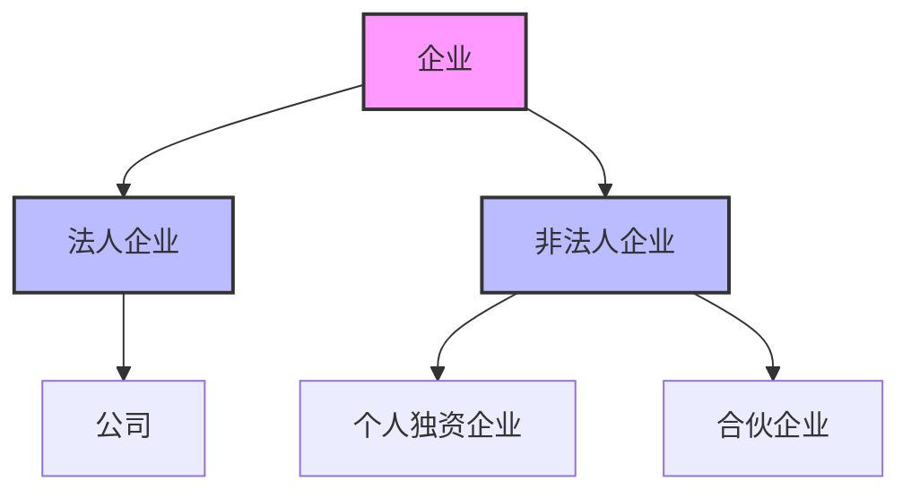
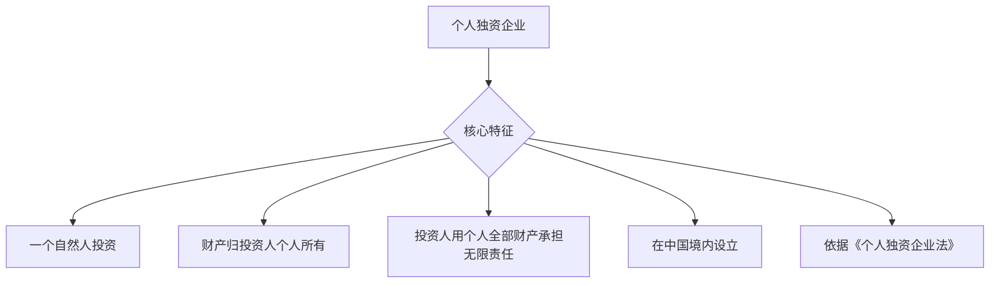
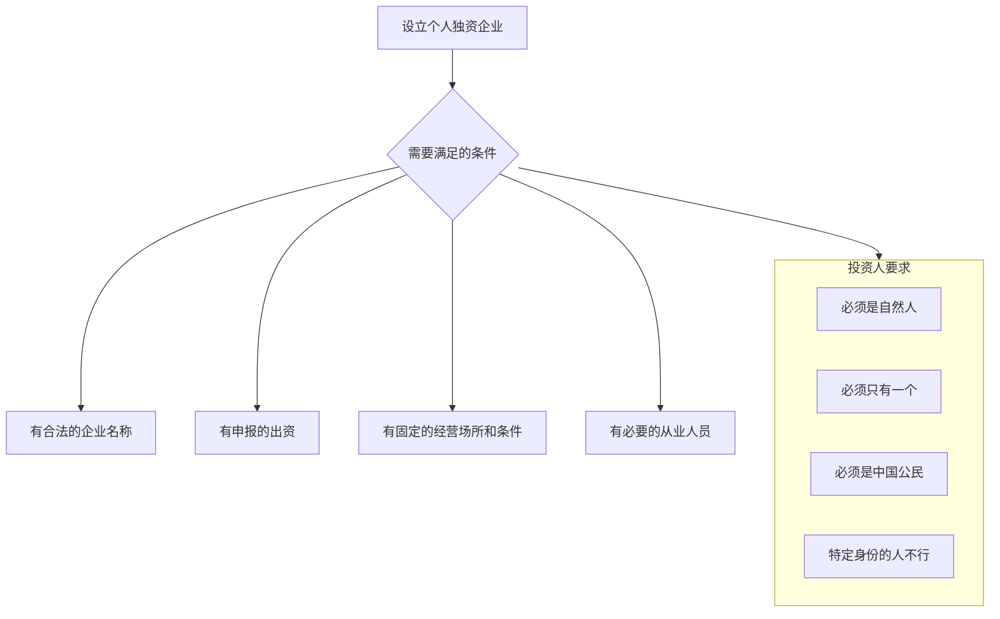
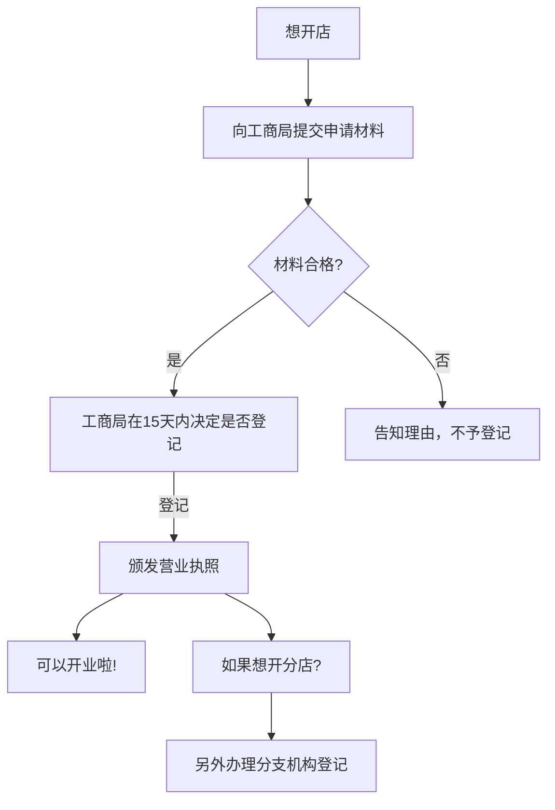
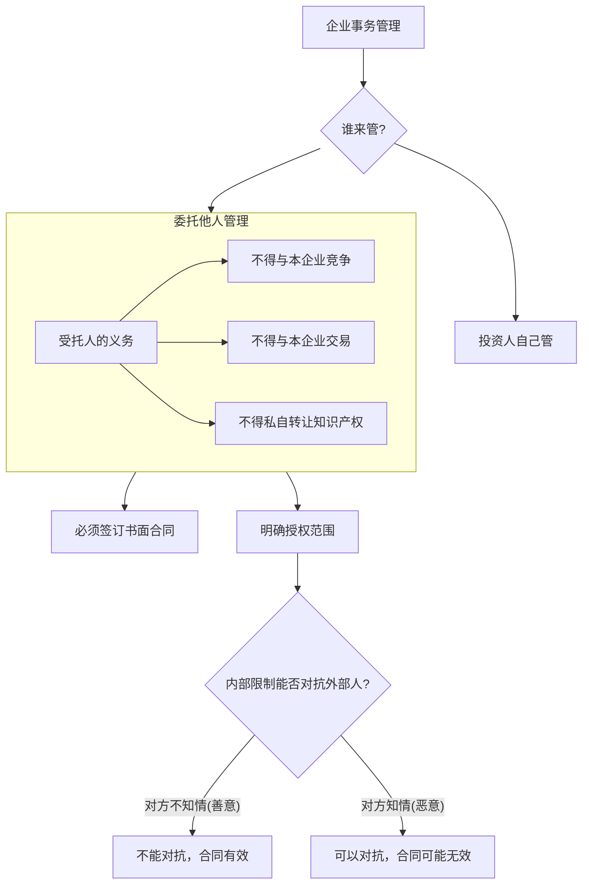
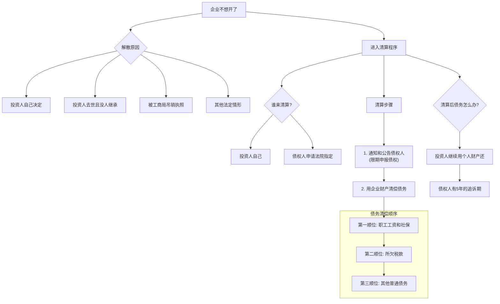

# 1 第二章 个人独资企业法 (Obsidian 学习版)

你好！欢迎来到个人独资企业的世界。想象一下，你想开一个小店，比如一个柠檬水摊，或者一个画室。这个店完全由你一个人说了算，赚的钱都归你，但如果亏了钱，你也要用自己所有的钱来还。这就是个人独资企业最核心的想法。

在我们深入细节之前，先来看看企业这个大家族里，个人独资企业处在什么位置。

> **一句话精髓:** 企业分为两大类，一类是“法人企业”，它像一个独立的“人”，能自己承担责任（比如公司）；另一类是“非法人企业”，它和老板是绑在一起的，老板要为企业负全部责任（比如个人独资企业）。

## 1.1 一、 个人独资企业法的概念

### 1.1.1 知识框架

### 1.1.2 深度解析

#### 1.1.2.1 什么是个人独资企业？

> **一句话精髓:** 就是一个老板用自己的钱开的、赚了亏了都自己兜着的买卖。

- **给8岁小朋友听:** 就像你在学校门口摆个小摊卖玩具，这个小摊就是你的“个人独资企业”。你用来进货的零花钱就是“投资”，卖玩具赚的钱都进你的口袋，这叫“财产为投资人个人所有”。但如果不小心把别人的东西弄坏了要赔钱，你光赔光进货的钱还不够，还得把你存钱罐里所有的钱都拿出来赔，这就叫“无限责任”。
    
- **大师级详解:**
    
    - **定义原文:** `个人独资企业是指依照《个人独资企业法》在中国境内设立，由一个自然人投资，财产为投资人个人所有，投资人以其个人财产对企业债务承担无限责任的经营实体。`
        
    - **来源与细节:**
        
        - **一个自然人投资:** “自然人”就是指我们这样活生生的人，有血有肉，而不是指一个组织或公司。并且，投资人只能有`$1$`个。如果是`$2$`个或更多人一起，那就变成“合伙企业”了。
            
        - **财产为投资人个人所有:** 这是个人独资企业最直接的特点。企业的钱和老板自己的钱，在法律上是分不开的。你店里赚的每一分钱，和你口袋里的钱，本质上都是你的钱。这导致了下一个特点。
            
        - **无限责任:** 这是最重要的一个概念，也是风险所在。“无限”指的是责任的范围是无限的，不局限于你当初投到企业里的那些钱。
            
            - **对比“有限责任”:** 你可能听过“有限责任公司”。“有限”的意思是，如果公司欠了`$100`万，但公司账上只有`$10`万，那最多也就赔这`$10`万，公司的老板（股东）不需要用自己的房子、车子来给公司还债。而个人独资企业的“无限责任”正相反，如果企业欠了`$100`万，企业资产只有`$10`万，那老板必须卖掉自己的房子、车子等个人财产，凑够剩下的`$90`万来还债。
                
        - **经营实体:** 它是一个从事经营活动的单位，但它不是一个独立的“法人”。在法律上，它更像是投资人本人在从事商业活动的一个延伸。
            

## 1.2 二、 个人独资企业的设立

### 1.2.1 (一) 设立条件

#### 1.2.1.1 知识框架

#### 1.2.1.2 深度解析

> **一句话精髓:** 想开个人独资企业，你得是个“身家清白”的中国普通人，给店起个好名字，准备好本钱，找好门面，再招几个帮手。

- **给8岁小朋友听:** 你想开个柠檬水摊，首先，你得是你自己（自然人），不能是你家的小猫小狗来开。而且只能你一个人开（`$1$`个投资人）。你得给小摊起个名字，比如“小明无敌好喝柠檬水”（合法的企业名称）。你得准备好买柠檬和糖的钱（申报的出资）。你得有个固定的摊位，不能今天在校门口，明天跑公园去（固定的经营场所）。如果忙不过来，你还可以请你的好朋友小红来帮忙收钱（必要的从业人员）。
    
- **大师级详解:**
    
    1. **投资人为一个自然人:**
        
        - **细节:** 必须是拥有中国国籍的自然人。外国人目前还不能在中国设立个人独资企业。
            
        - **禁止人群:** 文件中明确提到 `国家公务员、党政机关领导干部、警官、法官、检察官、商业银行工作人员等`，这些人因为其职务的特殊性，为了防止权力寻租和利益冲突，法律禁止他们投资设立个人独资企业。
            
    2. **有合法的企业名称:**
        
        - **细节:** 名称里不能含有“公司”、“有限”、“有限责任”等字样，因为这会让别人误以为你是公司，从而对你的责任形式产生误判。名称也需要符合国家的一些规定，不能用反动、色情或有损国家尊严的词汇。
            
    3. **有投资人申报的出资:**
        
        - **细节:** 法律没有规定最低出资额必须是多少，`$1`块钱原则上也可以。关键在于“申报”，也就是你要告诉登记机关你准备用多少钱来做这个生意。这个钱可以是货币，也可以是实物（比如你把自己的电脑作为企业的资产）。
            
    4. **有固定的生产经营场所和必要的生产经营条件:**
        
        - **细节:** 这是为了保证企业能正常经营，而不是一个“皮包”企业。你需要有一个确定的地址，和一些基本的设备。
            
    5. **有必要的从业人员:**
        
        - **细节:** 指的是除了投资人自己以外，根据企业规模可能需要的员工。如果就老板一个人，那他自己就是从业人员。
            

#### 1.2.1.3 **核心对比：个人独资企业 vs. 个体工商户**

这是一个非常重要的知识点，很多人会混淆。

> **一句话精髓:** 个人独资企业像个正规军，虽然老板要负全责，但规章制度更像一个“企业”；个体工商户更像游击队，形式更灵活，甚至可以家庭为单位经营。

|   |   |   |   |
|---|---|---|---|
|**对比项**|**个人独资企业**|**个体工商户**|**大师级解读**|
|**适用法律**|《个人独资企业法》|《个体工商户条例》|一个是“法”，一个是“条例”，法律效力层级不同，前者更高。|
|**出资人**|只能是一个自然人|可以是自然人，也可以是家庭|个体户更接地气，很多夫妻店就是以“家庭”为单位经营的。|
|**经营者**|投资人或其聘用的人|投资人或其家庭成员|个独企业的管理者可以是外聘的职业经理人，更专业化。|
|**经营场所**|必须有固定的场所|可以是固定的，也可以是流动的（如流动摊贩）|个体户的经营方式更灵活多样。|
|**财务制度**|必须建立财务制度|可以不建立，按规定建账即可|个独企业被要求更严格的财务管理，更像一个正规企业。|
|**法律地位**|是一个经营实体|法律上等同于公民个人|个独企业有独立的字号，可以对外以企业名义活动。|
|**承担责任**|投资人以个人财产承担无限责任|个人经营的，以个人财产承担；家庭经营的，以家庭财产承担。|两者都是无限责任，但个体户明确区分了个人经营和家庭经营的责任财产范围。|

### 1.2.2 (二) 设立程序

#### 1.2.2.1 知识框架

#### 1.2.2.2 深度解析

> **一句话精髓:** 准备好材料去工商局登记，他们觉得OK就会给你发个“准生证”（营业执照），你就可以开张了。

- **给8岁小朋友听:** 你想开柠檬水摊，得先跟妈妈（工商局）说一声，把你起的名字、准备的钱、摊位的位置都告诉她。妈妈觉得你这个计划不错，就会给你一张“好孩子奖状”（营业执照），你就可以拿着这张奖状去摆摊了。
    
- **大师级详解:**
    
    1. **提出设立申请:** 投资人需要准备一系列文件，如设立申请书、投资人身份证明、职业状况证明、企业场所使用证明等。
        
    2. **工商登记:** 这是设立的核心环节。工商行政管理机关（现在通常叫市场监督管理局）是登记机关。他们会在收到全部申请文件后的`$15$`天内做出决定。符合条件的，就准予登记，发给营业执照；不符合的，不予登记，并会书面说明理由。
        
    3. **分支机构登记:** 如果你的企业发展壮大了，想去别的城市开个分店，这个分店就叫“分支机构”。分店也需要去当地的工商局办理登记手续。很重要的一点是，分店不是独立的，它在外面欠了债，总店（也就是投资人）要负责偿还。
        

## 1.3 三、 个人独资企业的事务管理

### 1.3.1 知识框架

### 1.3.2 深度解析

> **一句话精髓:** 店可以自己管，也可以请人管；但请的人在外面签了不该签的单，只要外人不知情，这个单子老板也得认。

- **给8岁小朋友听:** 你的柠檬水摊，可以自己每天去看店（自行管理）。你也可以请好朋友小红帮你卖（委托他人管理）。你告诉小红，超过`$10`块钱的生意要先问你。但是有一天，有个叔叔来买水，一次性买了`$20`块钱的，小红没问你就卖了。虽然小红违反了你们的约定，但因为那个叔叔不知道这个约定，所以这`$20`块的生意还是算数的，你不能跟叔叔说“这生意不算数，你把柠檬水还给我”。这个叔叔就是“善意第三人”。
    
- **大师级详解:**
    
    1. **家庭财产出资的责任:**
        
        - **原文:** `个人独资企业投资人在申请企业设立登记时，明确以其家庭共有财产作为个人出资的，应当依法以家庭共有财产对企业债务承担无限责任。`
            
        - **解读:** 这是一个重要的选择。如果老板在开业时就明确表示，是拿“我们家的钱”来开店的，那么当企业欠债时，就要用整个家庭的共同财产来还。如果没说，一般就只用老板个人的财产来还。这是一个加重责任的情形，选择时要非常慎重。
            
    2. **委托管理与善意第三人:**
        
        - **原文:** `投资人对受托人或者被聘用的人员职权的限制，不得对抗善意第三人。`
            
        - **核心概念“善意第三人”:** 这是法律中一个非常重要的概念。“第三人”指合同双方（这里是企业和你请的管理者）之外的交易对象。“善意”指这个交易对象在交易时，并不知道也不应该知道你们企业内部的限制性规定。
            
        - **为什么有这条规定？** 这是为了保护交易安全和效率。如果每个和企业做生意的人，都得先去调查一下这个企业的内部规定，那生意就没法做了。法律选择保护不知情的外部交易方，把内部管理的风险留给企业自己。老板既然请了人，就要承担请人可能带来的风险。
            
    3. **受托人的忠实义务:**
        
        - **原文:** `未经投资人同意，投资人委托或者聘用的人不得从事与本企业相竞争的业务，不得同本企业订立合同或者进行交易，不得擅自将企业商标或者其他知识产权转让给他人使用。`
            
        - **解读:** 这三条是“忠实义务”的具体体现。
            
            - **竞业禁止:** 你请来的店长，不能自己再去旁边开一个一模一样的店跟你抢生意。
                
            - **禁止自我交易:** 店长不能把店里的东西卖给他自己，或者从他自己那里高价进货，这会损害老板的利益。
                
            - **保护知识产权:** 店长不能把你的“小明无敌好喝柠檬水”这个品牌（商标）私自授权给别人用。
                

## 1.4 四、 个人独资企业的解散和清算

### 1.4.1 知识框架

### 1.4.2 深度解析

> **一句话精髓:** 店不开了，得算算账（清算），先把欠员工的、欠国家的钱还了，再还其他人的；账算完了钱不够，老板还得接着还，但债主最多只能在`$5$`年内找你要。

- **给8岁小朋友听:** 你的柠檬水摊不准备开了（解散）。你得先算算账，看看还欠谁的钱（清算）。你之前请了小红帮忙，还欠她`$10`块钱工资，这得最先还给她。然后你还要交给妈妈`$5`块钱的“管理费”（税款）。最后，你还欠小刚`$20`块钱的柠檬钱（其他债务）。如果你的小摊里所有的钱加起来，还完了小红和妈妈的钱，只剩下`$5`块，那你只能先还给小刚`$5`块，剩下的`$15`块，得从你自己的存钱罐里拿钱来还。小刚必须在`$5$`年内找你要这`$15`块，如果过了`$5$`年他才想起来，那你就不用给了。
    
- **大师级详解:**
    
    1. **解散情形:** 这四种情况是导致企业“死亡”的法定原因。
        
        - `(1)` 主动死亡：老板不想干了。
            
        - `(2)` 意外死亡：老板去世了，又没人接班。
            
        - `(3)` 被判死刑：企业严重违法违规，被监管部门吊销了营业执照。
            
        - `(4)` 其他：法律规定的其他情况，是个兜底条款。
            
    2. **清算:** 解散不等于企业瞬间消失，它进入了一个“清算”阶段，目的就是了结所有的债权债务关系。
        
        - **清算人:** 优先由投资人自己清算，因为他对自己的企业最了解。但如果投资人不清算，或者债权人信不过投资人，可以向法院申请，让法院指定一个中立的清算人。
            
        - **通知和公告:** 这是为了保护债权人的利益。必须书面通知已知的债权人，对不知道的，要在报纸等媒体上公告。债权人看到通知后，要在规定时间内（接到通知的`$30$`天内，没接到通知看公告的`$60$`天内）来报上自己该收的钱数。
            
    3. **财产清偿顺序:**
        
        - 债务清偿顺序=所欠职工工资和社保费用→所欠税款→其他债务
        - **推导与来源:** 这个顺序体现了法律的价值取向。
            
            - **第一位（职工工资社保）:** 员工是弱势群体，他们的劳动报酬和基本生活保障是第一位的，体现了对劳动者权益的优先保护。
                
            - **第二位（税款）:** 税收是国家运行的基础，代表了社会公共利益，所以优先于普通的商业债务。
                
            - **第三位（其他债务）:** 这是平等的商事主体之间的债务，放在最后清偿。
                
    4. **解散后的责任追索期:**
        
        - **原文:** `个人独资企业解散后，原投资人对企业存续期间的债务仍应承担偿还责任，但债权人在五年内未向债务人提出偿债请求的，该责任消灭。`
            
        - **解读:** 这不是说`$5$`年后债务就自动没了。它是一个“诉讼时效”的概念。意思是，债权人必须在`$5$`年这个期限内，向原投资人主张权利（比如去法院起诉）。如果`$5$`年内你啥也不干，`$5$`年后法院就不会再保护你的权利了，原投资人就获得了“时效利益”，可以名正言顺地不还钱了。
            

## 1.5 案例分析 (例1)

让我们用刚刚学到的所有知识来解剖这个案例。

> **一句话精髓:** 内部规定管不了不知情的外部人，还钱要按顺序，企业还不清的债，老板拿自己的所有家当接着还。

### 1.5.1 案情回顾:

- 甲设立 A 企业 (个人独资)。
    
- 甲聘请乙管理，并内部规定: 签`$1`万元以上的合同需经甲同意。
    
- 乙未经同意，与善意的丙签订了`$2`万元的购货合同。
    
- A 企业亏损解散，法院指定戊清算。
    
- **资产情况:**
    
    - A 企业: 银行存款`$1`万 + 实物`$8`万 = `$9`万
        
    - 甲个人: B合伙企业出资`$6`万 + 其他财产`$2`万 = `$8`万
        
- **债务情况:**
    
    - 欠税款: `$2000`元
        
    - 欠乙工资: `$5000`元
        
    - 欠社保: `$5000`元
        
    - 欠丁: `$10`万元
        
    - 欠丙: `$2`万元 (来自乙的合同)
        

### 1.5.2 问题解答与深度解析:

**1. 乙与丙签订的`$2`万元货物合同是否有效？为什么？**

- **答案:** **有效。**
    
- **知识点应用:** 这正是“**投资人对受托人职权的限制，不得对抗善意第三人**”这一规则的完美体现。
    
- **大师级分析:**
    
    1. 乙是甲聘用的管理者，是A企业的代理人。他在职权范围内以A企业的名义对外活动，法律后果由A企业（最终是甲）承担。
        
    2. 甲对乙的限制（`$1`万元以上需同意）是企业**内部**的管理规定。
        
    3. 丙是“**善意第三人**”，因为他不知道也不应该知道甲和乙之间的这个内部约定。他看到的只是乙作为A企业的代表在和他进行交易。
        
    4. 为了保护交易安全和善意第三人丙的信赖利益，法律规定这份合同有效。A企业必须履行合同，支付`$2`万元货款。因此，丙也成为了企业的债权人。
        
    5. 甲的损失怎么办？甲可以依据他们之间的聘用合同，追究乙违反内部规定的责任，要求乙赔偿因此给企业造成的损失，但这是甲和乙之间的内部纠纷，不能影响外部合同的效力。
        

**2. A企业的财产清偿顺序是什么？**

- **答案:** 应该按照“先职工、再国家、后普通”的顺序进行清偿。
    
- **知识点应用:** **个人独资企业财产清偿顺序规则。**
    
- **大师级分析:**
    
    1. **总债务梳理:** 企业的总债务包括：欠乙工资`$5000` + 欠社保`$5000` + 欠税款`$2000` + 欠丁`$10`万 + 欠丙`$2`万 = `$13.2`万。
        
    2. **清偿顺序:**
        
        - **第一顺位:** 偿还所欠职工工资和社会保险费用。
            
            - 金额: 欠乙工资`$5000`元 + 欠社保`$5000`元 = `$1`万元。
                
        - **第二顺位:** 偿还所欠税款。
            
            - 金额: `$2000`元。
                
        - **第三顺位:** 偿还其他债务 (普通债务)。
            
            - 金额: 欠丁`$10`万元 + 欠丙`$2`万元 = `$12`万元。
                

**3. 如何满足丁的债权请求？**

- **答案:** 先用A企业的剩余财产清偿，不足部分由甲以其个人财产无限偿还。
    
- **知识点应用:** **投资人的无限责任。**
    
- **大师级分析 (详细计算):**
    
    1. **第一步: 用企业财产清偿**
        
        - A企业的总资产为`$9`万元。
            
        - **清偿第一顺位:** `$9`万 - `$1`万 (工资社保) = 剩余`$8`万。
            
        - **清偿第二顺位:** `$8`万 - `$2000` (税款) = 剩余`$7.8`万。
            
        - **清偿第三顺位:** 此时企业还剩下`$7.8`万元，但第三顺位的普通债务总额为`$12`万 (欠丁`$10`万 + 欠丙`$2`万)。显然，企业的钱不够还了。
            
        - 这`$7.8`万应该按比例清偿给丁和丙。丁的债权占`10/12`，丙的债权占`2/12`。
            
            - 丁可分得: `$7.8`万 * (`$10`万 / `$12`万) = `$6.5`万元。
                
            - 丙可分得: `$7.8`万 * (`$2`万 / `$12`万) = `$1.3`万元。
                
        - 此时，企业财产已用尽。
            
    2. **第二步: 计算剩余未偿还债务**
        
        - 丁的债权还剩: `$10`万 - `$6.5`万 = `$3.5`万元。
            
        - 丙的债权还剩: `$2`万 - `$1.3`万 = `$0.7`万元。
            
    3. **第三步: 投资人甲以个人财产承担无限责任**
        
        - 甲的个人财产总值为: 在B合伙企业的出资`$6`万 + 其他可执行财产`$2`万 = `$8`万元。
            
        - 这`$8`万元的个人财产，足以偿还剩余的全部债务 (`$3.5`万 + `$0.7`万 = `$4.2`万)。
            
        - 因此，甲需要用自己的个人财产，支付给丁`$3.5`万元，支付给丙`$0.7`万元。
            
    
    **最终结论:** 丁的`$10`万债权，通过清算A企业财产获得了`$6.5`万，再通过执行甲的个人财产获得了`$3.5`万，最终得到了全额清偿。
    

希望这份超级详细的解析能帮助你彻底掌握个人独资企业法的精髓！如果你还有任何疑问，随时都可以提出来。