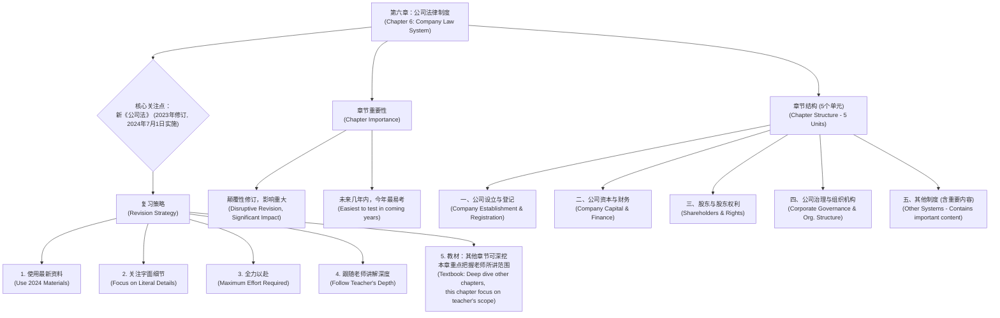
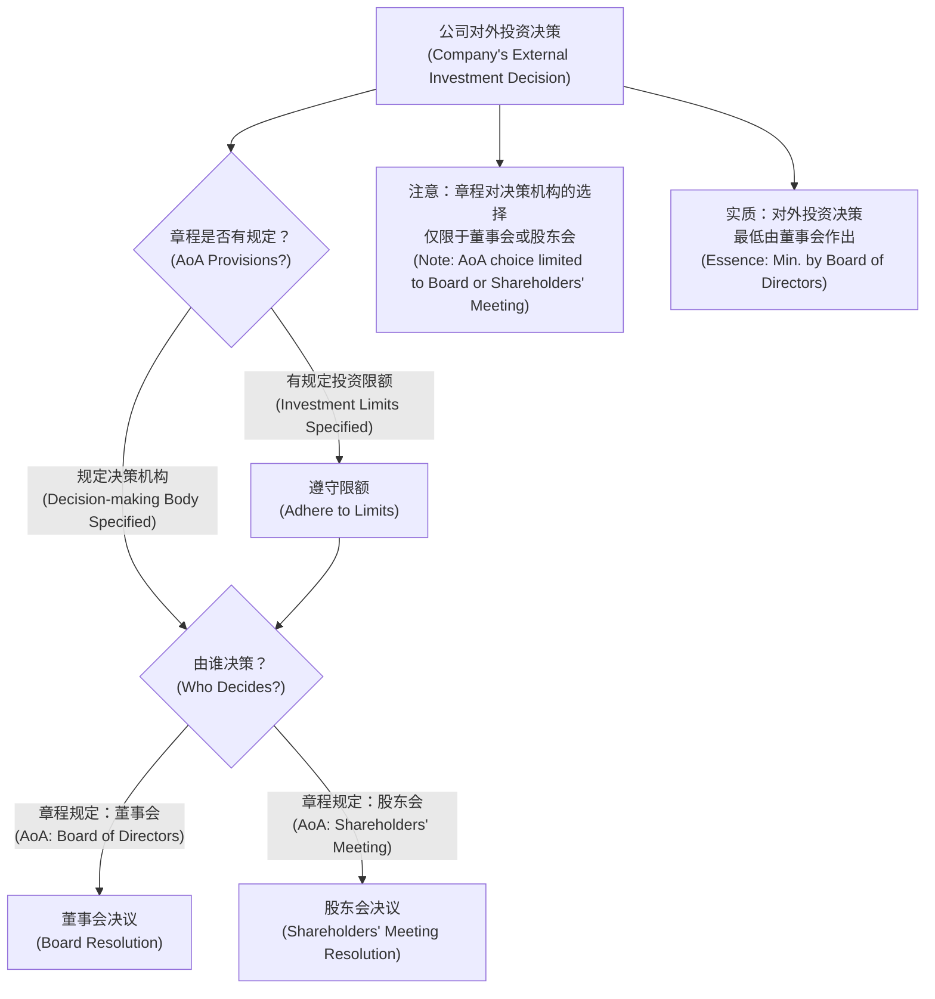
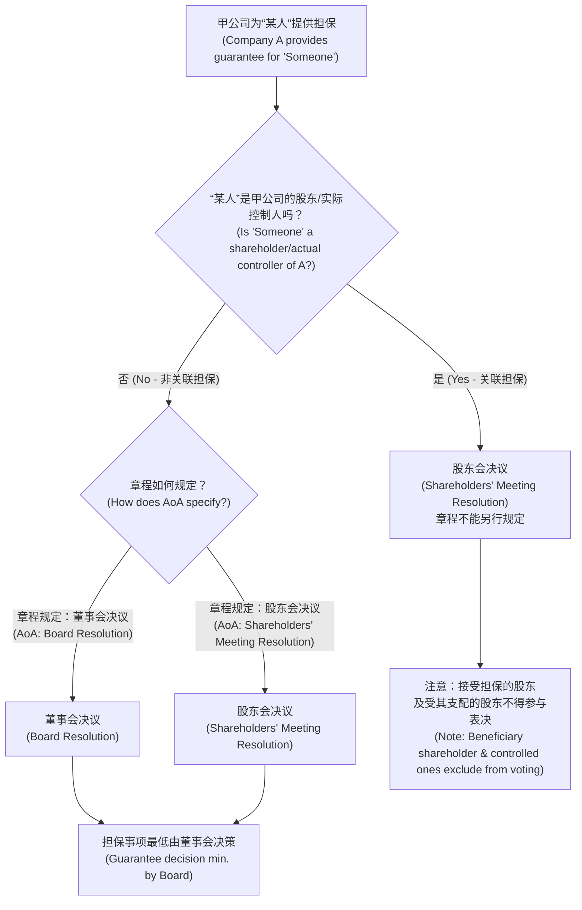
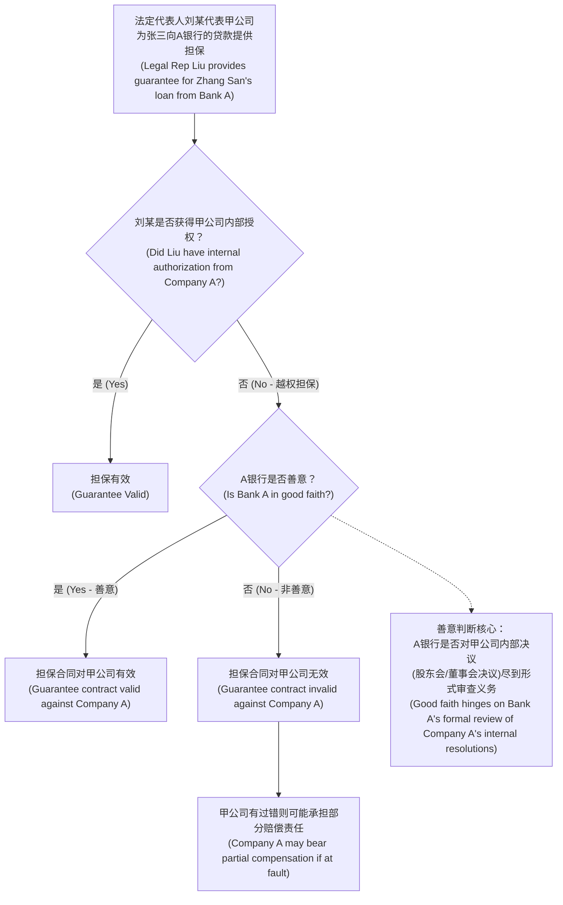

好的，我们一步一步来，把公司法律制度这块硬骨头啃下来，变成你肚子里的知识！我会用Obsidian的Markdown格式，并且特别注意Mermaid图的展示。

# 1 第六章 公司法律制度

## 1.1 概览与学习方法 (导论部分)

> **通俗概括：** 这一章讲的是开公司、管公司的规矩。因为国家刚改了新规矩 (新《公司法》)，所以我们得用最新的课本和练习题学，而且考试可能会更喜欢考我们记没记住规矩的条文，而不是让我们分析特别复杂的案子。这章特别重要，得下大力气学好！

### 1.1.1 知识框架 (Mermaid 图)

### 1.1.2 详细解读

#### 1.1.2.1 新《公司法》的颠覆性修订

*   **发生了什么？** 我们国家的《公司法》在2023年年底进行了一次非常大的修改，很多规定都变了。
*   **什么时候生效？** 新的《公司法》从 **2024年7月1日** 开始正式使用。
*   **为什么重要？** 这次修改太大了，几乎是把原来的很多东西推翻了重来。所以，如果你用老的学习资料，很多问题的答案可能跟新规定下正确的答案正好相反！
    *   **给8岁小朋友讲：** 就像玩游戏的规则突然大改版了，以前的攻略很多都用不上了，得看最新的攻略才能玩明白。
*   **行动指南：**
    *   **必须使用2024年新版的课程、书籍、习题。**
    *   **非常重要，再说一遍，用新资料！**

#### 1.1.2.2 新法实施时间对考试风格的影响

*   **背景：** 新法2024年7月1日才实施，离考试时间很近，离出题老师出卷子的时间更近。
*   **可能的影响：**
    *   **深入案例应用题可能减少：** 因为新法刚实施，实践中的复杂案例可能还不多，或者司法解释还没跟上，出题老师可能不太会出特别需要结合实践深挖的案例题。
    *   **文字型、字面考察题可能增加：** 老师们可能会更侧重考查大家对新法律条文本身记不记得、理不理解。
    *   **给8岁小朋友讲：** 新规则刚出来，大家都在熟悉，所以考试可能先考你知不知道新规则是怎么写的，而不是让你马上用新规则去解决一个超级复杂的问题。
*   **复习建议：**
    *   **更加关注法律规定的字面细节。**
    *   考试可能不会考得“非常深奥”，但对“条文本身”的考察可能很到位。

#### 1.1.2.3 第六章的考试地位与准备策略

*   **往年情况：** 第六章和第三章差不多，分值波动大。如果案例分析题的故事跟公司法关系大，分值就高，反之则低。通常建议当做8-10分的重要章节准备。
*   **今年特殊性：**
    *   **不要受往年情况束缚：** 因为公司法修改与“优化营商环境”这个国家大政策有关，影响面广，意义重大。
    *   **出多少分、什么题型都合理：** 所以不能掉以轻心。
    *   **有多少劲儿使多少劲儿：** 全力以赴准备！
*   **学习深度建议：**
    *   **按照老师讲解的深度来：** 老师讲到哪里，你就学到哪里。因为新法有很多问题再往前深究一步可能就没有明确结论了，需要等司法实践和解释。自己瞎挖容易把自己搞糊涂。
    *   **给8岁小朋友讲：** 就像学新知识，老师教到哪一步是有标准答案的，你就先学好这些。如果自己往前跑太快，可能会跑到没有路的地方，把自己弄迷路。
*   **教材使用建议：**
    *   **其他章节（尤其是小章节）：** 建议踏踏实实看教材，好好研究。
    *   **唯独第六章：** **不建议** 去深挖教材的每一个细节和答案。把老师讲的范围和规定把握住就行。
    *   **原因：** 教材可能写得非常细，但有些过于细致或尚无定论的点，老师在授课时会把握一个“目前有结论”的度。

#### 1.1.2.4 今年的复习目标

*   **核心思想：有多大劲儿使多大劲儿！**
*   **为什么这么强调？**
    *   今年不认真对待新《公司法》，明年会更惨。
    *   明年《公司法》依然是新的。
    *   明年可能还会有《公司法》的司法解释（具体怎么出不确定）。
    *   明年你还要面对一个更“刁钻”、出题技巧升级了的老师。
*   **结论：** 在未来3-5年内，**今年的《公司法》应该是最简单、最好考的一年。** 务必抓住机会，今年把经济法解决掉！
    *   **给8岁小朋友讲：** 今年是新《公司法》考试的“新手保护期”，难度相对低，赶紧趁现在通关！

#### 1.1.2.5 章节单元框架

> **通俗概括：** 这一章分成了五个部分，分别讲公司是怎么成立的、公司的钱是怎么回事、股东有啥权利、公司内部是怎么管理的，还有一些其他的规定。记住，没有哪个部分不重要，都要好好学！

*   **五个并列单元：**
    1.  **第一单元：公司的设立登记** (Company Establishment and Registration)
    2.  **第二单元：公司的资本与公司财务制度** (Company Capital and Corporate Financial System)
    3.  **第三单元：公司股东与股东权利** (Company Shareholders and Shareholder Rights)
    4.  **第四单元：公司治理与组织机构** (Corporate Governance and Organizational Structure)
    5.  **第五单元：其他制度** (Other Systems)
        *   **注意：** 第五单元不是“可以战略性放弃的单元”！里面有非常重要的内容，比如上市公司的特别规定、今年新增的简易减资问题等。
*   **总基调：** 第六章这五个单元，**没有哪个是相对次要的，都非常重要，** 一定要踏踏实实准备。

---

## 1.2 单元一：公司的设立与登记 (Company Establishment and Registration) - Part 1

> **通俗概括：** 我们要开一家公司，就像给一个小宝宝办出生证明一样，要走一些程序。在正式讲这些程序前，我们先额外了解一下公司怎么对外投资和给别人做担保，因为这两件事关系到公司的钱袋子安全。

### 1.2.1 (赠送考点) 公司的对外投资与担保

#### 1.2.1.1 公司是法人型企业

*   **核心知识点：**
    *   公司是 **法人型企业**。
        *   回忆第一章：法律关系主体有自然人、法人、非法人组织、国家。
        *   第五章的合伙企业是 **非法人组织**。
        *   第六章的公司是 **营利法人** (法人分营利法人、非营利法人、特别法人)。
    *   公司有 **独立的法人财产**，享有 **法人财产权**。
        *   **注意：** 不能说“因为公司是法人，所以有独立财产”。非法人企业（如合伙企业）也有独立于合伙人的企业财产，也享有财产权。
        *   **“所以”应该用在哪里？** 公司是企业法人，**所以** 公司以其 **全部财产** 对其债务承担责任。
            *   如果全部财产不够还债怎么办？原则上股东只承担 **有限责任** (Limited Liability)。
            *   公司和股东之间有“风险隔离墙”，股东通常不会因为公司欠债而把自己的家当赔进去 (不会“引火烧身”)。
            *   普通合伙人会“引火烧身”，因为他们承担无限连带责任。
            *   股东和有限合伙人承担的是有限责任。
            *   **例外：公司法人人格否认** (Piercing the Corporate Veil)。这种情况下，这堵“墙”被打破了，股东可能就要出来替公司还债。
        *   **给8岁小朋友讲“法人”和“有限责任”：**
            *   **法人：** 想象公司是一个独立的“大人”，它有自己的名字，可以自己买东西（财产），自己欠钱要自己还。
            *   **有限责任：** 你投资给这个“大人”10块钱让他开店，如果店开亏了，你最多就损失这10块钱，开店的“大人”欠的更多钱，一般不会让你再从自己零花钱里掏钱去还。你的责任是“有限”的。
*   **与对外投资担保的关系：**
    *   股东把钱交给公司，公司有了自己的钱（法人财产权）。
    *   公司的董事、监事、高管（董监高）在管理这些钱。
    *   股东会担心董监高乱花钱，特别是那些钱花出去可能回不来的项目，比如：
        *   **投资：** 投资可能成功赚钱，也可能失败血本无归。
        *   **担保：** 给别人借钱作保证，如果别人还不上，公司就得替他还，这钱可能也要不回来了。
    *   所以，对这种“钱可能一去不复返”的对外投资和担保，要重点关注和控制。

#### 1.2.1.2 对外投资 (External Investment)

> **通俗概括：** 公司想拿钱去投别的企业，原则上自己说了算，但公司章程（公司自己的“宪法”）可以规定投多少钱、谁来拍板，而且有些公司是不能乱投某些类型的企业的。

*   **原则：** 公司自主决定。
*   **新《公司法》原文解读：**
    *   “公司可以向其他企业投资。”
    *   “法律规定公司不得成为对所投资企业的债务承担连带责任的出资人的，从其规定。”
        *   **含义：** 有些公司不能去投资那种“一旦出事，自己也要跟着承担无限责任”的企业（比如普通合伙企业）。
        *   **举例：** 国有独资公司、上市公司等，按规定不能成为普通合伙人，也就不能投资于普通合伙企业。
        *   **其他公司：** 如果法律没禁止（比如一般的有限责任公司），就可以投资于普通合伙企业。
        *   **本次修改：** 只是把旧规定写得更明确了，实质理解没变。
*   **控制措施：**
    1.  **章程限额：** 公司章程可以对投资总额、单项投资的限额做出规定。
        *   一旦规定，公司决策时不能超过这个限额。
        *   **章程规定自由度：** **完全自由。** 章程想怎么规定限额都可以，公司自己遵守就行。
    2.  **决策机构：** 对外投资的决策，要按照章程的规定，由 **董事会** 或 **股东会** 决议。
        *   **章程规定自由度：** **有限自由。** 只能在“董事会决议”或“股东会决议”两者中选一个，不能规定由监事会或总经理决议。
        *   **结论：** 一家公司对外投资的决策，**最起码** 是董事会作出的。
            *   **给8岁小朋友讲：** 公司想拿钱出去投资，就像家里要买个大件玩具。家里的规矩（章程）可以写明“最多花多少钱买玩具”，也可以写明“买大玩具是爸爸（董事会）决定还是全家开会（股东会）决定”。但不能让小猫小狗（监事会或总经理个人）来决定。

##### 1.2.1.2.1 对外投资决策的Mermaid图

#### 1.2.1.3 公司担保的限制 (Restrictions on Company Guarantees)

> **通俗概括：** 公司给别人借钱当保人，风险很大。如果是给自家的股东或老板当保人，那必须全体股东开会同意（而且这个股东老板不能投票）；如果是给外人当保人，就看公司章程规定是董事们开会同意还是全体股东开会同意。总之，这事儿不能随便一个人就定了。

*   **区分关联担保与非关联担保：**
    *   **场景：** 某人向A银行借款，甲公司提供担保。
    *   **关键：** 看“某人”和甲公司是什么关系。

    | 类型         | “某人”是谁                                 | 决策机构 (由谁拍板)                                                                | 章程能否约定？ |
    | :----------- | :----------------------------------------- | :--------------------------------------------------------------------------------- | :------------- |
    | **关联担保** | 甲公司的 **股东** 或 **实际控制人**        | **只能由股东会决议**                                                               | **不能**       |
    | **非关联担保** | **不是**甲公司的股东或实际控制人 (如职工等) | 按 **公司章程规定**： 1. 董事会决议 或 2. 股东会决议                               | **可以**       |

*   **最低决策层级：** 公司担保事项，**最低最低** 是 **董事会** 拍板。监事会、董事长个人、总经理个人都不能拍板。

##### 1.2.1.3.1 公司提供担保的决策流程 (Mermaid图)

*   **重要概念区分 (补充内容，教材未写但重要)：**
    *   **股东 (Shareholder)：** 只要出钱投资公司买了股权，就是股东 (哪怕只买了1股)。
    *   **控股股东 (Controlling Shareholder)：** 新《公司法》规定：
        1.  出资额占资本总额 > $50\%$；或
        2.  持有股份数占股本总额 > $50\%$；或
        3.  虽然 < $50\%$，但对股东会决议能产生重大影响。
        *   **注意：** 上面关联担保说的是“股东”，不是“控股股东”。即便是小股东，公司为其担保也要股东会决议。
    *   **实际控制人 (Actual Controller)：** 新《公司法》规定 (与《证券法》趋同)：
        *   不一定是公司股东。
        *   通过投资关系、协议或其他安排，能够实际支配公司行为的人。
        *   **例子1：** 王某持有A公司$51\%$股份 -> 王某是A公司的控股股东，也是实际控制人。
        *   **例子2：** B公司持有A公司$51\%$股份，王某持有B公司$51\%$股份 -> 王某不是A公司的股东，但他是A公司的实际控制人 (通过B公司控制A公司)。
    *   **法定代表人 (Legal Representative)：**
        *   代表公司，和公司是同一主体。
        *   由 **章程规定**，在 **执行事务的董事或经理** 中选一个担任。(新《公司法》强调“执行事务的”)
        *   不一定是董事长。

*   **关联担保的表决细节 (为股东/实际控制人担保时)：**
    1.  **回避表决：**
        *   接受担保的股东，或受实际控制人支配的股东，**不得参加该事项的表决**。
        *   **注意：** 是“不得参加表决”，**不是**“不得出席会议”。可以出席会议说明情况，但投票时要回避。
    2.  **通过方式：** 该项表决由 **出席会议的其他股东** 所持 **表决权** 的 **过半数** 通过。
        *   **四个关键词：**
            1.  **出席会议的：** 没来开会的股东不算分母。
            2.  **其他股东：** 被担保的那个股东及其“小弟”们的表决权不算。
            3.  **表决权：** 通常按出资比例或持股比例算，不是按人头算。
            4.  **过半数通过：** 大于 $1/2$ ($>50\%$)。
        *   **给8岁小朋友讲：** 班上要投票决定给小明买个特别贵的奖品（小明是股东），小明可以来开会，但不能投票。投票时，只看其他来开会的同学的票数，如果超过一半同意，这事儿就成了。
        *   **公式理解 (不严格，助记)：**
            $$ \text{赞成票数} / (\text{出席会议的其他股东的总票数}) > 1/2 $$
        *   **主观题必备：** 这条规定要能准确背出来并理解。

*   **章程限额：** 和对外投资类似，公司章程可以对担保的总额、单项担保的限额进行规定。有规定则不能超过限额。

#### 1.2.1.4 法定代表人越权代表公司提供担保

> **通俗概括：** 公司的法定代表人（比如总经理或董事长）没有权力自己决定给别人担保，但他偷偷摸摸代表公司签了担保合同。这份合同对公司有没有用，主要看跟公司签合同的那一方（比如银行）知不知道法定代表人是“越权”的。

*   **前提：** 担保事项最起码要董事会批准，法定代表人个人无权决定。如果法定代表人未经授权擅自代表公司提供担保，就是 **越权代表行为**。
*   **场景：** 张三向A银行借款，甲公司的法定代表人刘某，没经过董事会/股东会同意，自己拍板以甲公司名义提供了担保。这份甲公司与A银行的担保合同效力如何？

*   **效力判断：**
    *   **相对人A银行善意 (Good Faith)：** 担保合同对甲公司 **发生效力** (有效)。
    *   **相对人A银行非善意 (Not in Good Faith)：** 担保合同对甲公司 **不发生效力** (原则上无效)。
        *   若主合同有效，担保合同无效：
            *   甲公司无过错：不承担责任。
            *   甲公司有过错：对债务人不能清偿部分，最多承担 **二分之一** 的赔偿责任。 (这是担保法相关规定)

*   **如何判断A银行是否“善意”？**
    *   **善意的定义：** 相对人A在签合同的时候，事实上不知道，并且 **也不应当知道** 法定代表人越权。
    *   **关键点：“不应当知道”怎么理解？** 法律规定担保要董事会/股东会批，银行难道不知道吗？
    *   **核心在于银行是否尽到了合理的“审查义务”：**
        *   法定代表人刘某可能会 **伪造决议文件** (董事会决议或股东会决议)。
        *   银行对决议文件的审查是 **形式审查义务**。只要银行审查了，一般就认为它尽到义务了，除非有证据证明银行明知是假的还配合。

    | 担保类型     | 银行A需审查的文件                                  | 银行A是否善意 (进而担保合同是否对甲公司有效)                                                                                                                              |
    | :----------- | :------------------------------------------------- | :----------------------------------------------------------------------------------------------------------------------------------------------------------------------- |
    | **关联担保** (为股东/实际控制人担保) | **股东会决议** (并确认表决程序合法)                | 只要A银行能证明在签合同时对**股东会决议**进行了审查，就视为善意，担保合同有效 (即使决议是伪造的)。                                                                                   |
    | **非关联担保** (为其他人担保)   | **董事会决议** 或 **股东会决议**                     | 除非能证明A银行明知按章程应由股东会决议而其只审查了董事会决议等特殊情况，否则，只要A银行审查了**董事会决议或股东会决议中任何一个**，一般就视为善意，担保合同有效 (即使决议是伪造的)。 |

    *   **给8岁小朋友讲：** 你们班长（法定代表人）偷偷拿班费（公司财产）给隔壁班小强（债务人）买零食作担保，答应如果小强不给钱，班级替他还。文具店老板（银行）收不收班级的钱呢？要看老板知不知道班长是偷偷拿的钱。如果班长骗老板说“我们班开会同意了”，还给老板看了“开会记录”（伪造的决议），老板也检查了记录，那老板就是“善意”的，班级可能就得认账。

##### 1.2.1.4.1 法定代表人越权担保效力判断 (Mermaid图)

---
（内容较多，我们先消化这部分，然后继续后续的“公司的设立与登记”其他考点。请确认这部分是否清晰，如有疑问随时提出！）