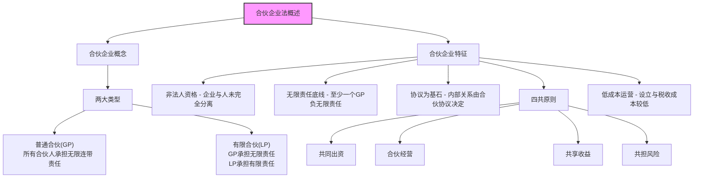
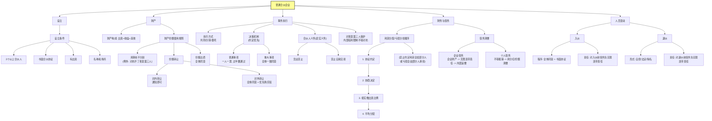
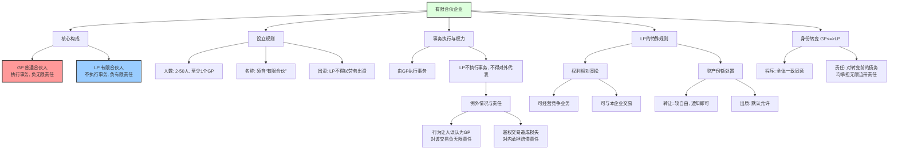
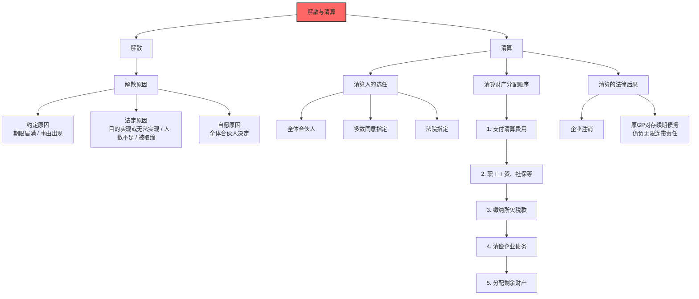

# 1 第三章 合伙企业法

## 1.1 第一节 合伙企业法概述

> **一句话概括精髓：** 这部分内容是总纲，告诉你“合伙企业”到底是个啥，它和我们熟知的“公司”有什么根本不同。

### 1.1.1 知识框架

### 1.1.2 一、合伙企业的概念

#### 1.1.2.1 原始定义

合伙企业，是指自然人、法人和其他组织依照《合伙企业法》在中国境内设立的普通合伙企业和有限合伙企业。

#### 1.1.2.2 “讲给8岁小朋友听”

> 想象一下，你和你的好朋友小明、小红决定一起开个柠檬水摊。你们三个就是“合伙人”，这个柠檬水摊就是“合伙企业”。你们可以一起决定柠檬水怎么卖，赚了钱大家一起分，这就是最简单的合伙。

#### 1.1.2.3 深度解析与“为什么”

- **“自然人、法人和其他组织”：**
    
    - **自然人：** 就是我们这样活生生的人，像你、我、张三、李四。
        
    - **法人：** 在法律上被当成“人”的组织，最常见的就是“公司”。比如，A公司可以和B公司一起成立一个合伙企业。为什么要有法人？因为这样可以让企业间的合作更灵活。
        
    - **其他组织：** 一些不具备法人资格但又能合法存在的实体，比如某些基金会、社会服务机构等。
        
    - **精髓：** 成为合伙人的资格很广泛，不光是个人，公司也能参与。
        
- **合伙企业的两种基本类型：**
    
    - **普通合伙企业 (General Partnership, GP):**
        
        - **定义：** 由普通合伙人组成，合伙人对合伙企业债务承担无限连带责任。
            
        - **“讲给8岁小朋友听”：** 你们的柠檬水摊欠了别人 100 块钱，但摊位上只剩下 10 块钱了。那么剩下的 90 块，不管是谁借的，债主都可以找你、小明、或者小红任何一个人要，而且如果你的零花钱罐里有 90 块，你就得全部拿出来还债。这就是“无限连带责任”。
            
        - **“无限连带责任”的来源和为什么：**
            
            - **无限责任：** 责任范围不限于你投入的钱（比如开摊时你投了 5 块钱），而是包括你的所有个人财产（你的压岁钱、玩具等）。
                
            - **连带责任：** 所有合伙人像被一根绳子捆在一起，任何一个人的行为引起的债务，其他人都要负责。债主可以找最有钱的那个合伙人要全部的钱，这个合伙人还了钱之后，再去找其他合伙人要他们该分摊的部分。
                
            - **为什么这么规定？** 因为合伙企业靠的是人与人之间的信任，没有像公司那样严格的财产制度（比如注册资本）。为了保护和这个“柠檬水摊”做生意的人（债权人），法律要求合伙人必须用自己的全部身家作担保，这样大家才敢放心地和你们做生意。
                
    - **有限合伙企业 (Limited Partnership, LP):**
        
        - **定义：** 由普通合伙人（GP）和有限合伙人（LP）组成。普通合伙人承担无限连带责任，有限合伙人以其认缴的出资额为限对合伙企业债务承担责任。
            
        - **“讲给8V小朋友听”：** 这次，你的邻居大强也想加入柠檬水摊，但他只愿意出 20 块钱，并且说好：“我只出钱，不参与管理，如果摊子亏了，我最多就亏这 20 块钱，你们不能找我要更多了。” 在这个新组合里，你、小明、小红还是“普通合伙人”，要承担无限连带责任。而大强就是“有限合伙人”，他的责任是“有限”的。
            
        - **“有限责任”的来源和为什么：**
            
            - **认缴的出资额：** 就是大强承诺要投的钱（20 块）。即使他还没真的把钱给你们，他的责任上限也已经是 20 块了。
                
            - **为什么这么规定？** 这是为了吸引那些只想投资赚钱，但不想参与经营也不想承担巨大风险的投资者。就像大强，他看好你们的柠檬水生意，愿意投钱，但他不想因为卖柠檬水这件事，把自己所有的玩具都赔进去。这种模式非常适合风险投资基金、私募股权基金等。
                

### 1.1.3 二、合伙企业的特征

#### 1.1.3.1 知识点逐条解析

- **(1) 合伙企业是不具有法人资格的营利性经济组织。**
    
    - **“讲给8岁小朋友听”：** 你们的柠檬水摊虽然能赚钱，但在法律上，它和你不是分开的。摊子就是你们，你们就是摊子。而“公司”就像一个独立的机器人，它有自己的财产，可以自己欠钱，和它的主人（股东）是分开的。
        
    - **深度解析：** “法人”意味着“法律上的人”，有独立的财产权、能独立承担责任。合伙企业不具备这个资格，所以它的财产和合伙人的财产分得不那么清楚，它的责任最终要由合伙人来承担。这正是它和“公司”最核心的区别。
        
    - 对比总结：
        
        | 特征 | 合伙企业 | 公司 |
        
        | :--- | :--- | :--- |
        
        | 法律人格 | 无 | 有（独立法人） |
        
        | 独立财产 | 无（财产归合伙人共有） | 有（法人财产） |
        
        | 责任承担 | 合伙人承担无限（或有限）责任 | 股东承担有限责任 |
        
- **(2) 至少有一名合伙人对合伙企业的债务承担无限连带清偿责任。**
    
    - **“讲给8岁小朋友听”：** 不管你们的柠檬水摊怎么组合，必须得有一个“大人”在里面，这个“大人”要承诺，万一出事了，他会负责到底。
        
    - **深度解析：** 这是合伙企业的底线。无论是普通合伙还是有限合伙，都必须有至少一个GP（普通合伙人）。这个GP是整个合伙企业信用的最终担保。没有GP，就没有人承担无限责任，债权人的利益无法保障，合伙企业也就失去了其存在的根基。
        
- **(3) 合伙企业的设立和内部管理是以合伙协议为基础的。**
    
    - **“讲给8岁小朋友听”：** 在开柠檬水摊之前，你、小明、小红最好写一张纸条，说清楚谁出多少钱，谁负责切柠檬，谁负责收钱，赚了钱怎么分。这张纸条就是你们的“合伙协议”，是你们这个小团队的“法律”。
        
    - **深度解析：** 合伙协议是合伙企业的“宪法”，它体现了“契约精神”和“意思自治”原则。法律给了合伙人很大的自由度，可以通过协议来约定内部的各种事情，比如权力分配、利润分配、入伙退伙条件等。法律的规定很多时候只是一个“默认选项”，如果协议里有约定，就按协议来。
        
- **(4) 合伙人共同出资、合伙经营、共享收益、共担风险。**
    
    - **“讲给8岁小朋友听”：** 大家有钱出钱，有力出力，一起想办法把柠檬水卖好。赚了钱，大家一起开心分；如果亏了钱，比如柠檬买多了卖不掉坏了，这个损失也要大家一起承担。
        
    - **深度解析：** 这是合伙关系的四个核心要素，缺一不可。
        
        - **共同出资：** 可以是钱，也可以是实物（比如桌子、榨汁机）、知识产权（柠檬水秘方）、土地使用权，甚至是劳务（我负责每天吆喝卖水）。**注意：** 在有限合伙企业中，有限合伙人（LP）不可以用劳务出资。为什么？因为LP不参与经营，他的价值主要体现在资本支持上。
            
        - **合伙经营：** 一起为了共同的目标而努力。
            
        - **共享收益：** 按约定比例分享利润。
            
        - **共担风险：** 按约定比例分担亏损和债务。
            
- **(5) 合伙企业的经营成本较低。**
    
    - **“讲给8岁小朋友听”：** 开一个柠檬水摊比开一个大型果汁公司要简单得多，不用办理复杂的手续，也不用每年交很多管理费。
        
    - **深度解析：** 相比于公司，合伙企业设立程序相对简单，没有法定最低注册资本的要求（公司有）。在税收方面，合伙企业本身不缴纳企业所得税，而是将利润分配给各个合伙人后，由合伙人各自缴纳个人所得税（或企业所得税，如果合伙人是公司的话）。这避免了在公司层面征一次税、在股东分红时再征一次个人所得税的“双重征税”问题。因此，综合来看，设立和维持的成本更低。
        

## 1.2 第二节 普通合伙企业

> **一句话概括精髓：** 这部分内容是讲最传统、最经典的“兄弟合伙”模式，里面的每个人都是老板，都要对企业负全责。

### 1.2.1 知识框架

### 1.2.2 一、普通合伙企业的设立条件

#### 1.2.2.1 原始定义

1. 有2个以上合伙人；
    
2. 有书面合伙协议；
    
3. 有合伙人认缴或者实际缴付的出资；
    
4. 有合伙企业的名称和生产经营场所；
    
5. 法律、行政法规规定的其他条件。
    

#### 1.2.2.2 “讲给8岁小朋友听”

> 你想和小明开一个柠檬水摊（普通合伙），需要满足几个条件：
> 
> 1. **至少两个人：** 你自己一个人不能叫“合伙”。
>     
> 2. **写个字条：** 把你们的约定写下来，这就是“书面协议”。
>     
> 3. **拿出本钱：** 你出 5 块钱，小明出榨汁机，这就是“出资”。
>     
> 4. **起个名字、找个地方：** 比如叫“快乐柠檬摊”，地点就在小区门口的大树下。这就是“名称”和“场所”。
>     
> 5. **遵守其他规定：** 比如不能在马路中间卖，要遵守城市管理规定。
>     

#### 1.2.2.3 深度解析

- **“2个以上合伙人”：** 合伙的“合”字就意味着多方参与，一个人无法构成合伙关系。
    
- **“书面合伙协议”：** 这是“人治”与“法治”的结合。口头协议虽然在某些情况下也有效，但极易产生纠纷。法律强制要求用书面形式，是为了“白纸黑字，有据可查”，明确各方权利义务，减少未来的矛盾。这是合伙企业设立的法定要件，没有书面协议就无法成立。
    
- **“认缴或者实际缴付的出资”：**
    
    - **认缴：** 我承诺投入 10 万元，但我现在可能只投了 1 万元，剩下的我保证在约定的时间内投进来。
        
    - **实际缴付：** 我承诺投 10 万元，并且已经全部投进来了。
        
    - **为什么这么规定？** 这给了合伙人灵活性。法律不强制要求你在设立时就把所有钱都拿出来，体现了对商业实践的尊重。但无论认缴还是实缴，你承诺的数额都是你计算利润分配、亏损分担的一个重要依据。
        
- **“名称和生产经营场所”：** 这是一个企业存在的基本物理和社会标识。名称用来区别于其他企业，场所是经营活动的地点。
    

### 1.2.3 二、普通合伙企业的财产

#### 1.2.3.1 财产的构成

- **(1) 合伙人的出资：** 这是企业最原始的启动资金和财产。
    
- **(2) 以合伙企业名义取得的经营收益：** 卖柠檬水赚来的钱，减去成本后，剩下的利润。
    
- **(3) 依法取得的其他财产：** 比如，有人看你们的柠檬水摊很辛苦，无偿捐赠给你们一把遮阳伞。这把伞也属于合伙企业的财产。
    

> **核心点：** 这些财产一旦投入或形成，就不再是某个合伙人的个人财产了，而是全体合伙人**共同共有**的财产。在企业解散清算前，谁也不能说“那个榨汁机是我出的，我要拿回家”，这是为了保证企业能正常运营。

#### 1.2.3.2 财产的分割、转让及出质

- **(1) 分割：**
    
    - **规则：** 合伙人在合伙企业清算前，不得请求分割合伙企业的财产。
        
    - **“讲给8岁小朋友听”：** 只要柠檬水摊还在开，小明就不能把他带来的榨汁机抱回家。因为榨汁机是大家做生意要用的工具，拿走了摊子就没法开了。只有等哪天大家决定不干了，散伙（清算）的时候，才能算清楚东西和钱怎么分。
        
    - **“善意第三人”保护：** 如果小明偷偷把榨汁机卖给了不知道内情的路人甲，那么这个买卖是有效的。路人甲可以合法地拥有榨汁机。为什么？为了保护市场交易的安全。如果每个买东西的人都要去调查卖家的东西是不是有权利卖，那交易就太难了。但是，小明的行为损害了合伙企业的利益，你和小红可以要求小明赔偿损失。
        
- **(2) 转让财产份额：**
    
    - **财产份额：** 这不是指某个具体的财产（比如一张桌子），而是合伙人在整个合伙企业财产蛋糕中所占的比例和相应的权利。
        
    - **A. 对内转让（转给其他合伙人）：**
        
        - **规则：** 应当通知其他合伙人。
            
        - **解析：** 就像你不想卖柠檬水了，想把你的“股份”转给小红。你只需要告诉小明一声就行了，不需要小明同意。因为接收方本身就是合伙人，值得信赖，不会改变合伙的基础。
            
    - **B. 对外转让（转给非合伙人）：**
        
        - **规则：** 须经其他合伙人**一致同意**。在同等条件下，其他合伙人有**优先购买权**。
            
        - **“讲给8岁小朋友听”：** 你不想干了，想把你的位置让给你的同学小刚。这件事必须小明和小红都点头同意才行。因为小刚是个外人，他们不了解小刚，合伙是基于信任的，不能随便加一个陌生人。而且，在小刚出价（比如 10 块钱买你的位置）的时候，小明或小红可以说：“我俩也出 10 块，我们自己买下来，不希望外人加入。” 这就是“优先购买权”。
            
        - **为什么这么规定？** 这是由合伙企业极强的“人合性”决定的。合伙的基础是合伙人之间的相互信任。引入一个新人，会彻底改变这种人际关系，所以必须得到所有“老伙计”的同意。优先购买权则是进一步巩固这种内部稳定性的措施。
            
- **(3) 出质财产份额：**
    
    - **出质：** 就是把财产份额当做“抵押”，去借钱。比如，你跟别人借钱，说：“如果我还不上，我在柠檬水摊里的那份权益就归你了。”
        
    - **规则：** 须经其他合伙人**一致同意**。否则无效。
        
    - **为什么？** 因为出质可能导致份额最终被转让给债权人（一个外人），这和“对外转让”的后果是一样的，都会引入一个不受欢迎的新合伙人。所以，法律规定了同样严格的条件——全体一致同意。
        

### 1.2.4 三、普通合伙企业的事务执行

#### 1.2.4.1 执行方式

- **(1) 全体共同执行：** 大事小事，三个人商量着来。优点是民主，缺点是效率低。
    
- **(2) 分别执行：** 你负责采购，小明负责制作，小红负责销售。每个人都有权对外代表企业。优点是高效，缺点是容易各行其是，产生矛盾。
    
- **(3) 委托执行：** 大家投票选出小明当“店长”（执行事务合伙人），由他主要负责日常经营。这是最常见的方式。
    

> **核心点：** 无论采用哪种方式，每个合伙人都享有平等的权利。即使选了店长，不当“店长”的你和小红，依然有权监督店长的工作。

#### 1.2.4.2 事务的执行和监督

- **报告、查阅、异议、撤销：**
    
    - **“讲给8岁小朋友听”：** 就算小明是店长，他也要定期向你和小红汇报生意怎么样（报告）。你和小红随时可以去翻看账本（查阅）。如果你觉得小明买的柠檬太贵了，可以提出反对意见（异议）。如果小明做了错误的决定，可以通过大家投票来撤销（撤销）。
        
    - **解析：** 这些权利保证了非执行事务合伙人的知情权和监督权，防止执行事务合伙人滥用权力。
        
- **决议（投票规则）：**
    
    - **普通事项：** **一人一票，过半数通过。** (除非协议另有约定)。
        
        - **例子：** 决定今天柠檬水是卖 2 块一杯还是 3 块一杯。三个人投票，两个人同意就行。注意，这里默认是“一人一票”，而不是按出资多少投票。体现了人与人之间的平等。
            
    - **重大事项：** **必须全体合伙人一致同意。** (除非协议另有约定)。
        
        - **哪些是重大事项？**
            
            - A. 改名字 (比如“快乐柠檬摊”改成“超级无敌柠檬摊”)
                
            - B. 改变经营范围 (不光卖柠檬水，还想卖烤肠)
                
            - C. 卖掉不动产 (把摊位所在的那块地卖了)
                
            - D. 转让知识产权 (把柠檬水秘方卖给别人)
                
            - E. 以企业名义为别人担保 (小明的叔叔借钱，让你们的柠檬水摊做担保)
                
            - F. 聘请外人当经理 (你们仨忙不过来，想雇一个人来管事)
                
        - **为什么这些事要一致同意？** 因为这些行为会从根本上改变合伙企业的性质、影响其核心资产或增加其巨大风险，对每个合伙人的利益都至关重要，所以必须所有人都同意才能进行。
            

#### 1.2.4.3 合伙人及管理人员的义务

- **(1) 合伙人的义务（忠实义务）：**
    
    - **A. 竞业禁止：**
        
        - **规则：** 不得自营或者同他人合作经营与本合伙企业相竞争的业务。
            
        - **“讲给8岁小朋友听”：** 你不能一边和小明、小红开着“快乐柠檬摊”，一边又在隔壁和别人开了个“开心柠檬摊”抢生意。
            
    - **B. 禁止自我交易：**
        
        - **规则：** 不得同本合伙企业进行交易 (除非另有约定或全体同意)。
            
        - **“讲给8岁小朋友听”：** 你家里有个榨汁机想卖掉，你不能自己决定，就把它卖给你们的“快乐柠檬摊”。因为你既是卖家又是买家代表，可能会为了自己多赚钱而让摊子吃亏（比如高价卖出）。
            
    - **C. 禁止损害企业利益：** 这是一个兜底条款，涵盖所有可能损害企业利益的行为。
        
    - **为什么有这些义务？** 这是基于合伙人之间的信托关系。你必须把合伙企业的利益放在首位，不能“吃里扒外”，损害集体利益来满足个人私利。
        
- **(2) 被聘任的经营管理人员的义务：**
    
    - **解析：** 如果你们雇佣了小张来当经理，小张必须在你们授权的范围内工作。如果他超越授权，比如你们只让他买 100 元的柠檬，他却买了 1000 元的，或者他因为粗心大意导致柠檬全部腐烂，那么他需要赔偿损失。
        
- **对善意第三人的保护：**
    
    - **规则：** 合伙企业对合伙人或经理权力的内部限制，不能用来对抗不知道内情的外部人（善意第三人）。
        
    - **“讲给8岁小朋友听”：** 你们约定小明一次最多只能买 50 块钱的货。但小明去水果店，以柠檬水摊的名义买了 100 块的柠檬，水果店老板不知道你们的内部约定。那么，这个买卖是有效的，柠檬水摊必须付给老板 100 块。付完钱后，你和小红可以再找小明，追究他违反内部约定的责任。
        
    - **为什么？** 还是为了保护交易安全。外部的生意伙伴没有义务、也不可能去了解你企业内部的所有规定。他只要相信小明是代表你们企业来的，交易就应该被保护。
        

### 1.2.5 四、利润分配及亏损分担

#### 1.2.5.1 分配顺序

这是一个非常重要的规则，体现了“约定优先”的原则。

1. **第一顺位：** 按照**合伙协议的约定**办理。
    
    > 这是最优先的，体现了“意思自治”。你们可以约定按 5:3:2 分，也可以约定谁干活多谁多分，完全自由。
    
2. **第二顺位：** 合伙协议没约定或约定不明确的，由**合伙人协商决定**。
    
    > 法律鼓励你们自己商量解决。
    
3. **第三顺位：** 协商不成的，由合伙人按照**实缴出资比例**分配、分担。
    
    - 公式可以表示为：
        
        某合伙人应分利润=总利润×所有合伙人实缴出资总额该合伙人实缴出资额​
    - **“讲给8岁小朋友听”：** 开摊时，你出了 5 块，小明出了 3 块，小红出了 2 块，一共 10 块钱。现在赚了 20 块钱，如果之前没约定怎么分，也商量不通，那就按出钱的比例分。你出了一半的钱，就分一半的利润，也就是 10 块。
        
4. **第四顺位：** 无法确定出资比例的（比如大家都是以劳务出资），由**合伙人平均分配、分担**。
    
    > 这是最公平、最简单粗暴的方式。三个人就一人分三分之一。
    

#### 1.2.5.2 禁止性规定

- **规则：** 合伙协议**不得**约定将全部利润分配给部分合伙人或者由部分合伙人承担全部亏损。
    
- **“讲给8岁小朋友听”：** 你们不能在协议里写“赚了钱全归小明，亏了钱全算小红的”。
    
- **为什么？** 因为这违反了“共享收益、共担风险”的合伙本质。如果一个人只享受收益不承担风险，或者只承担风险不享受收益，那他就不算真正的合伙人，这种约定是无效的。
    

### 1.2.6 **案例分析：例1**

让我们用刚才学到的知识来分析这个案例：

**案情回顾：**

- **合伙人：** 张三、李四、王五。
    
- **企业：** 甲合伙企业（摩托车修理销售）。
    
- **利润/亏损分配：** 5:3:2。
    
- **执行人：** 张三。
    
- **内部约定：** 10 万元以上业务需一致同意。
    
- **张三的行为：**
    
    1. 与赵六合伙成立了竞争性的乙企业。
        
    2. 从乙企业进配件给甲企业（自我交易）。
        
    3. 未经同意，做了 20 万元的采购，导致亏损。
        

**问题与解答：**

**（1）张三与赵六合伙成立乙企业的行为合法吗? 为什么?**

- **回答：** 不合法。
    
- **法律依据：** 《合伙企业法》规定，合伙人不得自营或者同他人合作经营与本合伙企业相竞争的业务（**竞业禁止义务**）。
    
- **分析：** 甲企业和乙企业都从事“摩托车修理和配件销售”，是直接的竞争关系。张三作为甲企业的合伙人，再去开办乙企业，直接违反了对甲企业的忠实义务。他可能会把甲企业的客户、商业秘密等带到乙企业，严重损害甲企业和其他合伙人的利益。
    

**（2）乙企业的配件能否卖给甲企业? 为什么?**

- **回答：** 一般情况下不能。
    
- **法律依据：** 《合伙企业法》规定，除合伙协议另有约定或者经全体合伙人一致同意外，合伙人不得同本合伙企业进行交易（**禁止自我交易**）。
    
- **分析：** 张三既是甲企业的合伙人，又是乙企业的合伙人。乙企业卖配件给甲企业，构成了张三与甲企业的交易。这种交易很容易产生利益冲突，比如张三可能会让乙企业高价卖配件给甲企业，损害甲的利益，为乙牟利。除非李四和王五明确知道这件事并且都表示同意，否则这个交易是不允许的。
    

**（3）某配件批发商将甲企业告上法庭后，李四和王五认为这笔交易并未按约定征得他们的同意，因此主张欠某配件商的钱应由张三个人负责，与甲企业无关，该主张能够成立吗? 为什么?**

- **回答：** 该主张不能成立。欠配件商的钱应由甲合伙企业承担。
    
- **法律依据：** 合伙企业对合伙人执行合伙事务以及对外代表合伙企业权利的限制，不得对抗善意第三人。
    
- **分析：**
    
    - 张三是甲企业的**执行事务合伙人**，对外他就有权代表甲企业。
        
    - 配件批发商（善意第三人）只知道张三是甲企业的代表，他没有义务也不知道甲企业内部有“10万元以上业务需一致同意”的约定。
        
    - 因此，张三以甲企业名义进行的 20 万元采购，在外部看来是有效的职务行为，由此产生的债务是**合伙企业债务**。
        
    - **结论：** 甲企业必须先用自己的全部财产去还这笔钱。如果还不够，张三、李四、王五需要用个人财产承担无限连带责任。
        
    - **内部追责：** 但是，在甲企业承担了责任之后，李四和王五可以追究张三的责任。因为张三违反了内部约定，给企业造成了损失，所以张三需要赔偿这笔损失。
        

**（4) 张三在担任甲企业负责人期间，认为既然自己是负责人就可以随意处理一切事务。李四和王五只能等待分配利润或者承担损失，没有其他任何权利，这种观点正确吗? 李四和王五在执行甲合伙企业事务中有没有什么权利?**

- **回答：** 这种观点完全错误。
    
- **法律依据：** 不执行合伙事务的合伙人，有权监督执行事务合伙人执行事务的情况。
    
- **分析：** 李四和王五作为不执行事务的合伙人，至少拥有以下权利：
    
    1. **知情权：** 有权了解企业的经营状况和财务状况。
        
    2. **查阅权：** 有权查阅合伙企业的会计账簿等财务资料。
        
    3. **监督权：** 监督张三的行为是否符合合伙协议和法律规定。
        
    4. **异议权：** 对张三执行的事务提出异议。
        
    5. **重大事项决策权：** 对于改变名称、转让不动产等重大事项，他们拥有一票否决权（因为需要全体一致同意）。
        
    
    - **结论：** 合伙企业不是“一言堂”。执行事务合伙人是“管家”，而不是“皇帝”，他要对全体合伙人负责，并接受其他合伙人的监督。
        

### 1.2.7 五、合伙企业的债务清偿

#### 1.2.7.1 合伙企业债务的清偿（企业欠别人的钱）

- **清偿顺序：**
    
    1. **第一步：用合伙企业的全部财产清偿。** 这是企业作为独立实体的第一层责任。
        
    2. **第二步：企业财产不够时，合伙人承担无限连带责任。**
        
        - **无限：** 用个人全部财产还债。
            
        - **连带：** 债权人可以找任何一个合伙人要全部的钱，这个合伙人不能说“你去找别人要他那份”，必须先全额偿还。
            
    3. **第三步：内部追偿。**
        
        - **规则：** 某个合伙人还的钱超过了自己按亏损分担比例应承担的数额，有权向其他合伙人追讨多付的部分。
            
        - **“讲给8岁小朋友听”：** 摊子欠了 90 块，债主看你有钱，让你一个人还了全部 90 块。但按照你们的约定（比如平均分担），你只需要承担 30 块。那么多付的 60 块，你可以找小明要 30 块，找小红要 30 块。
            

#### 1.2.7.2 合伙人个人债务的清偿（合伙人自己欠别人的钱）

- **规则：**
    
    1. **不得抵销或代位：** 你的债主不能说“你欠我钱，正好你们柠檬水摊欠我朋友钱，两笔账抵消吧”，这是不行的。也不能直接跑来替你管理柠檬水摊。这是为了维护合伙企业的独立性和稳定性。
        
    2. **清偿来源：**
        
        - **优先用个人财产还。**
            
        - **个人财产不够时：** 可以用**从合伙企业分到的利润**来还。
            
        - **还不够时：** 债权人可以向法院申请，**强制执行**你在合伙企业中的**财产份额**。
            
    3. **强制执行的后果：**
        
        - 法院会通知所有合伙人（小明、小红）。
            
        - **其他合伙人有优先购买权。** 他们可以买下你的份额，把钱给债权人。
            
        - 如果他们不买，也不同意把你的份额转让给外人，那么法律给了他们两个选择：
            
            - **办理退伙结算：** 就当你退出了，把你的份额折算成钱给你（的债权人）。
                
            - **削减份额结算：** 如果你的份额价值 50 块，但只欠债 20 块。可以卖掉你的一部分份额，还掉 20 块的债，你还继续当合伙人，只是份额变少了。
                

### 1.2.8 六、入伙与退伙

#### 1.2.8.1 （一） 入伙（新人加入）

- **1. 程序：**
    
    - **全体合伙人一致同意**（除非协议另有约定）。
        
    - 订立**书面入伙协议**。
        
    - 原合伙人有**如实告知**义务，必须把企业的真实家底（经营和财务状况）告诉新人。
        
- **2. 责任：**
    
    - **规则：** 新合伙人对**入伙前**合伙企业的债务承担**无限连带责任**。
        
    - **“讲给8岁小朋友听”：** 小刚想加入你们的柠檬水摊。在小刚加入之前，你们的摊子就已经欠了隔壁王奶奶 10 块钱。小刚一旦加入，那么王奶奶也可以找小刚要这 10 块钱。
        
    - **为什么这么规定？** 这是为了最大限度地保护债权人。合伙企业的全部财产和全体合伙人（无论新旧）的个人财产，共同构成了对债务的最终保障。这对新合伙人看似不公，但这是他加入一个已存续企业必须接受的代价。因此，新合伙人在入伙前，必须通过原合伙人的“如实告知”和自己的调查，来评估这个风险。
        

#### 1.2.8.2 （二） 退伙（有人退出）

- **1. 退伙的形式：**
    
    - **(1) 自愿退伙：** 自己想走。如果合伙协议约定了经营期限，在期限内退伙可能会给企业造成损失，需要赔偿。
        
    - **(2) 法定退伙（当然退伙）：** 发生了法律规定的某些情况，不想退也得退。比如：
        
        - 合伙人死亡或被宣告死亡。
            
        - 个人丧失偿债能力（破产了）。
            
        - 作为合伙人的法人或组织，执照被吊销、被关闭或被撤销。
            
        - 合伙人丧失了相关资格（比如律师合伙所的律师，律师证被吊销了）。
            
        - 个人财产被法院强制执行。
            
    - **(3) 除名：** 这个人太坏了，被大家一致同意开除。比如他严重违反合伙协议，或者有损害企业利益的行为。
        
- **2. 退伙的法律后果：**
    
    - **财产结算：** 其他合伙人要跟退伙人算账，把他入伙时投的钱和应得的利润，扣除他应承担的亏损和赔偿后，以“财产份额”的形式退还给他。
        
    - **责任承担：**
        
        - **规则：** 退伙人对**基于其退伙前的原因**发生的合伙企业债务，承担**无限连带责任**。
            
        - **“讲给8岁小朋友听”：** 你在 6月1号 退出了柠檬水摊。但摊子在 5月20号（你还在的时候）向王奶奶借了 10 块钱，这笔钱 7月1号 才到期。到了 7月1号，如果摊子还不起钱，王奶奶照样可以来找你要这 10 块钱。
            
        - **为什么？** 因为这笔债务是在你还是合伙人、享受合伙企业带来的利益时发生的。你不能通过退伙来逃避过去应该承担的责任。这同样是为了保护债权人。
            

### 1.2.9 **案例分析：例2**

**案情回顾：**

- **合伙人：** 甲、乙、丙。
    
- **丙的行为：** 决定退伙。
    
- **期间发生的事：** 甲以合伙企业名义与D公司签了合同。
    
- **丁的行为：** 要求入伙，口头约定“只负责销售，不担亏损，有提成”。
    
- **后续：** 丙办理退伙时，未结算与D公司的合同。企业后来违法被吊销执照，解散了。D公司来讨债。
    

**问题与解答：**

**（1）丙对合伙企业的债务是否还应当承担责任? 为什么?**

- **回答：** 应当承担责任。
    
- **法律依据：** 退伙人对基于其退伙前的原因发生的合伙企业债务，承担无限连带责任。
    
- **分析：** 合伙企业与D公司签订服装购销合同，发生在丙**决定退伙但尚未完成退伙结算**的期间，丙仍然是合伙人。因此，这份合同产生的债务是“基于其退伙前的原因发生的合伙企业债务”。所以，即使丙后来退伙了，D公司依然有权要求丙对这笔债务承担无限连带责任。
    

**（2）在该案的诉讼活动中，丁某可否被列为被告? 为什么?**

- **回答：** 不可以。
    
- **法律依据：** 新合伙人入伙，应当依法订立**书面入伙协议**。
    
- **分析：** 丁某虽然要求加入，其他合伙人也只是**口头认可**，但他们之间并没有订立**书面入伙协议**。根据法律规定，这是入伙的法定要件。没有书面协议，丁某在法律上就没有成功入伙，他不是合伙人。因此，他不对合伙企业的债务承担责任，不能被列为被告。
    
- **延伸思考：** 丁某“不承担亏损”的约定本身就是无效的，因为它违反了“共担风险”的合伙本质。
    

**（3）甲、乙、丙三人在对合伙企业事务作出决议时，该如何表决? 如果未就利润分配作出约定，则三人应当如何分配利润?**

- **回答：**
    
    - **表决方式：**
        
        - 对于**普通事务**，除非合伙协议另有约定，否则实行**一人一票，并经全体合伙人过半数通过**的表决办法。也就是三人中至少有两人同意。
            
        - 对于**重大事务**（如改变经营范围、处分不动产等），需要**全体合伙人一致同意**，即甲、乙、丙三人都同意。
            
    - **利润分配：**
        
        - 如果未就利润分配作出约定，则应遵循法定顺序：
            
            1. 由甲、乙、丙**协商决定**。
                
            2. 如果协商不成，则按照**实缴出资比例**进行分配。
                
            3. 如果无法确定出资比例，则**平均分配**（每人三分之一）。
                

## 1.3 第三节 有限合伙企业

> **一句话概括精髓：** 这是一种“升级版”的合伙，里面既有冲锋陷阵、承担无限责任的“将军”（GP），也有只管投钱、坐享其成（或承担有限损失）的“投资人”（LP），特别适合搞投资。

### 1.3.1 知识框架

### 1.3.2 一、有限合伙企业的概念

- **定义：** 由普通合伙人（GP）和有限合伙人（LP）组成，GP对企业债务承担无限连带责任，LP以其认缴的出资额为限对企业债务承担责任。
    
- **“讲给8岁小朋友听”：** 回到柠檬水摊。你和小明是GP，负责经营，如果摊子欠钱，你们要用全部家当去还。邻居大强是LP，他只投了 20 块钱，说好了不参与管理，如果摊子亏了，他最多损失这 20 块，你们不能再找他要钱。这个“有将军有士兵”的组合，就是有限合伙企业。
    

### 1.3.3 二、有限合伙企业的设立条件

- **1. 人数：** 2个以上，50个以下。**至少要有1个普通合伙人（GP）**。这是信用基础。
    
- **2. 书面合伙协议。**
    
- **3. 出资：** 有限合伙人（LP）**不得以劳务出资**。
    
    - **为什么？** LP的角色是财务投资者，他的价值在于提供资本，而不是提供劳动。法律要求他必须拿出真金白银（或等价物）来承担他那份“有限”的责任。如果允许他用劳务出资，他的责任就变成了空中楼阁，无法衡量和保障。
        
- **4. 名称：** 名称中必须标明“**有限合伙**”字样。
    
    - **为什么？** 这是为了向外界公示企业的性质。当别人看到“有限合伙”四个字，就知道这个企业里有一部分人（LP）的责任是有限的，从而在和它交易时，会有一个更审慎的风险评估。
        
- **5. 经营场所和必要条件。**
    

### 1.3.4 三、有限合伙企业的财产

- **1. 份额转让：**
    
    - **规则：** LP可以按协议约定向**合伙人以外的人**转让其份额，但应提前三十日通知其他合伙人。
        
    - 对比总结：
        
        | 类型 | 普通合伙人(GP)对外转让 | 有限合伙人(LP)对外转让 |
        
        |:---|:---|:---|
        
        |条件| 全体合伙人一致同意 | 按协议约定，通知即可 |
        
        |原因| GP的变更影响人合性基础 | LP的变更主要是财务投资者的变更，对企业经营影响小，所以更宽松。|
        
- **2. 份额出质：**
    
    - **规则：** LP可以将其份额出质（抵押），除非协议另有约定。
        
    - 对比总结：
        
        | 类型 | 普通合伙人(GP)出质 | 有限合伙人(LP)出质 |
        
        |:---|:---|:---|
        
        |条件| 全体合伙人一致同意 | 默认允许 |
        
        |原因| 与转让同理，GP出质风险大 | LP出质风险小，法律予以更多自由。 |
        

### 1.3.5 四、有限合伙企业事务的执行

- **1. 执行方式：**
    
    - **规则：** 只能由**普通合伙人（GP）** 执行合伙事务。LP不执行事务，不得对外代表企业。
        
    - **“权责对等”原则：** GP承担无限责任，风险最大，所以他们掌握经营权。LP只承担有限责任，风险小，所以他们让渡了经营权。这是权利和义务的平衡。
        
- **LP行为的特殊情况（重要）：**
    
    - **情况一：** 第三人有理由相信LP为GP并与其交易的，该LP对该笔交易承担与GP同样的**无限连带责任**。
        
        - **“讲给8岁小朋友听”：** 大强（LP）虽然说好不参与经营，但他天天在柠檬水摊前吆喝，指挥大家干活，还和供货商签单。供货商看他这么有派头，以为他也是老板（GP）。那么，对于和这个供货商的这笔交易，大强就要和你们一样，承担无限责任。
            
        - **为什么？** 这是“外观主义”原则，为了保护善意第三人。第三人根据他看到的外在表现（大强的行为）产生信赖，这种信赖应受法律保护。大强自己越权了，就要承担相应的后果。
            
    - **情况二：** LP未经授权以企业名义交易，给企业或他人造成损失的，LP应承担赔償责任。
        
        - **解析：** 这是对内的责任。如果大强的行为给你们的摊子造成了损失，他要赔钱给摊子。
            
- **2. 有限合伙人的权利（LP的自由）：**
    
    - **规则：** LP可以自营或与他人合作经营与本企业相竞争的业务；可以同本企业进行交易（除非协议另有约定）。
        
    - **为什么这么宽松？** 因为LP不参与经营，不接触核心机密，他从事竞争业务或与本企业交易，产生利益冲突的可能性较小。法律给了他更大的自由度，鼓励其进行多元化投资。
        

### 1.3.6 五、利润的分配

- **规则：** 有限合伙企业**不得**将全部利润分配给部分合伙人；**但是，合伙协议另有约定的除外**。
    
- **对比分析：**
    
    - **普通合伙：** **绝对禁止**“利润全给一部分人”。
        
    - **有限合伙：** **原则上禁止，但允许协议另有约定**。
        
    - **为什么有限合伙有例外？** 这是有限合伙这种组织形式高度灵活性的体现。在实践中（特别是基金领域），可能会有非常复杂的结构化安排。比如，协议可以约定，在GP收回所有投资成本和基准收益之前，全部利润都先分给GP。法律尊重这种商业安排的自由。
        

### 1.3.7 六、入伙与退伙

- **1. 入伙：** 新入伙的LP对入伙前企业的债务，以其**认缴的出资额为限**承担责任。
    
    - **对比：** 新入伙的GP要承担无限连带责任。这再次体现了GP和LP责任类型的根本不同。
        
- **2. 退伙：** LP退伙后，对基于其退伙前原因发生的企业债务，以其**退伙时从企业中取回的财产**承担责任。
    
    - **对比：** GP退伙后，要承担无限连带责任。LP的责任是有限的，其上限就是他从企业拿走的那些财产，不会追到他的其他个人财产。
        

### 1.3.8 七、普通合伙人和有限合伙人的相互转变

- **1. 转变程序：** 除非协议另有约定，GP转LP或LP转GP，都必须经**全体合伙人一致同意**。
    
    - **为什么？** 这种身份的转变是根本性的。GP变LP，意味着企业少了一个承担无限责任的人，增加了债权人的风险。LP变GP，意味着企业多了一个管理者，改变了内部权力格局。这都是重大事项，必须所有人同意。
        
- **2. 转变的法律责任（非常重要）：**
    
    - **规则：** 无论LP转GP，还是GP转LP，转变人对其**转变前**作为原身份期间，企业所发生的债务，承担的责任类型**不变**。
        
    - **更正与精确解释（基于法律精神）：**
        
        - **有限合伙人转变为普通合伙人的：** 对其作为有限合伙人期间发生的合伙企业债务，承担**无限连带责任**。
            
        - **普通合伙人转变为有限合伙人的：** 对其作为普通合伙人期间发生的合伙企业债务，承担**无限连带责任**。
            
    - **“讲给8岁小朋友听”：** 无论你怎么变形，你过去做的事情，责任是赖不掉的。
        
        - 大强（LP）今天变成了GP，但他不能说“我以前是LP，对以前的债只负有限责任”。不行，一旦他成为GP，就要对企业所有的债务（包括他当LP时发生的）负无限责任。
            
        - 你（GP）今天变成了LP，你也不能说“我现在是LP了，对以前的债只负有限责任”。不行，对于你在当GP期间发生的债务，你依然要负无限责任。
            
    - **为什么？** 立法目的是为了防止合伙人通过转变身份来逃避责任，最大限度保护债权人利益。
        

## 1.4 第四节 合伙企业的解散和清算

> **一句话概括精髓：** 天下没有不散的筵席，这部分讲的是柠檬水摊不干了，该怎么关门，怎么分行李。

### 1.4.1 知识框架

### 1.4.2 一、解散的原因

合伙企业在以下情况下，就要“散伙”了：

1. **合伙期限届满，** 合伙人决定不再经营。
    
2. **合伙协议约定的解散事由出现。** （比如约定“如果亏损超过100万就解散”）
    
3. **全体合伙人决定解散。** （大家都不想干了）
    
4. **合伙人已不具备法定人数满三十天。** （比如GP死后，30天内没有新的GP加入）
    
5. **合伙目的已经实现或者无法实现。** （比如成立时就是为了拍一部电影，电影拍完了就解散）
    
6. **依法被吊销营业执照、责令关闭或者被撤销。** （违法经营被取缔）
    
7. 法律、行政法规规定的其他原因。
    

### 1.4.3 二、清算

#### 1.4.3.1 清算人的选任

解散之后，不能一哄而散，必须成立“清算组”来处理后事。

- **清算人可以是：**
    
    - **全体合伙人。** （默认选项）
        
    - **经全体合伙人过半数同意，** 委托一个或几个合伙人，或者请外面的会计师、律师等第三方来担任。
        
    - 如果15天内大家还定不下来谁来清算，合伙人或者其他厉害关系人（比如债权人）可以**申请人民法院指定清算人**。
        

#### 1.4.3.2 财产的分配顺序（清偿顺序）

清算财产就像切一个蛋糕，必须按照法律规定的顺序来分，不能乱。

1. **支付清算费用：** 请律师、会计师来清算的费用得先付。
    
2. **支付职工工资、社会保险费用、法定补偿金：** 员工的血汗钱必须优先保障。
    
3. **缴纳所欠税款：** 欠国家的钱。
    
4. **清偿债务：** 还清所有欠外部债权人的钱。
    
5. **分配剩余财产：** 上面都付清了，如果还有剩下的，就按照之前约定的**利润分配**方式来分给各个合伙人。
    

#### 1.4.3.3 法律后果

- **规则：** 合伙企业注销后，原**普通合伙人**对合伙企业存续期间的债务仍应承担**无限连带责任**。
    
- **“讲给8岁小朋友听”：** 柠檬水摊虽然关门了，账本也烧了。但是如果某天突然又冒出来一个债主，说你们摊子以前欠他钱。那么，作为GP的你和小明，还是要用自己的钱去还。责任不会因为企业消失而消失。
    
- **为什么？** 这是对债权人最彻底的保护，也是普通合伙人无限责任的最终体现。
    

希望这份超级详细的解析能帮助你建立起对《合伙企业法》的完整认知。如果你对任何一个细节还有疑问，随时都可以提出来，我们继续探讨！