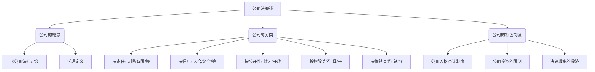
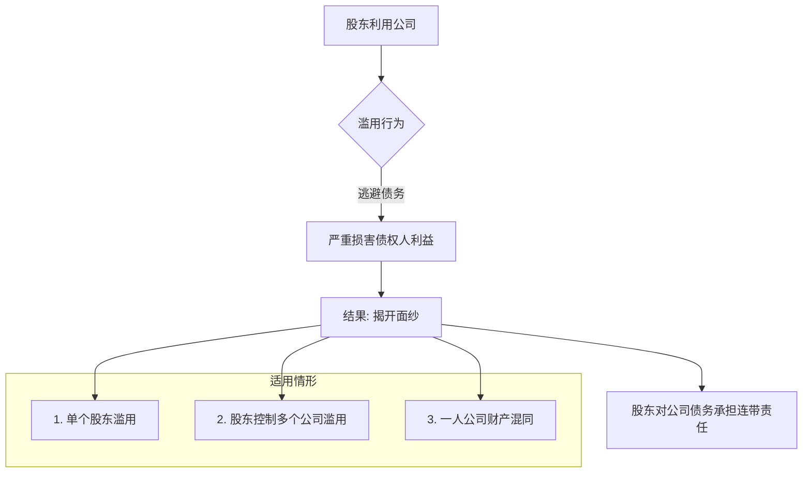

# 1 第四章 公司法
> 学习之前的小提示:
> 
> 把“公司”想象成一个为了赚钱而诞生的“机器人”。这个机器人有自己的身份（法人资格），有自己的钱（公司资产）。创造并控制这个机器人的人叫做“股东”。《公司法》就是这个机器人的“说明书”，告诉我们怎么创造它、怎么操作它、以及在它坏掉或者不用的时候怎么处理它。
## 1.1 第一节 公司法概述
### 1.1.1 知识框架 (Mermaid 图)

### 1.1.2 一、公司的概念
#### 1.1.2.1 **精髓一句话**
> 公司就是一个“独立的赚钱机器人”，它用自己的钱去还债，而它的主人（股东）只需要承担一开始投入的那么多钱的风险。
#### 1.1.2.2 **从0到专家**
**1.《公司法》上的定义**
> 原文: “本法所称公司是指依照本法在中国境内设立的有限责任公司和股份有限公司。”
> 
> “有限责任公司的股东以其认缴的出资额为限对公司承担责任”
> 
> “股份有限公司的股东以其认购的股份为限对公司承担责任。”
- **小白解读**: 这句话是法律给“公司”下的定义，非常严谨。它告诉我们，在中国，法律承认的“公司”主要就两种：**有限责任公司** 和 **股份有限公司**。
- **核心词解析**:
    - **有限责任**: 这是理解公司的关键！想象一下，你和朋友开了个奶茶店（公司），你投资了 `$1` 万元。结果奶茶店经营不善，欠了外面 `$100` 万。这个“有限责任”的意思就是，你最多只会损失你当初投的这 `$1` 万元，你家里的房子、车子、存款都跟这笔债没关系。你承担的责任是“有限的”。
    - **认缴的出资额 / 认购的股份**: 这就是你承诺要投给公司的钱。
        - **有限责任公司**里叫“出资额”，比如你认缴 `$10` 万。
        - **股份有限公司**里被切分成了更小的单位，叫做“股份”，比如你认购了 `$10` 万股，每股 `$1` 元。
    - **简单对比**: 这两种公司就像两种不同型号的机器人，核心的“有限责任”原理一样，但一些零件和组装方式不同。我们后面会详细学。
**2.学理上的定义**
> **原文**: 我国公司是指依《公司法》成立的，全部资本由股东出资构成,股东以其出资额或所持股份为限对公司承担责任,公司以其全部资产对公司债务承担责任的企业法人。
- **小白解读**: 这是学者们对法律条文的总结和提炼，更完整地描述了公司的特点。
- **核心词解析**:
    - **企业法人**: “法人”就是法律上把它当成一个“人”来看待。它有自己的名字、自己的财产、可以自己去签合同、去银行开户，甚至可以去告别人或者被别人告。它是一个独立的“法律人”，和它的创造者（股东）是分开的。
    - **公司以其全部资产对公司债务承担责任**: 这句话是“有限责任”的另一面。对于公司欠的债，公司必须用它自己**所有**的钱和东西去还。这和股东是分开的，股东不用拿自己的钱去还公司的债。
> 给8岁小朋友讲:
> 
> 想象一下，你用你的乐高积木拼了一个超酷的机器人（这就是公司）。你给了这个机器人一些游戏币（股东出资）让它去参加比赛。
> 
> - **股东有限责任**: 如果你的机器人在比赛里输了，撞坏了别人的玩具，最多就是把它的游戏币都赔光，你不需要再拿出你自己的零花钱去赔。
>     
> - **公司独立法人**: 这个机器人有自己的名字，比赛赢了奖品是它自己的，输了要赔也是用它自己的游戏币赔。它和你（它的主人）是分开的。
>     
### 1.1.3 二、公司的分类
#### 1.1.3.1 **精髓一句话**
> 就像给动物分类一样，我们可以从不同角度（比如股东责任大小、股东关系亲疏等）给公司贴上不同的标签。
#### 1.1.3.2 **从0到专家**
我们可以从很多维度来给公司“分类”，就像我们可以把人分为“男人/女人”、“大人/小孩”、“中国人/外国人”一样。
**1. 根据股东对公司承担责任的不同**
- **核心对比**: 这个分类标准是看“股东要不要为公司债务负责到底”。
- **无限公司**: 股东要对公司债务承担**无限连带责任**。意思是公司赔不起的钱，股东要拿自己的全部家当去还。这种公司风险极高，现在已经很少见了。
- **有限责任公司**: 我们前面讲过，股东只在自己出资的范围内承担责任。这是最常见的公司形式。
- **股份有限公司**: 和有限责任公司一样，也是有限责任。区别在于它的资本被分成了等额的“股份”，更容易转让和流通。
- **两合公司**: 公司里既有承担无限责任的股东，也有承担有限责任的股东。像一个“混合体”。
- **股份两合公司**: 是两合公司和股份有限公司的结合体。
> **小结**: 中国《公司法》主要规范的是**有限责任公司**和**股份有限公司**，因为它们能最好地鼓励投资、控制风险。
**2. 根据公司的信用基础不同**
- **核心对比**: 这个分类标准是看“大家信赖这个公司，是信赖它的人还是信赖它的钱”。
- **人合公司**: 信用基础是**股东个人**。大家因为信任这几个股东才和公司做生意。股东之间的关系非常紧密，像家人一样。典型的就是无限公司。
- **资合公司**: 信用基础是**公司的资本**。大家看的是公司有多少钱，而不是股东是谁。股东可以随便换，不影响公司。典型的就是股份有限公司。
- **人合兼资合公司**: 既看重人，也看重钱。典型的就是有限责任公司，它既有“人合”的特点（股东人数少，关系相对紧密），又有“资合”的特点（股东承担有限责任）。
**3. 根据公司的经营信息是否对外公开**
- **核心对比**: 这个分类标准是看“公司的财务报表等信息要不要给所有人看”。
- **封闭式公司**: 信息不公开，股东转让股权通常受限制。典型的就是有限责任公司。
- **开放式公司**: 信息必须向社会公开，股票可以自由买卖。典型的就是**上市公司**（一种特殊的股份有限公司）。
**4. 根据是否具有控股关系**
- **核心对比**: 这个分类标准是看“一个公司是不是被另一个公司控制着”。
- **母公司**: 能控制其他公司的公司。
- **子公司**: 被母公司控制的公司。子公司是独立的法人，有自己的财产，自己承担债务。
**5. 根据公司的内部管辖关系**
- **核心对比**: 这个分类标准是看“它是不是一个独立的‘人’”。
- **总公司**: 拥有和管理分公司的公司。
- **分公司**: 公司的分支机构，它**不是独立的法人**。它没有自己的财产，不能独立承担债务，它的所有责任最终都由总公司承担。比如“中国工商银行股份有限公司北京分行”，这个“北京分行”就是分公司，它出了问题，要由“中国工商银行股份有限公司”来负责。
### 1.1.4 三、公司的几种特色制度
#### 1.1.4.1 **1. 公司人格否认制度（又称“揭开公司的面纱”）**
##### 1.1.4.1.1 **知识框架 (Mermaid 图)**

##### 1.1.4.1.2 **精髓一句话**
> 公司是股东的“保护盾”，但如果你拿着盾牌去干坏事（比如躲债），法律就会把你的盾牌没收，让你自己去承担责任。
##### 1.1.4.1.3 **从0到专家**
> 原文: 《公司法》第二十三条规定：公司股东滥用公司法人独立地位和股东有限责任，逃避债务，严重损害公司债权人利益的，应当对公司债务承担连带责任。
> 
> ...只有一个股东的公司，股东不能证明公司财产独立于股东自己的财产的，应当对公司债务承担连带责任。
- **制度背景**: 正常情况下，公司和股东是分开的（公司人格独立），股东的责任是有限的（股东有限责任）。但有的股东会钻空子，把公司的钱当成自己的钱随便花，或者成立一个空壳公司来欠债，欠完债就把公司扔掉。这种行为破坏了公平。
- **“揭开公司面纱”**: 这个制度就是为了对付这种“坏股东”。法院会说：“虽然你和公司表面上是两个主体，但实际上你们已经混在一起了，你滥用了公司的独立性来耍赖。” 于是，法院会“揭开”公司这层“面纱”（或者说戳穿这个“保护盾”），直接让躲在后面的股东来还钱。
- **连带责任**: 这是一个很重的责任。意思是债权人（被欠钱的人）可以找公司还钱，也可以直接找这个滥用权力的股东还钱，甚至可以要求他们一起还钱。
- **一人公司特殊规则**: 如果公司只有一个股东，法律会特别严格。因为只有一个股东，太容易把公司和自己的财产搞混了。所以法律规定，这个股东**必须自己证明**公司的钱和自己的钱是分开的。如果证明不了（比如公司的账和自己的个人银行卡混用），那就要对公司的债务负责。这叫“举证责任倒置”。
##### 1.1.4.1.4 **例1 分析**
> **案情**: 纺织公司告杭州贸易公司。杭州贸易公司是个夫妻公司（黄某、陈某），欠了纺织公司`$65`万。执行时发现贸易公司没钱了，但它把注册资本`$50`万中的`$40`万转走去开了个新公司。
- **问题在哪？**
    1. **滥用公司法人独立地位**: 股东黄某和陈某把贸易公司的钱（这是公司的独立财产）拿去开他们自己的新公司，这就是典型的滥用股东权利，把公司的钱当成了自己的钱。
    2. **逃避债务**: 他们把钱转走，导致贸易公司变成一个空壳，无法偿还欠纺织公司的`$65`万元货款。
    3. **严重损害债权人利益**: 纺织公司的`$65`万要不回来了，利益受到了严重损害。
- 法院会怎么判？
    法院会适用“公司人格否认”制度，揭开杭州贸易公司的面纱。判决股东黄某和陈某对贸易公司欠纺织公司的$65万元债务承担连带责任。也就是说，纺织公司可以直接要求黄某和陈某用他们自己的个人财产来还这笔钱。
#### 1.1.4.2 **2. 公司投资的限制**
##### 1.1.4.2.1 **精髓一句话**
> 公司可以拿钱去投资别的公司当“老板”（股东），但不能去当那种要用自己全部身家给别人还债的“大冤种”（无限责任合伙人）。
##### 1.1.4.2.2 **从0到专家**
> **原文**: 《公司法》第十五条规定：“公司可以向其他企业投资；但是，除法律另有规定外，不得成为对所投资企业的债务承担连带责任的出资人。”
- **为什么可以投资？**: 公司存在的目的就是为了赚钱。投资是赚钱的一种方式，所以法律允许公司去投资别的企业，比如买别的公司的股票，成为别的有限责任公司的股东。
- **为什么有限制？**: 核心是为了**保护公司自己的财产安全和债权人的利益**。
    - **“对所投资企业的债务承担连带责任的出资人”** 指的是什么？主要是指普通合伙企业里的“普通合伙人”。这种合伙人需要对合伙企业的债务承担无限连带责任。
    - **风险分析**: 想象一下，A公司投资了B合伙企业。如果B企业欠了`$1`个亿，那么A公司不仅要赔光投进去的钱，还可能要用自己所有的资产去替B还债。这会让A公司自己也陷入破产的境地，A公司的股东和债权人都会血本无归。
    - **结论**: 为了防止这种“火烧连营”的风险，法律禁止公司去当这种风险极大的“无限责任出资人”。
> 关于投资决策程序:
> 
> 原文: 公司向其他企业投资或者为他人提供担保...由董事会或者股东会决议...公司为公司股东或者实际控制人提供担保的，必须经股东会决议。
- **解读**: 投资和担保都是大事，可能会让公司亏钱，所以不能由经理一个人说了算。必须由代表股东利益的**董事会**或**股东会**开会决定。
- **特殊情况**: 如果是公司给自己的大股东或者实际控制人提供担保，这里面就有利益冲突的风险（比如大股东想空手套白狼，让公司替自己背锅）。为了防止这种情况，法律规定得更严：
    1. **必须由股东会决议**（董事会说了不算）。
    2. **接受担保的那个股东不能投票**。这叫“关联股东回避表决”，是为了保证决策的公平性。
#### 1.1.4.3 **3. 股东会和董事会决议瑕疵的救济制度**
##### 1.1.4.3.1 **知识框架 (Mermaid 图)**
```mermaid
graph TD
    A[决议有毛病(瑕疵)] --> B{看毛病大小};
    B -- 大毛病:内容违法 --> C[决议无效];
    B -- 小毛病:程序或章程问题 --> D[决议可撤销];
    C --> E[自始无效,任何人可主张];
    D --> F[股东60天内去法院请求撤销];
```
##### 1.1.4.3.2 **精髓一句话**
> 公司开会做的决定，如果内容本身就犯法，那这个决定自始至终就是一张废纸（无效）；如果只是开会程序有点小毛病，那股东可以在规定时间内去法院申请把它作废（可撤销）。
##### 1.1.4.3.3 **从0到专家**
公司做的所有重大决定都是通过“股东会”或者“董事会”开会投票（也就是“决议”）来完成的。但如果这个会开得不规范，或者做的决定有问题怎么办？法律给了几种“后悔药”。
**（1）无效的决议**
- **情形**: **决议内容**违反了法律、行政法规。
- **特点**:
    - **绝对无效，自始无效**: 这个决议从它被做出来的那一刻起就是无效的，好像从来没有存在过。
    - **举例**: 股东会决议要去抢银行，或者决议生产销售假冒伪劣产品。这种内容本身就是违法的，所以决议无效。
    - **谁可以主张**: 任何人（包括公司、股东、董事、债权人等）都可以向法院主张这个决议是无效的。
**（2）可撤销的决议**
- **情形**:
    1. **内容**违反了**公司章程**（公司自己的“小宪法”）。
    2. **程序**违反了法律、行政法规或公司章程。比如：
        - 开股东会没有提前通知所有股东。
        - 投票的方式不对。
        - 召集会议的人没有资格。
- **特点**:
    - **效力待定**: 在被法院撤销前，这个决议**暂时是有效的**。
    - **只有股东能申请**: 只有公司的股东才有权去法院请求撤销。
    - **有时间限制**:
        - 一般情况：股东必须在决议做出之日起**`$60`日内**去法院起诉。过期不候！
        - “轻微瑕疵”除外：如果程序上的毛病很小，对最终结果没啥影响（比如晚通知了`$5`分钟，但人也来了，也投票了），那法院可能就不支持撤销了。
        - 未被通知的股东特殊保护：如果一个股东压根就没被通知去开会，他的`$60`天从他**知道或者应该知道**决议那天开始算。但最长不能超过决议作出之日起`$1`年。
> 给8岁小朋友讲:
> 
> 全班同学投票决定春游去哪里。
> 
> - **无效决议**: 如果大家投票决定“春游去抢劫”，这是违法的，这个决定就算全票通过也是废纸一张，老师（法院）会直接宣布它无效。
>     
> - **可撤销决议**: 班长在没有通知小明的情况下，组织大家投票决定去公园。小明知道了以后很不高兴，他可以在一定时间内（比如两天内）跟老师报告，说这次投票程序不对，要求重新投。老师可能会同意，撤销上次的投票结果。但如果小明过了好久才说，那就晚了。
>     
## 1.2 第二节 有限责任公司
### 1.2.1 知识框架 (Mermaid 图)
```
graph TD;
    A[有限责任公司] --> B(设立);
    A --> C(组织机构);
    A --> D(股权转让);
    B --> B1[设立条件];
    B --> B2[设立程序];
    B --> B3[股东出资];
    B --> B4[股东责任];
    C --> C1[股东会(权力机构)];
    C --> C2[董事会(执行机构)];
    C --> C3[经理(日常管理)];
    C --> C4[监事会(监督机构)];
    D --> D1[内部转让];
    D --> D2[外部转让(优先购买权)];
    D --> D3[异议股东回购请求权];
    D --> D4[股权继承];
```
_(接下来的内容会按照这个框架逐一展开... 由于内容非常多，我会继续为你生成后续章节的详细解读。请告诉我你是否准备好继续学习第二节的内容，或者对第一节还有没有其他问题？)_
_(由于篇幅限制，这里先展示第一节的完整内容。如果需要继续，我会按照同样的标准和格式完成后续所有章节的解读。)_