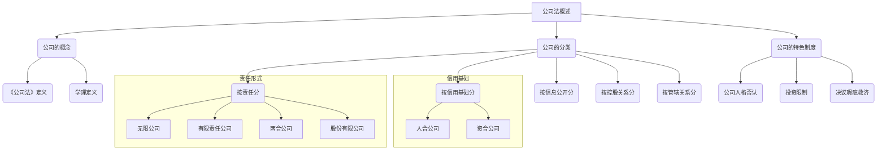

# 1 第四章 公司法

## 1.1 第一节 公司法概述

你好！欢迎来到公司法的世界。别担心，这并不复杂。想象一下，你想和朋友们一起开个店卖玩具，但又怕万一亏钱了，会把自己的房子都赔进去。公司法就是一套规则，教你怎么成立一个“独立的”玩具店（也就是公司），让这个“店”自己去赚钱、自己去承担风险，和你个人的财产分开。这样，即使店亏了，你最多也只是损失掉当初投进去的钱，不会影响到你的其他财产。

**本节精髓一句话概括：** 公司法就是创造一个叫“公司”的独立法人，让它自己去闯荡江湖，股东们在背后提供支持并承担有限的风险。

### 1.1.1 本节知识框架 (Mermaid)

### 1.1.2 一、公司的概念

#### 1.1.2.1 《公司法》上的定义

- **原文内容：** “本法所称公司是指依照本法在中国境内设立的有限责任公司和股份有限公司。”
    
    - “有限责任公司的股东以其认缴的出资额为限对公司承担责任”
        
    - “股份有限公司的股东以其认购的股份为限对公司承担责任。”
        
- **从0到1的讲解：**
    
    - **这是什么意思呢？** 法律首先告诉我们，它认可的“公司”只有两种主要形式：“有限责任公司”和“股份有限公司”。你可以把它们想象成两种不同型号的“机器人”。
        
    - **“有限责任”是核心！** 这是公司最神奇的地方。我们来举个例子给8岁小朋友听：
        
        - **情景：** 小明想开一个柠檬水摊，他投入了$10块钱买柠檬和杯子。这个柠檬水摊就是一个“小公司”。
            
        - **有限责任：** 如果柠檬水卖得不好，亏了15块，小明需要赔这15块吗？不需要！他只需要承担他最初投入的那10块钱的损失。那多出来的5块亏损，找谁要去呢？找那个“柠檬水摊”这个“小公司”要去。但“小公司”已经没钱了，所以只能自认倒霉。小明自己的其他玩具和零花钱都是安全的。
            
        - **“认缴的出资额” / “认购的股份”：** 这就是小明当初承诺要投的$10块钱。股东（公司的老板们）说好要投多少钱，他们的最大责任就是把这些钱投够，公司的其他债务就和他们个人没关系了。
            
- **精髓一句话：** 公司就像一个独立的“人”，股东的责任是有限的，亏了也只亏投入的钱，不会亏到倾家荡产。
    

#### 1.1.2.2 学理上的定义

- **原文内容：** 我国公司是指依《公司法》成立的，全部资本由股东出资构成,股东以其出资额或所持股份为限对公司承担责任,公司以其全部资产对公司债务承担责任的企业法人。
    
- **从0到1的讲解：**
    
    - 这是学者们对上面法律定义的进一步解释，更全面一点。它强调了几个关键点：
        
        1. **依法成立：** 开公司不是随便就能开的，必须按照国家规定的步骤来。
            
        2. **资本来源：** 公司的钱都来自股东。股东可以是人，也可以是其他公司。
            
        3. **双重责任分离（划重点！）**
            
            - **股东对公司：** 是“有限责任”（上面解释过了）。
                
            - **公司对外面：** 公司自己欠了别人的钱（比如供应商的货款），要用它“自己”的全部财产（比如账上的现金、仓库里的货、买的设备）来还。这叫“无限责任”。
                
        4. **企业法人：** “法人”就是法律上把它当成一个“人”来看待。它有自己的名字、自己的财产、可以自己去签合同、打官司。所以公司是一个“企业”身份的“法律上的人”。
            
- **精髓一句话：** 公司是一个用股东的钱武装起来的、能自己承担责任的“法律人”。
    

### 1.1.3 二、公司的分类

这里就像给动物分类一样，从不同角度看，公司有不同的叫法。

#### 1.1.3.1 根据股东对公司承担责任的不同

- **无限公司：** 股东要对公司债务承担无限连带责任。就是说，公司亏了，股东得拿自己的所有家当去还债。风险非常高！（现在国内很少见了）
    
- **有限责任公司：** 我们上面讲的，股东只在出资范围内负责。
    
- **两合公司：** 公司里有两种股东，一种是承担无限责任的，一种是承担有限责任的。
    
- **股份有限公司：** 和有限责任公司类似，也是有限责任。区别在于，它的资本被分成了等额的“股份”，像切蛋糕一样，大家可以买卖这些“蛋糕块”（股票）。
    
- **股份两合公司：** 结合了股份公司和两合公司的特点。
    

对比总结：

| 类型 | 责任形式 | 核心特点 |

| :--- | :--- | :--- |

| 无限公司 | 无限责任 | 风险极高，股东身家和公司绑定 |

| 有限责任公司 | 有限责任 | 人合+资合，股东人数少，股权转让不自由 |

| 股份有限公司 | 有限责任 | 纯资合，资本划分为股份，股权转让相对自由 |

| 两合公司 | 有限+无限 | 两种股东并存 |

**给小朋友讲：**

- **无限公司：** 就像你和朋友合伙做生意，亏了钱，你得把你的玩具全拿出来赔。
    
- **有限/股份公司：** 你只把你投入的那个玩具赔掉就行，其他的玩具安全。
    

#### 1.1.3.2 根据公司的信用基础不同

- **人合公司：** 更看重股东之间的信任关系。比如无限公司，大家彼此不信任怎么敢把身家性命绑在一起呢？
    
- **资合公司：** 更看重钱。我不管你是谁，只要你出钱买了股份，你就是股东。比如股份有限公司。
    
- **人合兼资合公司：** 两者都看重。比如有限责任公司，既要股东出钱，也强调股东之间的合作关系。
    
- **精髓一句话：** 人合公司看“人缘”，资合公司看“钱缘”。
    

#### 1.1.3.3 其他分类

- **封闭式 vs. 开放式：**
    
    - **封闭式：** 不对外公开财务信息，股权转让受限制（如有限责任公司）。
        
    - **开放式：** 财务信息要公开，股票可以自由买卖（如上市公司）。
        
- **母公司 vs. 子公司：**
    
    - **母公司：** 能控制另一家公司的公司（比如持有它超过一半的股份）。
        
    - **子公司：** 被母公司控制的公司。
        
    - **例子：** 腾讯是母公司，它投资的很多游戏公司就是它的子公司。
        
- **总公司 vs. 分公司：**
    
    - **总公司：** 管理中心。
        
    - **分公司：** 只是总公司派出去的一个分支机构，没有独立的法人资格，不能自己承担责任。它的所有责任都由总公司来承担。
        
    - **例子：** 你家楼下的“中国银行xx支行”就是分公司，它出了问题，是中国银行总行来负责。
        

### 1.1.4 三、公司的几种特色制度

这部分是公司法里的“独门绝技”，非常重要！

#### 1.1.4.1 公司人格否认制度（揭开公司的面纱）

- **原文内容：** 《公司法》第二十三条规定：公司股东滥用公司法人独立地位和股东有限责任，逃避债务，严重损害公司债权人利益的，应当对公司债务承担连带责任。...
    
- **从0到1的讲解：**
    
    - **这是什么意思？** 我们前面说，公司是独立的，股东责任是有限的。但如果有的股东不老实，把公司当成自己的“小金库”或者“挡箭牌”来耍赖，那法律就要出手了！“公司人格否认”就像是法官扯掉了公司独立的“面纱”，直接揪出背后的坏股东，让他对公司的债务负责。
        
    - **什么情况会触发？**
        
        1. **滥用公司独立地位：** 比如把公司的钱和自己的钱混在一起花，分不清谁是谁的。
            
        2. **滥用股东有限责任：** 成立公司就是为了恶意躲债。
            
        3. **结果：** 严重损害了债权人（借钱给公司的人）的利益。
            
    - **“连带责任”是什么？** 就是债权人可以找公司要钱，也可以直接找那个坏股东要钱，甚至可以让他们一起还钱。
        
    - **特殊情况：**
        
        - **控制多个公司：** 一个老板控制好几个公司，让它们之间互相捣腾资产来躲债，那么这几个公司要一起承担责任。
            
        - **一人公司：** 如果公司只有一个股东，这个股东必须证明公司的钱和他自己的钱是严格分开的，如果证明不了，就要对公司的债务负责。这是因为一人公司太容易出现财产混同了。
            
- **精髓一句话：** 别拿公司当挡箭牌，如果你滥用它，法律会让你个人承担责任。
    
- **案例分析 (例1：纺织公司起诉杭州贸易公司案)**
    
    - **案件背景：**
        
        - 被告是一个夫妻公司（典型的股东人数少，关系密切）。
            
        - 欠了原告$65万多的货款。
            
        - 法院判了要还钱，但执行时发现公司没钱了。
            
        - 钱去哪了？公司账上50万，被股东拿走了40万去开了个新公司。
            
    - **法律分析：**
        
        1. **滥用行为：** 股东（黄某和陈某）明显把被告公司的财产（$40万）当成了自己的财产，随意挪用去开新公司。这就是典型的“财产混同”，滥用了公司的独立地位。
            
        2. **后果：** 导致被告公司没钱还债，严重损害了原告（债权人）的利益。
            
        3. **适用法则：** 这就触发了“公司人格否认”制度。
            
        4. **结论：** 法院可以判决股东黄某和陈某对这$65万余元的债务承担“连带责任”。纺织公司可以直接向黄某和陈某个人追讨这笔钱。
            

#### 1.1.4.2 公司投资的限制

- **原文内容：** 公司可以向其他企业投资；但是，除法律另有规定外，不得成为对所投资企业的债务承担连带责任的出资人。
    
- **从0到1的讲解：**
    
    - **这是什么意思？** 公司有钱了，可以拿钱去投资别的公司，当别的公司的股东。这很正常。
        
    - **但是有个限制！** 公司不能去投资那种需要承担“无限连带责任”的企业（比如成为合伙企业的普通合伙人）。
        
    - **为什么？** 因为公司自己的股东对公司是“有限责任”，如果公司对外投资变成了“无限责任”，那风险就会无限传递给公司，最终可能损害公司和它背后股东的利益。这违背了有限责任这个核心原则。
        
    - **投资决策程序：**
        
        - **谁决定投资？** 一般由董事会或股东会决定，具体看公司章程怎么写。
            
        - **特殊情况：为股东或实际控制人提供担保。** 这种情况风险很高，因为可能存在利益输送。所以法律规定：
            
            1. **必须**由股东会决议。
                
            2. 被担保的那个股东或者被实际控制人支配的股东，在投票时要**回避**，不能参加投票。
                
            3. 决议需要**出席会议的其他股东**所持表决权的**过半数**通过。
                
- **精髓一句话：** 公司可以投资，但不能去冒无限责任的风险，并且给大股东担保要特别小心。
    

#### 1.1.4.3 股东会和董事会决议瑕疵的救济制度

- **从0到1的讲解：**
    
    - 公司的大事都是通过开会（股东会、董事会）投票决定的，这个决定就叫“决议”。但如果开会程序或者决定的内容有问题怎么办？法律提供了“后悔药”。
        
    - **（1）无效的决议：**
        
        - **情况：** 决议内容违反了国家的法律、行政法规。比如，决议大家一起去走私。
            
        - **后果：** 这个决议从一开始就是一张废纸，根本没有法律效力。任何人都可以主张它无效。
            
    - **（2）可撤销的决议：**
        
        - **情况：**
            
            - 内容违反了公司自己的“内部宪法”——公司章程。
                
            - 开会程序（召集、表决方式）违反了法律或公司章程。比如，按规定要提前15天通知开会，结果只提前了1天。
                
        - **后果：** 这个决议暂时是有效的，但受影响的股东可以在规定时间内去法院申请“撤销”它。
            
        - **“轻微瑕疵”除外：** 如果程序上的小毛病对决议结果没产生实质影响，那就不能撤销。比如，通知晚了1天，但所有人都来开会并投票了。
            
    - **（3）申请撤销的程序（时间限制）：**
        
        - **一般情况：** 从决议作出的那天起，$60天内必须去法院起诉。
            
        - **未被通知开会的股东：** 从他知道或者应该知道决议作出的那天起60天内。但是，如果决议作出已经超过1年了，那就算了，不能再撤销了（撤销权消灭）。
            
- **精髓一句话：** 公司决议如果违法就无效，如果违规可撤销，但想撤销得赶紧。
    

> 好了，以上就是第一节的全部内容。我们了解了什么是公司，它有哪些分类，以及几个非常酷的法律制度。是不是感觉对公司有了一个全新的认识？就像认识了一位新朋友，我们知道了它的姓名、性格和一些特别的习惯。接下来，我们将深入了解最常见的公司类型——有限责任公司。准备好了吗？