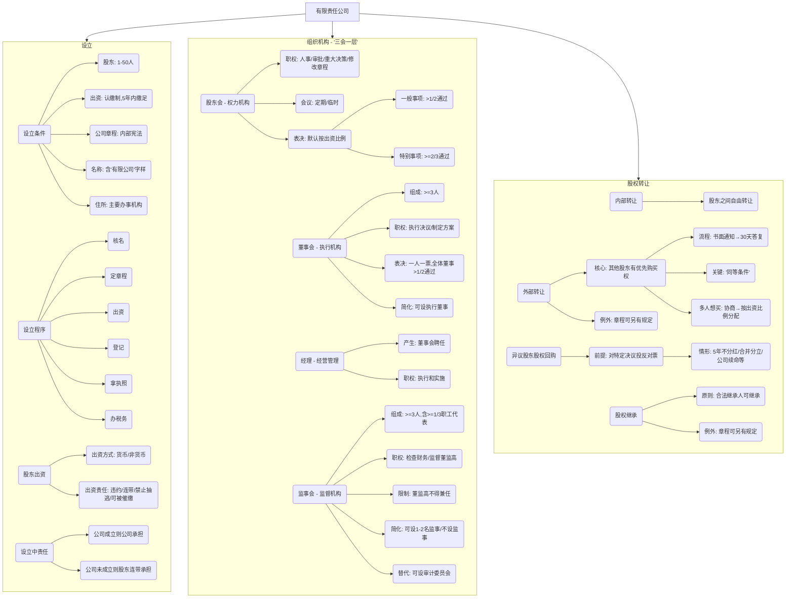

## 0.1 第二节 有限责任公司

上一节我们认识了“公司”这位新朋友，现在我们要深入了解它的一个“分身”——有限责任公司。这可以说是最受欢迎的一种公司形式了，你身边的小卖部、餐馆、创业公司，绝大多数都是有限责任公司。因为它既能让股东承担“有限责任”，设立起来又相对灵活，股东人数不多，非常适合熟人、朋友之间合伙创业。

**本节精髓一句话概括：** 有限责任公司就像一个由少数股东紧密组成的“家庭式”企业，大家关起门来商量事，想卖掉自己的“家庭股份”给外人没那么容易。

### 0.1.1 本节知识框架 (Mermaid)

### 0.1.2 一、有限责任公司的设立

想成立一家有限责任公司，就像想组建一个家庭，需要满足一些基本条件，并走完一套固定的流程。

#### 0.1.2.1 设立的条件

- **原文内容：**
    
    - （1）股东符合法定人数-----由一个以上五十个以下股东出资设立
        
    - （2）有符合公司章程规定的全体股东认缴的出资额——自公司成立之日起五年内缴足
        
    - （3）股东共同制定公司章程
        
    - （4）有公司名称和合法的组织机构——应当在公司名称中标明有限责任公司或者有限公司字样
        
    - （5）有公司住所-----主要办事机构所在地
        
- **从0到1的讲解：**
    
    1. **股东人数：** 人不能太多，也不能没有。最少1个（这种叫“一人有限责任公司”），最多50个。这体现了它的“人合性”，圈子不能太大。
        
    2. **出资额（认缴制）：** 这是个重要的概念。
        
        - **认缴：** 成立公司时，股东们先商量好，承诺每个人要投多少钱，把这个总数登记下来就行，不要求马上把钱全部掏出来。
            
        - **缴足期限：** 法律给了大家一个缓冲期，承诺的钱要在公司成立后的5年内全部交齐。
            
        - **给小朋友讲：** 你和朋友说好要凑100块买个大机器人。你们先去“登记”，说我们承诺会凑100块。这个“承诺”就是认缴。然后你们有5年的时间慢慢把各自的钱凑齐交上来。
            
    3. **公司章程：** 这是公司的“根本大法”，是股东们自己制定的“内部宪法”。里面规定了公司的名字、经营范围、股东怎么分钱、怎么开会、怎么投票等一切重要事项。所有股东都必须遵守。
        
    4. **公司名称和组织机构：** 公司得有个正式的名字，并且名字里必须带有“有限责任公司”或“有限公司”的字样，让别人一看就知道这家公司是有限责任的。同时，要按照规定建立起股东会、董事会这些管理架构。
        
    5. **公司住所：** 公司得有个“家”，也就是它的主要办公地址。这个地址是需要登记的。
        

#### 0.1.2.2 设立的程序

- **原文内容：**
    
    - （1）名称预先核准
        
    - （2）全体股东制定公司章程
        
    - （3）股东出资
        
    - （4）申请设立登记
        
    - （5）签发营业执照
        
    - （6）办理税务帐户
        
- 从0到1的讲解：
    
    这是一个标准流程，就像办身份证一样一步步来：
    
    1. **核名：** 先去市场监督管理局（工商局）的系统里查一下，你想好的公司名字是不是被人用过了，没问题就先预定下来。
        
    2. **定章程：** 全体股东坐下来，把公司的“宪法”（公司章程）商量好并签字。
        
    3. **出资：** 股东按照章程的规定，开始缴纳他们承诺的资金。
        
    4. **登记：** 把所有材料（名称核准通知、章程、股东身份证明、住所证明等）准备好，提交给市场监督管理局，申请成立公司。
        
    5. **拿执照：** 审核通过后，工商局会发给你一张“营业执照”。拿到执照的那一刻，公司就正式诞生了！它成了一个独立的“法人”。
        
    6. **后续：** 之后还要去办理税务登记、银行开户等手续，公司才能正常经营。
        

#### 0.1.2.3 股东的出资

- **原文内容：**
    
    - （1）出资方式：股东可以用货币出资，也可以用实物、知识产权、土地使用权等...作价出资...
        
    - （2）出资责任：公司成立前...承担违约责任。公司成立后...股东未...实际缴纳出资...设立时的其他股东与该股东在出资不足的范围内承担连带责任...不得抽逃出资...
        
- **从0到1的讲解：**
    
    - **（1）用什么来投资？**
        
        - **货币：** 最直接的方式，就是拿钱投资。
            
        - **非货币财产：** 也可以拿“东西”来投资，但这个“东西”必须能用钱估价，并且能转让。比如：
            
            - **实物：** 厂房、机器设备、汽车。
                
            - **知识产权：** 专利、商标。
                
            - **土地使用权** 等。
                
        - **如何操作？** 拿东西投资，不能股东自己说值多少钱就值多少钱，需要找专业的评估机构来评估作价，然后办理产权转移手续，把东西的所有权从股东个人名下转到公司名下。
            
    - **（2）不交钱的后果？**
        
        - **违约责任：** 股东承诺了出钱但没按时交，对内要向其他守信的股东承担违约责任。
            
        - **连带责任（重要！）：** 公司成立后，如果发现某个股东的出资是假的、不足的（比如用一堆破铜烂铁冒充高精尖设备），那么，**设立公司时的其他所有股东**都要和这个有问题的股东一起，对不足的部分承担“连带责任”。
            
            - **为什么？** 因为大家是一起发起公司的，有义务互相监督，确保每个人都把钱交足了。
                
        - **抽逃出资：** 公司成立后，股东把已经交了的钱又偷偷拿回去，这是绝对禁止的违法行为。
            
        - **提前催缴：** 新规定！如果公司欠了外债还不上，债权人可以要求那些还没到5年出资期限的股东，提前把他们承诺的钱交上来还债。
            

#### 0.1.2.4 股东的责任

- **原文内容：**
    
    - （1）公司设立时的股东为设立公司从事的民事活动，其法律后果由公司承受。
        
    - （2）公司未成立的，其法律后果由公司设立时的股东承受...
        
- **从0到1的讲解：**
    
    - 这说的是公司还没拿到营业执照之前，发起人为了成立公司而做的一些事情，责任谁来负？
        
    - **公司成立了：** 比如发起人为了公司租办公室、买设备，这些合同的责任，由成立后的公司来承担。
        
    - **公司没成立成功：** 那这些责任就由全体发起人自己来承担，他们要一起对这些债务负责（连带责任）。
        

### 0.1.3 二、有限责任公司的组织机构

公司是一个“法人”，但它自己不会说话、不会做事，需要一套“大脑”和“手脚”来运转，这就是它的组织机构。主要包括“三会一层”：股东会、董事会、监事会和经理层。

#### 0.1.3.1 （一）股东会

- **性质及组成：** 公司的**最高权力机构**，相当于“议会”，由**全体股东**组成。所有最重大的事情都由它说了算。
    
- **职权（权力清单）：**
    
    - **人事权：** 选举和更换董事、监事，决定他们的工资。
        
    - **审批权：** 审议批准董事会、监事会的报告，批准公司的分红方案和亏损弥补方案。
        
    - **决策权：** 对公司增加/减少注册资本、合并、分立、解散等“生死存亡”的大事作出决议。
        
    - **立法权：** 修改公司的“宪法”——公司章程。
        
- **股东会会议：**
    
    - **开会时间：** 分为**定期会议**（按章程规定，比如每年一次）和**临时会议**。
        
    - **谁能提议开临时会？**
        
        1. 代表1/10以上表决权的股东。
            
        2. 1/3以上的董事。
            
        3. 监事会。
            
    - **谁来召集和主持？** 董事会召集，董事长主持。
        
    - **如何投票？**
        
        - **议事方式：** 默认是**按照出资比例**行使表决权。谁出的钱多，谁说话分量就重。但公司章程可以约定“一人一票”。
            
        - **表决程序（划重点！）：**
            
            - **一般事项：** 必须经代表**过半数（>50%）**表决权的股东通过。
                
            - **重大事项（特别决议）：** 必须经代表**三分之二（≥2/3）**以上表决权的股东通过。这些大事包括：
                
                - 修改公司章程
                    
                - 增加或减少注册资本
                    
                - 公司合并、分立、解散
                    
                - 变更公司形式（比如有限公司想变成股份公司）
                    

#### 0.1.3.2 （二）董事会

- **性质及组成：** 股东会的**执行机构**，相当于“政府内阁”，负责公司的日常决策。
    
    - **小公司可以简化：** 股东人数少或规模小的公司，可以**不设董事会**，只设一名**执行董事**，他拥有董事会的全部职权。
        
    - **组成：** 成员为3人以上。可以有职工代表。
        
    - **任期：** 每届任期不超过3年，可以连选连任。
        
- **职权：**
    
    - **执行和报告：** 执行股东会的决议，向股东会报告工作。
        
    - **日常决策：** 决定公司的经营计划和投资方案。
        
    - **方案制定：** 制定分红方案、增资减资方案、合并分立方案等，然后提交给股东会去批准。
        
    - **人事权：** 聘任或解聘公司经理。
        
- **董事会会议：**
    
    - **表决方式：** **一人一票**。这和股东会按出资比例投票不同。
        
    - **通过门槛：** 决议必须经**全体董事的过半数（>50%）**通过。注意，是“全体董事”，而不是“出席董事”。
        

#### 0.1.3.3 （三）经理

- **性质及组成：** 负责公司**日常经营管理**的具体负责人，相当于“CEO”或“总经理”，由董事会聘任。
    
- **职权：** 主要是执行董事会的决定，组织实施具体的生产经营活动。
    

#### 0.1.3.4 （四）监事会

- **性质及组成：** 公司的**监督机构**，相当于“纪委”，负责监督董事和高级管理人员有没有乱来，有没有损害公司利益。
    
    - **小公司可以简化：** 可以不设监事会，只设一两名监事。经全体股东同意，甚至可以不设监事。
        
    - **新选择（审计委员会）：** 公司也可以在董事会下面设一个**审计委员会**来行使监事会的职权。
        
    - **组成：** 成员不得少于3人，必须有**职工代表**，且比例不低于1/3。
        
    - **谁不能当监事？** 董事、高级管理人员（经理、财务负责人等）不能兼任监事，因为自己不能监督自己。
        
- **职权：**
    
    - 检查公司财务。
        
    - 监督董事、高管的行为，对违法的可以提出罢免建议。
        
    - 提议召开临时股东会。
        
    - 代表公司起诉有问题的董事、高管。
        
- **案例分析 (例2)**
    
    - **案件背景：** A、B、C三人设立公司，草拟了一个章程。我们来当“法官”，审查一下这个章程合不合法。
        
    - **问题逐条分析：**
        
        1. **“每一股东享有同等的表决权”** - **可能没问题。** 《公司法》规定股东会默认按出资比例行使表决权，**但**“公司章程另有规定的除外”。所以，如果A、B、C三方都同意一人一票，并写进章程，这是合法的。
            
        2. **“董事会决定公司的利润分配方案和弥补亏损方案”** - **有问题！** 原文规定，董事会的职权是“**制订**”这些方案，而**“审议批准”**方案是**股东会**的权力。董事会不能越权替股东会做决定。
            
        3. **“董事会由5人组成”** - **没问题。** 有限责任公司董事会成员为三人以上即可。
            
        4. **“监事会由A、B、C各派一人组成”** - **有问题！** 这里忽略了职工代表。监事会中职工代表的比例不得低于三分之一。如果公司有职工，就必须选举职工代表进入监事会。此外，如果A、B、C三人同时也是公司的董事或高管，他们就不能兼任监事。
            
        5. **“若在经营期间三方合作有问题，可抽回出资”** - **绝对有问题！** 这是典型的“抽逃出资”，是法律明令禁止的。股东投入公司的钱就变成了公司的财产，不能随意抽回。如果合作有问题，可以通过股权转让等方式退出，但不能直接抽钱走人。
            

### 0.1.4 三、有限责任公司的股权转让

股权就是股东在公司里的权利和利益，是可以像商品一样转让的。

#### 0.1.4.1 股权的内部转让

- **原文内容：** 有限责任公司的股东之间可以相互转让其全部或者部分股权。
    
- **从0到1的讲解：**
    
    - 股东之间互相转让股权，是完全自由的。因为这只是“家庭内部”的事情，没有外人进来，不影响公司的“人合性”。比如，你有$30%的股权，可以直接卖10%$给另一个股东。
        

#### 0.1.4.2 股权的外部转让（重要！）

- **原文内容：** 股东向股东以外的人转让股权的...其他股东在同等条件下有优先购买权...
    
- **从0到1的讲解：**
    
    - **想卖给外人？没那么简单！** 因为这会引入一个新的“家庭成员”，必须征得原家庭成员的同意。法律为此设计了**“优先购买权”**制度。
        
    - **流程：**
        
        1. **书面通知：** 想卖股权的股东（A），必须用书面形式，把转让的数量、价格、支付方式等条件，告诉所有其他股东（B、C、D）。
            
        2. **其他股东表态：** 其他股东收到通知后，有30天的时间考虑。
            
            - **不回复：** 30天内不说话，视为**放弃**优先购买权。
                
            - **同意购买：** 如果B说“A卖给外人的价格是多少，我也出这个价钱买”，那么B就有权优先购买。
                
        3. **“同等条件”是关键：** 指的是价格、支付方式等主要条件都一样。
            
        4. **多人都想买怎么办？** 如果B和C都想行使优先购买权，他们俩先**协商**各自买多少。如果**协商不成**，就按照他们**各自原来的出资比例**来分配要转让的股权。
            
    - **章程可以另有规定：** 公司章程可以对股权转让设置更严格或不同的规则，比如规定“必须经过全体股东同意才能对外转让”。
        
- **案例分析 (例3)**
    
    - **案件背景：**
        
        - 股东及出资：丁40万，甲、乙、丙、戊各10万。（注意：乙后来追加投资10万，这个是另一回事，不影响原始出资比例）。总出资80万。
            
        - 丁想把30万股权，以36万价格，转让给外部人己。
            
        - 甲和乙都想以36万的价格行使优先购买权。
            
    - **法律分析：**
        
        1. 甲和乙都提出了在“同等条件”（36万价格）下购买，他们都享有优先购买权。
            
        2. 现在的问题是，这30万的股权怎么在甲和乙之间分配？
            
        3. 首先，应当由甲和乙**自行协商**。比如甲买20万，乙买10万，或者反过来，只要他们谈得拢就行。
            
        4. 如果协商不成，则要**按照转让时各自的出资比例**来行使优先购买权。这里的“出资比例”是指在**原股东内部**的比例。
            
            - 甲的出资是10万，乙的出资也是10万（追加的投资在这里不算，应按原始出资比例计算，除非章程另有规定）。他们的出资比例是 10:10，也就是 1:1。
                
            - 所以，如果协商不成，甲和乙可以各购买丁要转让股权的一半，即甲购买15万股权，乙购买15万股权。
                

#### 0.1.4.3 异议股东的股权回购

- **原文内容：** 有下列情形之一的，对股东会该项决议投反对票的股东可以请求公司按照合理的价格收购其股权...
    
- **从0到1的讲解：**
    
    - **这是什么？** 这是给“道不同不相为谋”的股东一个退出的机会。当公司发生重大变化，某个股东坚决反对，又不愿意继续待下去时，他可以要求公司用合理的价钱，把他的股权买回去。这叫**“回购请求权”**。
        
    - **触发条件（必须是投了反对票）：**
        
        1. **公司连续五年盈利但不分红：** 公司一直赚钱，但大股东就是不分钱，小股东拿不到回报，就可以要求退出。
            
        2. **公司合并、分立、转让主要财产：** 这些都是改变公司根本的“大手术”，反对的股东可以要求走人。
            
        3. **公司章程规定的营业期限届满，但股东会决议续命：** 公司本来按规定要“寿终正寝”了，但股东会开会决定修改章程让公司继续活下去，不同意的股东可以要求退出。
            
        4. **控股股东滥用权利：** 大股东欺负小股东，严重损害了小股东的利益，受害的小股东可以要求公司回购其股权。
            

#### 0.1.4.4 股权的继承

- **原文内容：** 自然人股东死亡后，其合法继承人可以继承股东资格；但是，公司章程另有规定的除外。
    
- **从0到1的讲解：**
    
    - 股东去世了，他的儿子、女儿等合法继承人，原则上可以继承他的股权，成为公司的新股东。
        
    - **但是，** 有限责任公司强调“人合性”，其他股东可能不希望一个陌生人（继承人）加入。所以，**公司章程可以对此作出限制**，比如规定“股东死亡后，其股权由其他股东购买，对继承人进行现金补偿”。