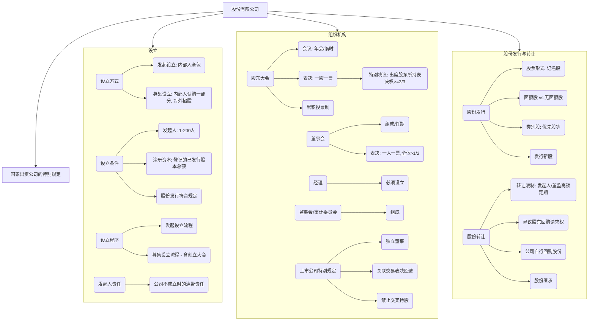

## 0.1 第三节 股份有限公司

你好！学完了有限责任公司，我们再来看看它的“兄弟”——股份有限公司。想象一下，如果说有限责任公司是几个好朋友合开的一家小店，那么股份有限公司就像一个大型的购物商场。它不再仅仅依赖于几个老板之间的信任，而是把整个“商场”的价值，切分成成千上万份标准化的“股份”，任何人只要有钱，都可以来购买一份“股份”，成为这个“商场”的小股东。这种方式能吸引到更多人的资金，所以通常规模更大。

**本节精髓一句话概括：** 股份有限公司是一个“金钱的联盟”，它把资本切成股份公开交易，股东来去自由，但公司管理规则也更加严格和标准化。

### 0.1.1 本节知识框架 (Mermaid)

### 0.1.2 一、股份有限公司的设立

#### 0.1.2.1 设立的方式

- **原文内容：** 股份有限公司的设立，可以采取发起设立或者募集设立的方式。
    
- **从0到1的讲解：**
    
    - **（1）发起设立：** 就像几个富豪朋友说：“我们自己凑钱开个大公司吧，所有股份我们自己全买了，不对外卖。” 也就是说，公司的全部股份由发起人自己认购。这种方式比较简单、私密。
        
    - **（2）募集设立：** 就像几个创始人说：“我们能力和资金有限，先自己买一部分股份，剩下的股份向社会上的其他人去卖，邀请大家一起来当股东。” 这种方式能筹集到更多资金，但程序更复杂，监管更严格。
        

#### 0.1.2.2 设立的条件

- **从0到1的讲解：** 和有限责任公司相比，条件更严格。
    
    1. **发起人：** 至少1人，最多200人。并且，需要有半数以上的发起人在中国境内有住址。
        
    2. **注册资本：** 股份有限公司的注册资本，就是它在工商局登记的已经发行出去的股份的总金额。
        
        - **发起设立：** 发起人必须认购全部股份。
            
        - **募集设立：** 发起人自己认购的股份，不能少于总股份数的 35%。
            
    3. **发起人协议和公司章程：** 发起人要签订协议，明确权利义务。要制定公司章程，如果是募集设立，章程草案需要经过**创立大会**通过。
        
    4. **名称和组织机构：** 名称中必须标明“股份有限公司”或“股份公司”字样。
        
    5. **住所：** 必须有固定的经营场所。
        

#### 0.1.2.3 设立的程序

- **（1）发起设立程序（简化版）：**
    
    1. 核名、定章程。
        
    2. 发起人认足股份并缴足股款。
        
    3. 选举董事会和监事会。
        
    4. 向工商局申请登记。
        
- **（2）募集设立程序（复杂版）：**
    
    1. 核名、发起人草拟章程。
        
    2. 发起人先认购$35%$以上的股份。
        
    3. 向证监会等机构申请，获得批准后才能向社会公开招股。
        
    4. 公告招股说明书，和证券公司、银行签协议。
        
    5. 股款募足后，必须在30天内召开**创立大会**。
        
        - **创立大会：** 由所有认购了股份的人（包括发起人和其他公众股东）参加，是决定公司能否最终成立的会议。它要通过公司章程、选举董事会和监事会等。
            
    6. 董事会在创立大会结束后30日内，向工商局申请设立登记。
        

#### 0.1.2.4 公司不能成立时发起人的责任

- **从0到1的讲解：** 如果公司最终没能成立起来，发起人要承担责任：
    
    1. 为了设立公司产生的各种费用和债务，由发起人**连带承担**。
        
    2. 已经向社会公众募集的股款，要**连本带息**（银行同期存款利息）退还给认股人，这个责任也是**连带的**。
        

### 0.1.3 二、股份有限公司的组织机构

#### 0.1.3.1 （一）股东大会

- **性质：** 依然是公司的最高权力机构。
    
- **与有限责任公司的主要区别：**
    
    - **会议召开：**
        
        - **年会：** 每年必须召开一次。
            
        - **临时会议触发条件：** 除了董事会、监事会提议外，一个关键区别是：**单独或合计持有公司$10%$以上股份的股东**请求时，就应当在两个月内召开临时股东大会。
            
    - **表决方式（核心区别）：**
        
        - **一股一票：** 这是基本原则。你持有100股，就有100票，不再是按出资比例。体现了纯粹的“资合性”。
            
        - **特别决议：** 修改章程、增减资、合并分立等重大事项，必须经**出席会议的股东所持表决权的三分之二以上**通过。注意，这里的分母是“出席会议”的股东，而不是全体股东。
            
    - **累积投票制（保护中小股东的利器）：**
        
        - **这是什么？** 在选举董事、监事时，给中小股东更多机会选出自己的代言人。
            
        - **如何操作？**
            
            - 假设公司要选7名董事，你持有100股。
                
            - 在普通投票制下，你对每个候选人最多投100票。
                
            - 在累积投票制下，你的总票数 = 100股 × 7名董事 = 700票。
                
            - 你可以把这700票**集中投给一个你支持的候选人**，也可以分配给几个人。
                
        - **案例分析 (例4):**
            
            - 公司总共100股，要选7名董事。
                
            - 股东甲（小股东）有15股，总票数 = 15×7=105 票。
                
            - 股东乙（大股东）有85股，总票数 = 85×7=595 票。
                
            - 如果没有累积投票制，乙可以轻松让他支持的7个人全部当选。
                
            - 有了累积投票制，甲可以把他的105票全部集中投给他最支持的那一个候选人，这样大大增加了这位候选人当选的机会，保证了小股东在董事会里至少有“一席之地”。
                

#### 0.1.3.2 （二）董事会

- **组成：** 董事长和副董事长由**全体董事的过半数**选举产生。
    
- **会议：** 每年至少召开**两次**会议。
    
- **表决：** 依然是**一人一票**，决议需经**全体董事的过半数**通过。
    

#### 0.1.3.3 （三）经理

- **规定：** 股份有限公司**必须**设经理，由董事会聘任或解聘。
    

#### 0.1.3.4 （四）监事会 / 审计委员会

- **监事会会议：** 每**六个月**至少召开一次会议，比有限责任公司更频繁。
    
- **审计委员会：** 同样，也可以在董事会下设审计委员会来替代监事会。
    
- **案例分析 (例5):**
    
    - **案件背景：** A公司作为发起人，拟定了募集设立股份有限公司的方案。
        
    - **问题逐条分析：**
        
        1. **“10个发起人中有6个住所地在境外的发起人”** - **有问题！** 法律要求“半数以上的发起人在中国境内有住所”。10个发起人，至少要有5个在中国境内有住所，这里只有4个，不符合规定。
            
        2. **“由于是募集设立的公司，因此所有的出资必须是货币出资”** - **有问题！** 法律没有这样规定。股份有限公司的股东同样可以用实物、知识产权等非货币财产出资，只要依法评估作价并转移产权即可。
            
        3. **“成立大会可以根据需要由发起人决定召开的时间”** - **有问题！** 法律有明确时间限制：“发起人应当自公司设立时应发行股份的股款缴足之日起30日内召开公司成立大会”。不能随意决定。
            
        4. **“公司的注册资本是6000万元，其中10个发起人认购1800万元”** - **有问题！** 发起人认购的金额是1800万，占总资本6000万的比例是 1800÷6000=30%。法律规定，募集设立时，发起人认购的股份**不得少于**35%。这里不符合规定。
            
        5. **“如果公司不能成立，发起人和缴足股款的认股人共同承担相应的法律责任”** - **有问题！** 责任主体划分错误。如果公司不能成立，法律责任应由**发起人**承担连带责任，而那些缴了钱的普通认股人是受保护方，他们不承担设立失败的责任，反而有权要求发起人连本带息退还股款。
            

### 0.1.4 三、上市公司组织机构的特别规定

上市公司是股份有限公司里的“公众人物”，它的股票在证券交易所公开交易，所以对它的监管更严。

1. **概念：** 上市公司是指其股票在证券交易所上市交易的股份有限公司。
    
2. **独立董事制度：** 上市公司董事会里必须要有一定数量的“独立董事”。他们与公司没有任何利益关系，能够站在中立、客观的角度发表意见，保护中小股东利益。
    
3. **关联交易的表决：** 如果董事会讨论的事项和某个董事有利益关系（比如公司要向这个董事开的公司采购东西），那么这个董事在投票时必须**回避**，不能投票，也不能代理其他董事投票。
    
4. **禁止交叉持股：** 上市公司的控股子公司，不能反过来再购买母公司（该上市公司）的股份。这是为了防止资本虚增和不当的内部控制。
    

### 0.1.5 四、股份有限公司股份的发行和转让

#### 0.1.5.1 股份发行

- **股票形式：** 公司发行的股份，体现为“股票”这种凭证。现在发行的都应是**记名股票**。
    
- **（1）面额股与无面额股：**
    
    - **面额股：** 股票上印有固定的金额，比如“每股1元”。发行价格可以等于或高于面额，但**不能低于面额**。高于面额的部分（溢价）要计入“资本公积金”。
        
    - **无面额股：** 股票上不记载固定金额，只表明其占公司总股本的比例。
        
- **（2）类别股：** 公司可以发行权利不同的股票，比如：
    
    - **优先股：** 在分红、分配剩余财产时，享有优先权。
        
    - **表决权差异股：** 一股的表决权可能多于或少于普通股。
        
    - **转让受限股**等。
        
- **（3）新股发行：**
    
    - 股东会可以授权董事会，在三年内决定发行不超过已发行股份$50%$的新股。
        
    - 向社会公开发行新股，必须由证券公司承销。
        

#### 0.1.5.2 股份转让

- **（1）股份转让的限制（锁定期）：**
    
    - **发起人股份：** 公司成立后**一年内**不得转让。如果是上市公司，自上市之日起**一年内**不得转让。
        
    - **董事、监事、高级管理人员（董监高）：**
        
        - 任职期间，每年转让的股份不得超过其所持有本公司股份总数的 25%。
            
        - 离职后**半年内**，不得转让其所持有的本公司股份。
            
- **（2）异议股东的股权回购：**
    
    - 与有限责任公司类似，当公司合并、分立、转让主要财产或连续五年盈利不分红时，投反对票的股东可以要求公司回购其股份。但这条规定**不适用**于公开发行股份的公司（上市公司）。因为上市公司的股东如果不满意，可以随时在二级市场把股票卖掉，退出很方便。
        
- **（3）公司股份的自行回购：**
    
    - 原则上，公司**不得收购本公司的股份**（即“库存股”）。
        
    - **例外情况：**
        
        - 为了减少注册资本；
            
        - 与持有本公司股份的其他公司合并；
            
        - 用于员工持股计划或股权激励；
            
        - 用于转换可转换公司债券；
            
        - 上市公司为维护公司价值及股东权益所必需（比如股价过低时进行回购稳定股价）。
            
- **（4）股份的继承：**
    
    - 和有限责任公司一样，自然人股东死亡后，其合法继承人可以继承股东资格。但是，如果公司章程对股份转让有限制，则要遵守章程的规定。
        

### 0.1.6 五、国家出资公司组织机构的特别规定

- **定义：** 指国家作为出资人的国有独资公司、国有资本控股公司。
    
- **出资人职责：** 由国务院或地方政府（或其授权的国资委等机构）代表国家行使股东权利。
    
- **特别之处：**
    
    - **股东会：** 国有独资公司不设股东会，由履行出资人职责的机构行使股东会职权。但一些核心权力，如制定修改章程、合并分立、增减资、分配利润等，必须由该机构自己决定，不能授权给公司董事会。
        
    - **董事会：** 国有独资公司的董事会，**过半数**成员应当为**外部董事**，以加强监督。
        
    - **兼职禁止：** 董事、高管未经出资人机构同意，不得在其他企业兼职。