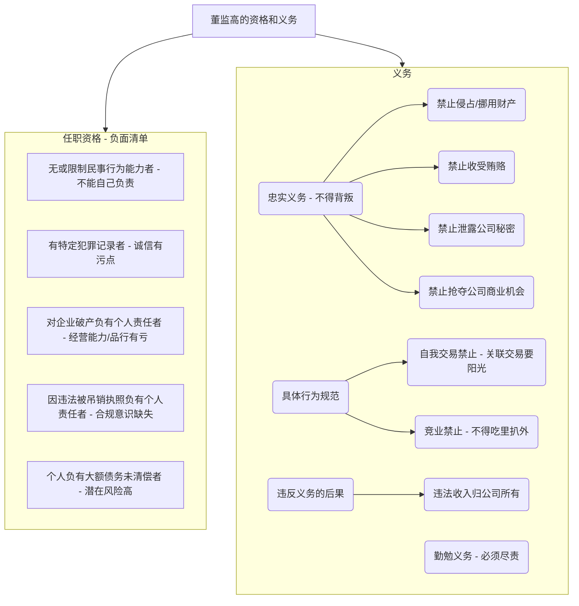

## 0.1 第四节 董事、监事、高级管理人员的资格和义务

你好！把公司比作一艘大船，董事、监事、高级管理人员（比如总经理、财务总监）就是这艘船的船长、大副和瞭望员。他们决定船往哪里开，如何应对风浪。正因为他们的角色如此重要，所以法律对什么样的人才能当“船长”，以及“船长”必须做什么、不能做什么，都有着非常严格的规定。这一节就是“船长”们的行为准则手册。

**本节精髓一句话概括：** 当公司高管，有门槛、有禁区，你必须是个清白、诚信、有能力的人，并且要全心全意为公司服务，绝不能损公肥私。

### 0.1.1 本节知识框架 (Mermaid)

### 0.1.2 一、董事、监事、高级管理人员的任职资格

法律没有规定当高管需要什么学历、什么经验，但它规定了一个“负面清单”，只要你沾上以下任何一条，就不能担任公司的董事、监事或高级管理人员。这就像机场安检，有些东西是绝对不能带上飞机的。

- **原文内容及从0到1的讲解：**
    
    1. **“无民事行为能力或者限制民事行为能力”**
        
        - **讲解：** 这主要指未成年人或者不能辨认自己行为的精神病人。
            
        - **为什么？** 公司的决策复杂且责任重大，一个连自己行为都不能完全负责的人，怎么能去管理一个公司、对全体股东负责呢？
            
        - **给小朋友讲：** 你不能让一个3岁的小宝宝来当你们小队的队长，因为他可能还分不清什么是对的、什么是错的。
            
    2. **“因贪污、贿赂、侵占财产、挪用财产或者破坏社会主义市场经济秩序，被判处刑罚...执行期满未逾五年...”**
        
        - **讲解：** 只要犯过和“钱”、“经济秩序”有关的罪，哪怕刑满释放了，也得再等上5年“观察期”，才能有资格当高管。
            
        - **为什么？** 这类犯罪直接反映了一个人的诚信问题。让一个有过“不诚实”前科的人去管钱、管公司，风险太高了，股东们不放心。
            
        - **给小朋友讲：** 如果一个小朋友以前有过偷拿别人玩具的记录，那大家选举“玩具保管员”的时候，肯定会对他特别小心，需要他用很长时间证明自己改好了才行。
            
    3. **“担任破产清算的公司、企业的董事或者厂长、经理，对该公司、企业的破产负有个人责任的，自...完结之日起未逾三年”**
        
        - **讲解：** 如果你之前管理的一家公司破产了，并且法院认定你对这个破产有不可推卸的个人责任（比如因为你的胡乱决策），那么从那家公司破产程序走完开始算，你3年内不能在新的公司当高管。
            
        - **为什么？** 这既是对你过去经营失败的一种惩罚，也是为了保护新公司的股东，避免他们选了一个曾把企业“开翻船”的人当船长。
            
    4. **“担任因违法被吊销营业执照、责令关闭的公司、企业的法定代表人，并负有个人责任的，自...吊销之日起未逾三年”**
        
        - **讲解：** 和上一条类似，如果你之前是某个公司的法定代表人，这家公司因为违法经营被政府取缔了（吊销执照），并且你对此负有个人责任，那你也需要被“禁赛”3年。
            
        - **为什么？** 这表明你缺乏对法律的敬畏和合规经营的意识，需要“冷静”一段时间。
            
    5. **“个人因所负数额较大债务到期未清偿被人民法院列为失信被执行人”**
        
        - **讲解：** 这就是我们常说的“老赖”。如果你欠了别人很多钱，法院判了你还，你却赖着不还，被列入了黑名单，那你也没资格当公司高管。
            
        - **为什么？** 一个连自己债务都不清偿的人，诚信已经破产。同时，一个身负巨债的人，很可能会动歪脑筋，利用职务之便去挪用公司的钱来还自己的债，这对公司是巨大的潜在风险。
            

### 0.1.3 二、董事、监事、高级管理人员的义务

拿到了“船长”资格证，就必须遵守“船长”的守则。这些义务的核心，可以归纳为两大义务：**忠实义务**和**勤勉义务**。

- **忠实义务 (Duty of Loyalty)：** 核心是“忠诚”，你必须把公司的利益放在第一位，不能背叛公司。
    
- **勤勉义务 (Duty of Care)：** 核心是“勤奋尽责”，你必须像一个正常、谨慎的人在处理自己事务一样，来处理公司的事务，不能懒惰、马虎。
    

法律条文主要围绕这两个核心，规定了一些具体的“能”与“不能”。

#### 0.1.3.1 董事、监事、高级管理人员不得实施的行为（忠实义务的具体体现）

- **（1）侵占公司财产、挪用公司资金：** 这是最严重的背信行为。把公司的钱当成自己的钱，是绝对禁止的。
    
- **（2）将公司资金以其个人名义或者以其他个人名义开立账户存储：** 公司的钱必须放在公司的账户里，公私分明。
    
- **（3）利用职权贿赂或者收受其他非法收入：** 不能利用手中的权力为自己谋取不法利益。
    
- **（4）接受他人与公司交易的佣金归为己有：** 比如公司采购，供应商给了回扣，这个回扣应该归公司，你不能自己揣腰包。
    
- **（5）擅自披露公司秘密：** 公司的商业秘密（如客户名单、技术方案）是公司的重要资产，不能泄露。
    
- **（6）利用职务便利为自己或者他人谋取属于公司的商业机会：**
    
    - **讲解：** 这是“机会侵占”禁止。比如，你作为公司的采购经理，得知有一批非常便宜的原材料要出售，这是一个属于公司的赚钱机会。你不能自己偷偷跑去把这批货买了，然后高价卖给公司或其他公司来赚钱。你必须先把这个机会报告给公司。
        
    - **给小朋友讲：** 老师说下午要发糖果，让你去办公室拿。你知道了这个消息，不能自己先跑去把糖果都拿走分给你的好朋友，你应该把糖果拿回来，由老师决定怎么分给全班同学。
        

#### 0.1.3.2 自我交易禁止

- **原文内容：** 董事、监事、高级管理人员，直接或者间接与本公司订立合同或者进行交易，应当就...事项向董事会或者股东会报告，并按照公司章程的规定经董事会或者股东会决议通过。
    
- **从0到1的讲解：**
    
    - **这是什么？** 就是高管不能“左手和右手做生意”。比如，你是一家公司的董事，同时你自己又开了一家提供原材料的公司。现在，你想让你管理的公司，从你自己开的公司采购原材料。
        
    - **可以吗？** 可以，但有严格的程序要求，不能自己决定。
        
    - **程序：** 你必须**主动报告**这件事给董事会或股东会，把所有情况都说清楚，然后由**没有利害关系**的其他董事或股东来投票决定，到底要不要做这笔生意。整个过程必须阳光透明。
        
    - **为什么？** 防止你利用权力，制定一个对自己有利、但对公司不利的交易（比如高价采购），损害公司和其他股东的利益。
        

#### 0.1.3.3 竞业禁止

- **原文内容：** ...未向董事会或者股东会报告，并...经...决议通过，不得自营或者为他人经营与其任职公司同类的业务。
    
- **从0到1的讲解：**
    
    - **这是什么？** 就是禁止你“吃着碗里，看着锅里”。你在A公司当高管，就不能自己再去开一家和A公司有竞争关系的B公司，也不能到B公司去当高管。
        
    - **可以吗？** 同样，原则上不行。但如果你向公司**报告**了，并且获得了公司董事会或股东会的**批准**，那就可以。
        
    - **为什么？** 防止你利用在A公司获得的商业秘密、客户资源去帮助B公司来和A公司竞争，这是一种严重的背叛行为。
        
    - **给小朋友讲：** 你是红队的队长，就不能同时又跑去给蓝队当教练，教他们怎么打败红队。
        
- **违反义务的后果：**
    
    - 如果你违反了上述规定，比如通过自我交易或者竞业禁止赚了钱，那么这些**违法所得的收入，必须全部上交归公司所有**。