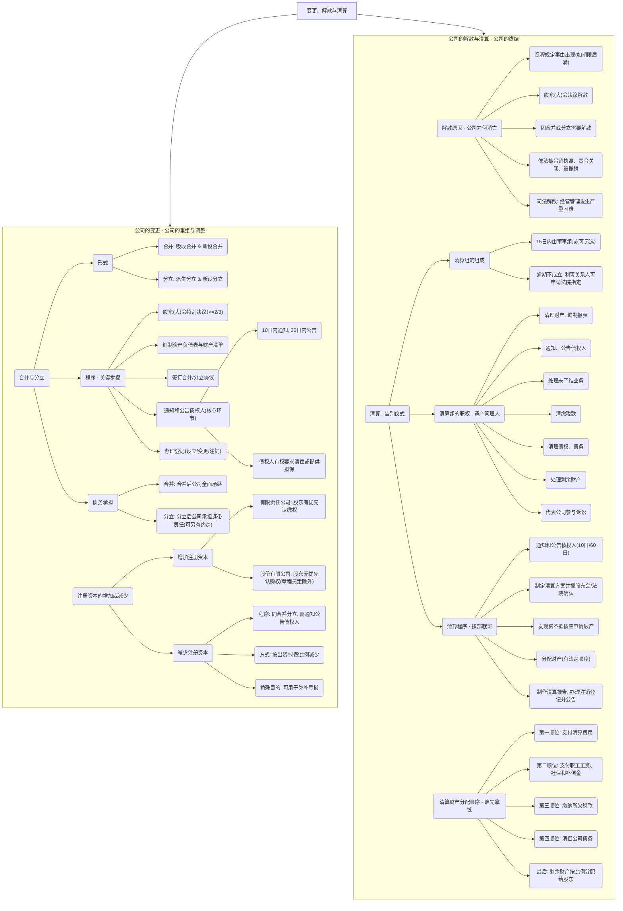

## 0.1 第六节 公司的变更、解散与清算

你好！欢迎来到公司法学习的最后一章。我们已经见证了公司的诞生（设立）、成长（运营），现在我们要探讨它生命中的重大转折与最终的归宿。公司不是一成不变的，它会通过合并变得更强大，通过分立变得更灵活。有时候它也需要“增肌”（增加资本）或“减脂”（减少资本）。但天下没有不散的筵席，当公司无法再经营下去时，它也需要一个合法、有序的方式来结束自己的生命，这就是解散与清算。

**本节精髓一句话概括：** 公司的一生会经历各种变化，无论是变身、增减体重，还是最终的“寿终正寝”，都必须严格按照法律程序来，尤其是要优先保护好债权人的利益。

### 0.1.1 本节知识框架 (Mermaid)

### 0.1.2 一、公司的合并与分立

#### 0.1.2.1 合并与分立的形式

- **（1）合并：两个或多个公司合成一个。**
    
    - **吸收合并：** A公司把B公司“吃掉”，B公司消失，A公司继续存在。就像大鱼吃小鱼。
        
    - **新设合并：** A公司和B公司都消失，合并成一个新的C公司。就像两个面团揉成一个新面团。
        
- **（2）分立：一个公司分成两个或多个。**
    
    - **派生分立：** A公司还在，但它分出一部分业务和财产，成立了一个新的B公司。就像壁虎断尾，尾巴变成了新的个体，但壁虎自己还活着。
        
    - **新设分立：** A公司整个解散，它的全部财产被分成了B公司和C公司。就像把一个大蛋糕切成两块，原来的大蛋糕没了。
        

#### 0.1.2.2 合并与分立的程序

这是一个非常重大的事项，程序很严格，核心是为了保护不愿意合并分立的股东以及公司的债权人。

1. **股东（大）会进行表决：** 这是**特别决议事项**，必须经代表**三分之二以上**表决权的股东通过。
    
2. **编制资产负债表和财产清单：** 把公司的家底盘点清楚。
    
3. **签订合并与分立的协议：** 相关各方把具体方案用合同形式确定下来。
    
4. **通知和公告债权人（最关键的程序！）：**
    
    - **时间要求：** 公司必须在做出决议后的**10日内**书面通知已知的债权人，并且在**30日内**在报纸上进行公告（让那些公司不知道的债权人也能看到）。
        
    - **债权人的权利：** 债权人收到通知后（或看到公告后）的一段时间内（30天/45天），如果他们觉得公司的合并或分立会影响到自己债权的安全，他们**有权要求公司立即清偿债务，或者提供相应的担保**。
        
    - **为什么？** 比如，你借钱给实力雄厚的A公司，现在它要分立成实力较弱的B和C公司，你的债权风险就变大了，所以法律给你这个权利来保护自己。
        
5. **办理登记：** 到工商局办理相关的设立、变更或注销登记手续。
    

#### 0.1.2.3 债务的承担

- **公司合并：** 简单明了，合并前各方的债权债务，由合并后继续存在的公司或新设立的公司**全部继承**。
    
- **公司分立：** 分立前的债务，由分立后的公司承担**连带责任**。也就是说，债权人可以找分立后的任何一家公司要求偿还全部债务。当然，如果公司在分立前已经和债权人就债务如何分割达成了书面协议，那就按协议来。
    

### 0.1.3 二、注册资本的增加或减少

#### 0.1.3.1 注册资本的增加

- **有限责任公司：** 增资时，原股东在同等条件下，有权**优先按照实缴的出资比例**来认缴新增的资本。这和股权转让的优先购买权类似，是为了保持原股东的持股比例不被稀释。当然，全体股东可以约定不按这个比例来。
    
- **股份有限公司：** 增发新股时，原股东**默认不享有优先认购权**。因为股份公司更强调资本的开放性。但是，公司章程或股东会决议可以特别规定股东享有优先认购权。
    

#### 0.1.3.2 注册资本的减少

- **减资比增资要麻烦得多！** 因为减少资本意味着公司对外承担责任的财产减少了，对债权人不利。
    
- **程序：** 必须履行和公司合并、分立一样的**通知和公告债权人的程序**，给予债权人要求清偿或提供担保的权利。
    
- **方式：** 应当按照股东的出资或持股比例，相应地减少大家的股份。
    
- **特殊目的：** 当公司用完所有公积金还弥补不了亏损时，可以通过减资的方式来弥补亏损。
    

### 0.1.4 三、公司的解散与清算

#### 0.1.4.1 公司解散的原因

什么情况下公司会走到生命的尽头？

1. **公司章程规定的营业期限届满**或出现其他解散事由。
    
2. **股东会决议解散**：股东们自己开会决定不干了。
    
3. **因公司合并或者分立需要解散**。
    
4. **依法被吊销营业执照、责令关闭或者被撤销**：被政府强制关闭。
    
5. **司法解散**：当公司经营管理发生**严重困难**，股东之间陷入僵局（比如吵得不可开交，啥也决定不了），继续下去只会让股东的利益受到更大损失时，持有公司全部股东表决权**$10%$以上**的股东，可以去请求人民法院强制解散公司。
    

#### 0.1.4.2 公司的清算

公司决定解散后，不能一关门就了事，必须进行“清算”，也就是把公司的所有财产、债权债务都清理干净，办一个合法的“告别仪式”。

- **（1）清算组的组成**
    
    - 在解散事由出现之日起**15日内**，应当成立清算组。
        
    - 清算组一般由**董事**组成，但公司章程或股东会可以另选他人。
        
    - 如果公司到期不成立清算组，债权人等利害关系人可以**申请人民法院指定**人员组成清算组。
        
- **（2）清算组的职权**
    
    - 清算组就像公司的“遗产管理人”，负责处理公司所有善后事宜，包括清理财产、处理未了结的业务、收取债权、清偿债务、代表公司打官司等。
        
- **（3）清算的程序**
    
    1. **通知和公告债权人：** 清算组成立后10日内通知，60日内公告，让所有债权人来申报债权。
        
    2. **制定清算方案：** 清理完财产后，制定方案并报股东会或法院确认。
        
    3. **申请破产：** 如果清算中发现公司的全部财产还不够还债（资不抵债），清算组必须立即停止清算，转而向法院**申请破产清算**。
        
    4. **分配财产：** 按照下面的法定顺序进行分配。
        
    5. **注销登记：** 清算结束后，制作清算报告，去工商局申请注销公司登记，并进行公告。至此，公司才在法律上正式消亡。
        
- （4）清算财产的分配顺序（划重点！）
    
    公司剩下的财产，必须严格按照以下顺序来支付，顺序不能颠倒：
    
    1. **支付清算费用：** 包括清算组成员的报酬、公告费、诉讼费等。
        
    2. **支付职工的工资、社会保险费用和法定补偿金。**
        
    3. **缴纳所欠税款。**
        
    4. **清偿公司债务：** 偿还欠供应商、银行等的普通债务。
        
    5. **分配给股东：** 如果以上都付清了还有剩余，这部分财产才能按照股东的出资或持股比例分配给股东。
        

> 恭喜你！到这里，我们已经完成了《公司法》这一整章的学习。从公司的诞生到消亡，从内部治理到外部关系，我们一起系统地梳理了所有核心知识点。希望这段旅程让你对公司法有了全新的、深刻的理解。法律的世界既严谨又充满智慧，它为商业活动提供了坚实的框架和保障。相信现在的你，已经具备了公司法的基础知识体系，不再是“小白”了！