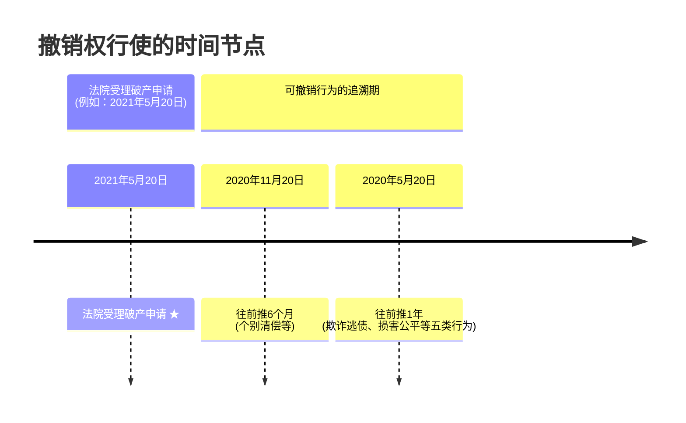

好的，我们来一起学习破产法中的撤销权。这部分内容就像是给破产程序装上了一个“后悔药”和“纠错器”，防止债务人在破产前耍小聪明损害大家的利益。

# 1 第八章 破产法
## 1.1 第四节 债务人财产
### 1.1.1 （三）撤销权

> [!TIP] 通俗概括
> 撤销权，简单来说，就是破产程序开始前的一段时间里，如果债务人做了一些不公平或者想逃债的行为（比如偷偷把财产送人、贱卖财产、或者只还个别“关系好”的人的钱），管理人（代表所有债权人利益的人）可以向法院申请，把这些行为“撤了”，把财产追回来，公平地分给大家。

---

#### 1.1.1.1 为什么要学习撤销权？
很多时候，企业在感觉自己快不行了（要破产了）的时候，可能会动歪心思，比如把值钱的东西偷偷转移给亲戚朋友，或者只还那些跟自己关系好的人的钱，这样一来，等到真正破产清算的时候，留给其他债权人的财产就少了，这对其他债权人非常不公平。撤销权就是法律赋予管理人的一种武器，来纠正这些不公平的行为。

>[!NOTE] 提示：与《合同法》撤销权的对比
>咱们今天学的是破产法里的撤销权。以后学习《合同法》的时候，还会遇到一个撤销权（在合同保全部分，与代位权并列）。到时候你可以把这两个撤销权对比一下，看看它们的相同点和不同点。现在先在这里留个念想。

---

#### 1.1.1.2 撤销权的概念与构成要件

撤销权是指**管理人**对债务人在**破产案件受理前的法定期间内**所进行的**欺诈逃债**或**损害公平清偿**的行为，有权**申请法院**来撤销并追回财产的权利。

这句话有点长，我们把它拆开来看，就像玩乐高积木一样，一块一块拼起来：

*   **谁享有撤销权？ (Who)**
    *   **管理人 (Administrator)**：这是非常重要的考点！不是债务人自己，也不是单个债权人。管理人是法院指定的，负责管理债务人财产、代表全体债权人利益的人。
    *   *为什么是管理人呢？* 因为管理人是中立的，代表所有债权人的整体利益，他来行使这个权利最公平。如果让债务人自己撤销，他可能不愿意；如果让某个债权人撤销，他可能会只顾自己的利益。

*   **针对什么时间内的行为？ (When)**
    *   **破产案件受理前的法定期间内**：这个“法定期间”很重要，不是无限期的。法律规定了两个时间段：
        1.  **受理破产申请前一年内**
        2.  **受理破产申请前六个月内**
    *   *为什么要有时间限制？* 如果时间太长，很多交易都会变得不稳定，大家做生意会没有安全感，不知道什么时候自己收到的钱会被追回去。所以法律划定了一个合理的追溯期。

*   **针对什么样的行为？ (What kind of acts)**
    *   **欺诈逃债或损害公平清偿的行为**：这是一个总的说法。具体哪些行为属于这两类，法律有明确规定。我们后面会详细学习在“一年内”和“六个月内”分别有哪些具体行为可以被撤销。

*   **怎么做？ (How)**
    *   **有权申请法院撤销**：管理人不能自己说撤销就撤销，他需要向法院提出申请，由法院来裁定是否撤销。
    *   **追回财产**：一旦法院裁定撤销，之前被不当处置的财产就要被追回来，重新纳入债务人财产，用于对所有债权人的公平清偿。

> [!IMPORTANT] 记住3W拆解法
> 学习法律条文或概念时，可以尝试用 Who (谁)、When (何时)、What (何事/何物)、Why (为何)、How (如何) 这些问题来帮助理解和记忆。

##### 1.1.1.2.1 图解撤销权的时间轴

为了更直观地理解这个“法定期间”，我们画一个时间轴：

*   假设法院在 `2021年5月20日` 受理了破产申请。
*   那么，从 `2020年5月20日` 到 `2021年5月20日` 这**一年内**发生的一些特定行为，管理人可以申请撤销。
*   另外，从 `2020年11月20日` 到 `2021年5月20日` 这**六个月内**发生的另一些特定行为（主要是针对“个别清偿”），管理人也可以申请撤销。

你会发现，这两个时间段有一部分是重合的（后六个月）。没关系，具体适用哪个规则，要看行为的性质。

##### 1.1.1.2.2 为什么要有撤销权？——打击“假破产、真逃债”

> [!INFO] 通俗概括
> 设立撤销权，主要是为了防止债务人知道自己快不行了，在破产前赶紧把财产“处理”掉，比如送给亲戚、低价卖给朋友，或者只还给自己想还的人，这样就坑了其他债权人。撤销权就是要把这些不公平的“小动作”给纠正过来。

债务人通常对自己公司的财务状况最了解。当他预感到公司可能要破产时，可能会提前做一些“安排”：
*   把财产无偿转让给关联方。
*   以极低的价格把优质资产卖掉。
*   提前偿还某些“关系户”债权人的债务。
*   为原本没有担保的债务突然提供贵重的财产担保。
*   故意放弃自己对外的到期债权（本来可以收回来的钱不要了）。

这些行为都会导致债务人的总财产减少，最终损害全体债权人的利益。法律设立撤销权，就是为了把这些在破产程序正式开始前一定期限内发生的、意图减少破产财产或造成不公平清偿的行为“拉回来”，恢复财产原状，确保所有债权人能得到更公平的对待。

---

#### 1.1.1.3 可撤销行为的具体情形

##### 1.1.1.3.1 (1) 受理破产申请前一年内的可撤销行为

> [!TIP] 通俗概括
> 破产前一年内，如果债务人做了以下五种“亏本买卖”或者“偏心”的事，管理人可以请求法院撤销。

法律规定，在人民法院受理破产申请前**一年内**，涉及债务人财产的下列行为，管理人有权请求人民法院予以撤销：

为了方便记忆，有个口诀：**“前期无价宝”**。
（想象一下，前妻虽然分开了，但回想起来还是无价之宝，所以不舍得“撤销”她。用这个不舍得撤销的“前期无价宝”来反向记忆需要被撤销的情形。）

我们来逐个解释“前期无价宝”代表什么：

*   **无：无偿转让财产** (对应法律条文第一种情形)
    *   *通俗解释*：白送东西给别人。比如，公司快破产了，老板把公司名下的汽车无偿过户给自己的小舅子。
    *   *为什么可撤销*：这明显减少了公司的财产，损害了其他债权人的利益。
    *   *例子*：A公司预计要破产，在破产申请受理前10个月，将其拥有的一套价值$100万的房产无偿赠与其法定代表人的亲属B。管理人发现后，可请求法院撤销该赠与行为，将房产追回。

*   **价：以明显不合理的价格进行交易** (对应法律条文第二种情形)
    *   *通俗解释*：贱卖或贵买。比如，公司把价值$100万的设备以$10万的价格卖给关联公司，或者花$200万买一个只值$50万的东西。
    *   *什么是“明显不合理”？* 司法解释有标准：
        *   **高价买入**：交易价格高于市场价格的 $30\%$ (记住“高三”)。
        *   **低价卖出**：交易价格低于市场价格的 $70\%$ (记住“低七”)。
        *   *注意*：不仅仅是价格，如果付款条件、付款期限等其他交易条件明显不合理，也可能被认定。
    *   *例子*：B公司在破产申请受理前8个月，将其一批库存商品（市场价$50万元）以$10万元的价格出售给C公司，C公司是B公司股东控制的另一家企业。管理人可请求法院撤销此交易。
    *   >[!NOTE] 提示：与《合同法》撤销权的对比
    >   《合同法》中显失公平的合同也可以被撤销，这里的“明显不合理价格交易”与之类似，但破产法有更具体的判断标准和更强的保护债权人的目的。

*   **宝：对没有财产担保的债务提供财产担保** (对应法律条文第三种情形)
    *   *通俗解释*：本来借钱的时候没说要抵押，现在快破产了，突然给这笔借款加上了抵押物。
    *   *为什么可撤销*：这叫“补充担保”。本来这个债权人是一般债权人，大家排队分粥喝。你突然给他加了个“小灶”（担保物），他就有了优先受偿权，对其他没有担保的债权人就不公平了。
    *   *核心在于“补充”*：如果是在借款发生**同时**提供担保，那是正常的。这里特指对**原来没有**担保的债务，在破产前一年内**事后追加**的担保。
    *   *例子*：D公司在破产申请受理前5个月，为其一年前向E银行借入的一笔$200万元信用贷款（原无担保）追加提供了其名下一处厂房作为抵押。管理人可请求法院撤销该抵押行为。

*   **前：对未到期的债务提前清偿** (对应法律条文第四种情形)
    *   *通俗解释*：欠的钱还没到还款日，就急急忙忙提前还了。
    *   *什么是“未到期”？* 这里的“未到期”特指 **在破产申请受理后才到期** 的债务。
    *   *为什么可撤销*：一般人都会想晚点还钱，钱在手里多待一天是一天（享受期限利益）。债务人反常地提前还，而且是还那些本应在破产程序开始后才到期的债务，很可能是想在破产前“照顾”某些债权人。
    *   *例子*：F公司的破产申请于 `2021年5月20日` 受理。该公司有一笔债务本应于 `2021年8月1日` 到期。但在 `2021年1月10日` (受理前一年内，且债务在受理后到期)，F公司就提前清偿了这笔债务。管理人可请求法院撤销该清偿行为。
    *   *思考*：如果债务是在破产申请受理前就到期了，那么在受理前一年内清偿，适用这个规则吗？不完全是，那就要看是否属于下面要讲的“六个月内个别清偿”的情况了。这个我们稍后会专门总结。

*   **期：放弃债权** (对应法律条文第五种情形)
    *   *通俗解释*：别人欠公司的钱，公司说“你不用还了”。
    *   *为什么可撤销*：这跟“无偿转让财产”性质类似，都是直接减少了公司的财产，损害了全体债权人的利益。
    *   *例子*：G公司在破产申请受理前3个月，对其客户H公司尚欠的$30万元货款表示放弃追讨。管理人可请求法院撤销G公司的这一放弃债权行为，并向H公司追讨该笔款项。

**关于“放弃债权”的补充说明 (诉讼时效问题)：**
1.  **诉讼时效中断**：从法院受理破产申请之日起，债务人对外享有债权的诉讼时效中断。这对债权人是有利的，因为时效中断后会重新计算，债务人（管理人）有更充足的时间去追讨。
2.  **视为放弃债权的情形与时效重新计算**：如果债务人没有正当理由，在该破产申请受理前一年内，对其到期的债权没有及时行使权利，导致该债权超过了诉讼时效（本来能要回来的钱，因为拖延不要，过时效了），那么从法院受理破产申请之日起，这个债权的诉讼时效重新计算。这实际上是给了管理人一个“复活”这些债权的机会，把钱追回来。

> [!WARNING] 重要注意点：管理人不作为时，债权人的补救措施
> 如果管理人对于上述“**期、无、价**”三种行为（即放弃债权、无偿转让财产、以明显不合理价格交易）没有去请求法院撤销，那么**债权人**可以依据**《民法典》中关于债权人撤销权的规定**，自己提起诉讼，请求法院撤销债务人的这些行为。追回的财产归入债务人财产。
> *   **谁能告？** 债权人。
> *   **依据什么法律？** 《民法典》（不是《破产法》）。
> *   **针对哪几种行为？** 仅限“期、无、价”这三种，不包括“提前清偿未到期债务”和“为无担保债务提供担保”。
> *   *为什么有这个规定？* 防止管理人失职或疏忽，给债权人多一道保障。

##### 1.1.1.3.2 (2) 受理破产申请前六个月内的可撤销行为（针对个别清偿）

> [!TIP] 通俗概括
> 破产前半年，如果债务人已经明显不行了（符合破产条件了），却还在“挑人”还钱，这种“偏心”的还款行为也可能被撤销。

法律规定，在人民法院受理破产申请前**六个月内**，债务人符合下列情形（即已经出现**破产原因**），仍对**个别债权人**进行清偿的，管理人有权请求人民法院予以撤销。但是，个别清偿使债务人财产受益的除外（这个除外情况我们后面讲“禁止撤销的个别清偿”时细说）。

*   **前提条件（破产原因）**：债务人必须已经处于以下一种状态：
    1.  **不能清偿到期债务，并且资产不足以清偿全部债务（即“资不抵债”）**。
    2.  **不能清偿到期债务，并且明显缺乏清偿能力**。
    *   *简单说*：就是公司已经快完蛋了，账上的钱不够还债，或者明显还不起债了。

*   **行为**：对**个别债权人**进行清偿。
    *   *什么叫“个别清偿”？* 就是只还了一部分债权人的钱，而不是按比例公平地还给大家。
    *   *为什么可撤销*：在债务人已经快破产的情况下，他的财产理论上应该公平地分配给所有债权人。如果这时候他还挑着还钱，就等于让某些债权人“插队”先拿钱，损害了其他债权人的公平受偿权。
    *   *例子*：J公司在 `2021年3月1日` (破产申请受理前2个多月，属于6个月内) 时，已经严重资不抵债，无法支付到期工人工资和供应商货款。但此时，J公司却向其关联公司K公司偿还了一笔借款。管理人可以请求法院撤销对K公司的这笔清偿。

> [!NOTE] 对比：受理破产申请后的个别清偿是 **无效** 的
> *   **受理前六个月内**的个别清偿，是**可撤销**的（需要管理人申请法院撤销）。
> *   **受理破产申请后**的个别清偿，是**无效**的。
> *   *区别在哪里？*
>     *   **可撤销**：行为在被法院撤销前是有效的，需要一个撤销动作。
>     *   **无效**：行为从一开始就是无效的，法律不承认它的效力，不需要特意去撤销。这是因为一旦法院受理破产申请，债务人的财产就处于“冻结保护”状态，任何个别清偿都是对全体债权人利益的直接侵害，所以直接无效。

##### 1.1.1.3.3 (3) 关于债务到期与清偿行为撤销的总结 (一年与六个月规则的梳理)

> [!SUMMARY] 总结：债务到期时间与撤销规则适用
> 面对一个债务清偿行为，我们怎么判断它是否能被撤销呢？可以按以下步骤思考：
>
> 1.  **行为发生时间是否在“受理破产申请前一年之外”？**
>     *   如果是，那么一般撤销不了。法律管不了那么远。
>
> 2.  **行为发生时间在“受理破产申请前一年内”：**
>     *   **第一步：判断债务何时到期？**
>         *   **情况A：债务是在“受理破产申请后”才到期**
>             *   那么，这种提前清偿就属于我们前面讲的“一年内可撤销”的“前期无价宝”中的“**前**”（对未到期债务提前清偿）。管理人可以依据此条申请撤销。
>         *   **情况B：债务是在“受理破产申请前”就已经到期了**
>             *   这种情况下，它不属于“对未到期债务提前清偿”。
>             *   **第二步：看是否满足“六个月内个别清偿”的条件？**
>                 *   即，这个清偿行为是否发生在**受理前六个月内**？
>                 *   并且，债务人在清偿时是否已经具备了**破产原因**（资不抵债或明显缺乏清偿能力）？
>                 *   如果都满足，那么管理人可以依据“六个月内对有破产原因下的个别清偿可撤销”的规则申请撤销。
>                 *   如果不满足（比如虽然是受理前到期，但清偿发生在受理前7个月，或者清偿时债务人财务状况还行），则可能无法撤销。

*   *简单理解*：
    *   一年内的规则（前期无价宝），主要针对的是那些本身行为性质就有问题的（白送、贱卖、不该给的担保、不该提前还的债、放弃能收回的钱）。
    *   六个月内的规则，主要针对的是“偏心还钱”这种不公平的行为，而且要求债务人当时已经“病入膏肓”了。

---

#### 1.1.1.4 禁止撤销的个别清偿 (例外情况)

> [!TIP] 通俗概括
> 虽然“偏心”还钱一般要被撤销，但有些“偏心”是合理的，甚至是必要的，法律就允许了，不能撤销。

前面我们说，受理前六个月内，债务人有破产原因了还对个别债权人清偿，管理人可以请求撤销。但是，有几种情况下的个别清偿是不能撤销的，即使它发生在受理前六个月内且债务人有破产原因：

*   **第一类：使债务人财产受益的个别清偿**
    1.  **债务人为维系其基本生产需要而支付的水费、电费等。**
        *   *为什么不撤销？* 这是为了让企业能继续运营下去。如果连水电费都不让交，企业直接停摆，可能损失更大，更不利于全体债权人。这有点像“共益债务”的理念，是为了大家的共同利益。
        *   *例子*：工厂快破产了，但为了完成最后一批订单（卖出去能赚不少钱），支付了当月的电费以保证机器运转。
    2.  **债务人所支付的劳动报酬、人身损害赔偿金。**
        *   *为什么不撤销？* 支付工人工资是天经地义的，也是维持社会稳定的需要。人身损害赔偿金也具有特殊性。这些支付通常是为了企业能继续经营（工人干活）或者处理必要的法律责任，从整体看可能对全体债权人有利。
        *   *例子*：公司在申请破产前3个月，支付了拖欠工人的工资；或者支付了因工伤事故产生的员工医疗费。
    3.  **使债务人财产受益的其他个别清偿。**
        *   这是一个兜底条款，比较灵活。关键看这个清偿行为最终是不是让债务人的总财产增加了，或者避免了更大的损失，从而对全体债权人有利。

*   **第二类：基于司法程序作出的个别清偿**
    *   **债务人经诉讼、仲裁、执行程序对债权人进行的个别清偿。**
        *   *为什么不撤销？* 因为这些清偿是经过法院判决、仲裁裁决或者法院强制执行的，具有司法公信力。如果管理人再去申请撤销，等于法院自己否定自己的判决或执行，这不合适。
        *   *例子*：债权人A起诉债务人B公司要求还款，法院判决B公司败诉并偿还。B公司在破产申请受理前4个月根据判决支付了款项。这个支付一般不能撤销。
        *   **例外**：但是，如果**债务人与债权人恶意串通，损害其他债权人利益的除外**。
            *   *通俗解释*：就是债务人和某个债权人合起伙来，搞个“假官司”，目的就是让这个债权人通过“合法的”司法程序优先拿到钱，坑其他债权人。
            *   *例子（虚假诉讼）*：债务人快不行了，跟他的朋友（债权人）说：“你赶紧去法院告我，我配合你输官司，然后法院判我还你钱，这样就不算我‘个别清偿’了，别人也说不出啥。”这种通过虚假诉讼实现的“清偿”，如果被查实是恶意串通，还是可以被撤销的。但实践中证明“恶意串通”很难。

---

#### 1.1.1.5 无效的行为 (比可撤销更严重)

> [!TIP] 通俗概括
> 有些行为实在太坏了，法律直接认定它们“作废”，从一开始就不算数，连“撤销”的步骤都省了，而且没有时间限制。

除了前面讲的“可撤销行为”，还有两种行为，因为其性质恶劣，法律直接规定它们是**无效**的，而不是“可撤销”。

*   **无效行为与可撤销行为的区别**：
    *   **可撤销行为**：在被法院依法撤销前，行为本身是有效的。需要管理人主动去申请撤销。有时间限制（受理前一年或六个月）。
    *   **无效行为**：行为从一开始就是无效的（“自始无效”），法律根本不承认其效力，不需要任何人申请撤销。一般没有严格的时间限制，只要被发现，就认定无效。

*   **哪些行为是无效的？**
    1.  **为逃避债务而隐匿、转移财产的。**
        *   *通俗解释*：欠了一屁股债，偷偷把值钱的东西藏起来，或者转到别人名下。
        *   *例子*：公司老板在公司破产前，把公司账户的钱全部转到自己老婆的私人账户，然后说公司没钱了。
    2.  **虚构债务或者承认不真实的债务的。**
        *   *通俗解释*：本来没欠那么多钱，故意说自己欠了很多钱（比如跟亲戚朋友串通伪造借条），或者承认一些根本不存在的债务。这样做的目的是稀释其他真债权人的受偿比例。
        *   *例子*：公司为了少还银行贷款，和关联方伪造了一份巨额借款合同，并将其列入公司债务。

这些无效行为，无论发生在破产申请受理前多久，一旦被发现，都应认定为无效，并将相关财产追回。

---

#### 1.1.1.6 案例分析 (根据视频中的真题)

**【真题示例】** (根据视频内容模拟，实际年份可能略有出入)
根据《企业破产法》的规定，人民法院受理破产申请前六个月内，涉及债务人财产的下列行为中，管理人有权请求人民法院予以撤销的是？
A. 支付职工的劳动报酬
B. 支付人身损害赔偿金
C. 向他人无偿转让企业财产
D. 在设定债务的同时为该债务提供财产担保

**【小白式解题思路】**

1.  **审题，抓关键词**：
    *   “受理破产申请前**六个月内**”：这是时间范围。
    *   “管理人有权请求**撤销**”：问的是哪些行为可以被撤销。

2.  **回忆相关知识点**：
    *   **一年内可撤销 (“前期无价宝”)**：无偿转让、不合理价格交易、为无担保债务提供补充担保、提前清偿未到期债务、放弃债权。
    *   **六个月内可撤销**：债务人有破产原因前提下的**个别清偿**。
    *   **禁止撤销的个别清偿**：支付劳动报酬、人身损害赔偿金；为维系生产支付的水电费；使债务人财产受益的其他清偿；经司法程序清偿（非恶意串通）。

3.  **逐个分析选项**：

    *   **A. 支付职工的劳动报酬**
        *   *思考*：劳动报酬属于什么？这是“禁止撤销的个别清偿”里的内容。即使发生在六个月内，也是不能撤销的。
        *   *结论*：A不能撤销。

    *   **B. 支付人身损害赔偿金**
        *   *思考*：同上，人身损害赔偿金也属于“禁止撤销的个别清偿”。
        *   *结论*：B不能撤销。

    *   **C. 向他人无偿转让企业财产**
        *   *思考*：“无偿转让”是“前期无价宝”里的“无”。这个行为的撤销期是**一年内**。题目说的是“六个月内”，六个月内当然也包含在一年内。所以，如果在受理前六个月内发生了无偿转让，是符合一年内可撤销的情形的。
        *   *结论*：C可以撤销。

    *   **D. 在设定债务的同时为该债务提供财产担保**
        *   *思考*：“前期无价宝”里有个“宝”，指的是“对**没有**财产担保的债务**提供**财产担保”（即补充担保）。而选项D说的是“在设定债务的**同时**”提供担保，这是正常的担保行为，不是事后补充的，不属于可撤销的情形。
        *   *结论*：D不能撤销。

4.  **得出答案**：
    *   综合分析，选项C是管理人有权请求法院撤销的行为。

> [!TIP] 做题小技巧
> 这个题目虽然问的是“六个月内”，但选项C考核的是“一年内”的规则。这提醒我们，六个月是包含在一年内的，只要符合一年内可撤销的五种情形，即使发生在六个月内，也适用一年规则。同时，也要注意排除那些“禁止撤销”的情形。

---

学习撤销权，关键是理解它设立的目的（维护公平），掌握好两个时间段（一年和六个月）各自对应的可撤销行为类型，以及那些例外的禁止撤销情形。多画画时间轴，用口诀辅助记忆，结合例子去理解，就不会觉得那么难了！

希望这些解释对你有所帮助！接下来，我们稍作休息，再来看取回权。