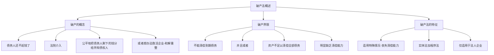
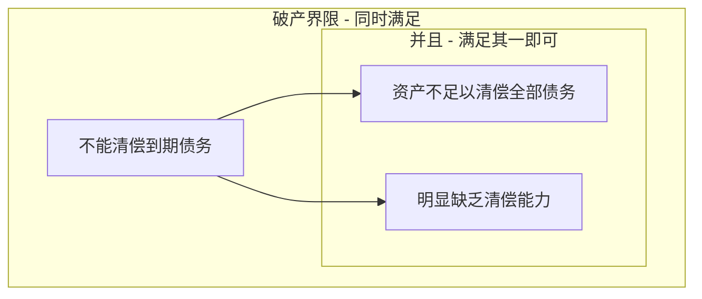
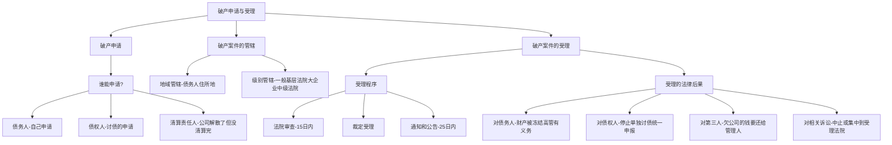
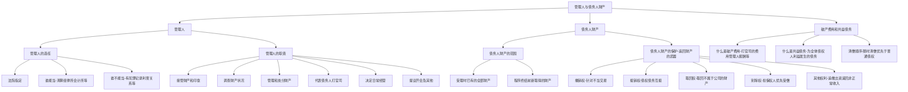
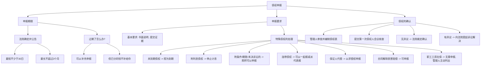
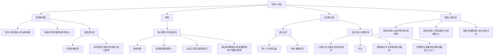
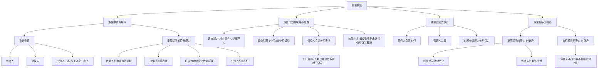
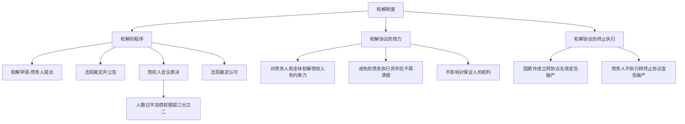
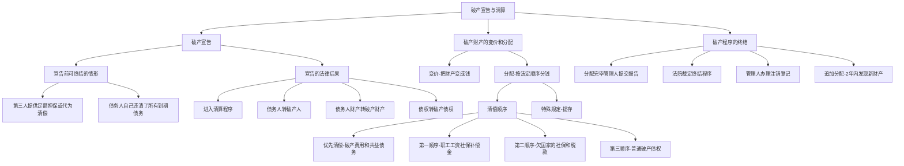

# 1 第五章 企业破产法

## 1.1 第一节 破产法概述

### 1.1.1 知识框架 (Mermaid)

### 1.1.2 破产的概念

**通俗一句话：** “破产”就是一家公司“资不抵债”，欠的钱还不上了，法院站出来主持公道，要么把公司剩下的家当公平地分给所有讨债的人，要么想办法帮公司起死回生。

从零到专家：

想象一下，你开了一家玩具公司，但因为经营不善，欠了供应商A $100万 的货款，欠了银行B $200万 的贷款，还欠了房东C $50万 的租金。现在，公司账上只剩下 $20万，所有的机器、库存玩具全卖了也只能凑够 $80万，总共只有 $100万。而你总共欠了 $350万。

这时候，你就陷入了“不能清偿到期债务”并且“资产不足以清偿全部债务”的困境。

- **债务人：** 就是那个欠钱还不上的人，这里是你的玩具公司。
    
- **债权人：** 就是那些讨债的人，这里是供应商A、银行B和房东C。
    
- **不能清偿到期债务：** 指的是到了该还钱的日子，你却拿不出钱来还。这是一种状态。
    
- **资产不足以清偿全部债务：** 指的是把你所有的家当（资产）都卖了，也凑不够还清所有欠款（债务）的钱。
    
- **人民法院依当事人申请：** 破产程序不是自动开始的，必须有人（可以是欠钱的你，也可以是讨债的A、B、C）向法院提出申请。
    
- **强制清算分配：** 如果公司实在救不活了，法院就会强制性地把你仅有的 $100万 财产，按照法律规定的顺序和比例，公平地分给A、B、C。这里强调“公平”，意味着不能因为你跟A关系好就先还给他，而要按照法律一视同仁。
    
- **和解或重整：** 这是另外两种选择，是“救活”公司的办法。
    
    - **和解：** 你（债务人）主动和A、B、C这些债权人商量：“各位大哥，我现在真的没钱，能不能少还点，或者晚点还？给我个机会，让我继续经营，挣了钱再还你们。” 如果大家同意并达成协议，公司就可以避免马上“死亡”。
        
    - **重整：** 这更像一个大手术。法院会深度介入，可能引进新的投资人，调整公司业务，更换管理层等，目标是让公司恢复造血能力，最终走出困境。这通常适用于那些虽然暂时有困难，但还有市场前景和挽救价值的公司。
        

法律来源：

这个概念综合了《中华人民共和国企业破产法》的核心思想，其目的不仅仅是“搞死”一个企业，更重要的是在企业陷入绝境时，提供一个有序、公平解决债务问题的法律框架，并尽可能地挽救有价值的企业。

### 1.1.3 破产界限

**通俗一句话：** 就是判断一家公司“病”到什么程度才可以申请破产的“诊断标准”。

从零到专家：

破产界限，也叫破产原因，是启动破产程序的“门槛”。不是说一欠钱就能破产，必须达到法定的严重程度。法院只有看到企业符合这个标准，才会受理破产案件。

法律来源与细节解读：

《企业破产法》第二条第一款规定：

> “企业法人不能清偿到期债务，并且资产不足以清偿全部债务或者明显缺乏清偿能力的，依照本法规定清理债务。”

我们来拆解一下这个“门槛”：

- **核心条件：不能清偿到期债务。**
    
    - 这是基础，是必须满足的条件。意思是“还款日到了，但还不起”。
        
    - 比如，合同约定5月31日要还供应商货款，但到了那天公司账上一分钱都拿不出来。
        
- **并列条件（满足其一即可）：** 在满足核心条件的基础上，下面两个条件满足任何一个就行。
    
    1. **资产不足以清偿全部债务（资不抵债）：**
        
        - 这是典型的“账面”破产。就是把公司所有的东西（厂房、设备、现金、专利等）全算上，加起来的总价值也比欠的所有钱（短期、长期债务都算上）要少。
            
        - 比如，公司总资产评估下来值 $1000万，但总负债有 $1200万。
            
    2. **或者，明显缺乏清偿能力：**
        
        - 这是一种“现金流”破产。可能公司账面上资产还挺多，比如有很多地皮、厂房，总资产大于总负债。但是，这些资产一时半会儿变不了现，而公司又没有足够的现金来支付马上到期的债务。
            
        - 比如，公司有价值 $5000万 的土地，但只欠了 $100万 的紧急债务。可这块地没那么快卖掉，公司账上又没钱，导致无法支付这 $100万。这种情况就是“明显缺乏清偿能力”。它还包括其他情况，比如资金枯竭、停止生产经营、法定代表人下落不明等。
            

知识对比总结：

| 条件 | 解释 | 俗称 |

| :--- | :--- | :--- |

| 不能清偿到期债务 | 到期债务无法用货币支付 | 还不起 |

| 资产不足以清偿全部债务 | 全部资产价值 < 全部债务总额 | 资不抵债 |

| 明显缺乏清偿能力 | 虽资产可能>负债，但无现金支付到期债务 | 现金流断了 |

**破产界限的逻辑关系图：**

重整的特殊门槛：

《企业破产法》第二条第二款还提到：

> “企业法人有前款规定情形，或者有明显丧失清偿能力可能的，可以依照本法规定进行重整。”

- **新增加的可能性：** 注意“有明显丧失清偿能力可能”这句话。这意味着，公司还没到真正“病危”的那一步，只是出现了“病危”的迹象（比如，主要客户流失、核心技术被淘汰等），就可以提前申请重整，进行“预防性治疗”，防止情况进一步恶化。这是重整制度的一个独特之处，体现了“早发现、早治疗”的原则。
    

### 1.1.4 破产法的特征

**通俗一句话：** 这部法律很特别，只管公司“死”或“救”的事，既讲道理（实体法）又讲步骤（程序法），而且主要只管“公司”（法人），不管“个人”（自然人）。

**从零到专家：**

1. **调整范围特殊：**
    
    - **一句话概括：** 只在公司快不行的时候才出手。
        
    - **详细解释：** 普通的经济法律，比如《合同法》，管的是平时做生意的各种约定。而《破产法》只处理一种极端情况：债务人丧失清偿能力。它的核心任务不是别的，就是解决在这种烂摊子下，如何公平、有序地偿还所有债权人的债务，避免出现“会哭的孩子有奶吃”（谁闹得凶谁先拿到钱）的混乱局面。
        
2. **实体与程序合一：**
    
    - **一句话概括：** 既告诉你“该怎么办”（实体），也告诉你“一步一步怎么走”（程序）。
        
    - **详细解释：**
        
        - **实体法** 的内容是规定权利和义务，比如：哪些财产算是破产财产？债权人有哪些权利？债务清偿的先后顺序是什么？这些都是“实体”规定。
            
        - **程序法** 的内容是规定完成这些事情的步骤和手续，比如：怎么申请破产？法院如何受理？债权人会议怎么开？管理人怎么指定？这些都是“程序”规定。
            
    - 《破产法》把这两部分紧密地结合在一部法律里，形成了一个完整的解决方案，所以说它是“综合性法律”。
        
3. **适用对象有限：**
    
    - **一句话概括：** 目前主要只管企业法人。
        
    - **详细解释：** 法人，你可以简单理解为一个被法律承认的、可以像人一样拥有权利和承担义务的“组织”，最常见的就是“有限责任公司”和“股份有限公司”。《企业破产法》主要就是为这些组织设计的。
        
    - **知识对比：**
        
        - **法人破产：** 公司欠的债，用公司的全部财产来还。还不上，公司就没了，但一般不会追到股东个人的其他财产（除非股东有违法行为）。这就是所谓的“有限责任”。
            
        - **个人破产：** 在一些已经建立个人破产制度的国家或地区（比如我国的深圳特区），如果一个自然人（就是我们这样的个人）欠了巨额债务还不上，也可以申请破产。
            
        - **我国现状：** 在全国范围内，我国目前还没有统一的个人破产法，所以《企业破产法》主要调整的是企业法人的破产问题。
            

## 1.2 第二节 破产申请与受理

### 1.2.1 知识框架 (Mermaid)

### 1.2.2 破产申请

**通俗一句话：** “敲响法院大门”，告诉法官“这家公司不行了，快来管管吧”的这个动作，就是破产申请。

从零到专家：

破产程序不是自动开始的，必须有人主动向法院提出申请。法律规定了谁有资格来“敲门”。

- **谁有资格申请？**
    
    1. **债务人（自己申请）：**
        
        - **场景：** 公司自己最清楚自己的财务状况。当发现已经符合了破产界限（还不上了、资不抵债了），公司自己可以主动向法院“投案自首”，申请破产。
            
        - **可以申请什么？** 债务人选择面最广，可以申请 **重整**（寻求拯救）、**和解**（商量还款方案）或者 **破产清算**（直接关门清算）。这体现了鼓励债务人主动解决问题的精神。
            
    2. **债权人（讨债的申请）：**
        
        - **场景：** 供应商、银行等债权人发现债务人公司到期不还钱，而且看起来已经快不行了，就可以向法院申请，要求对这个公司进行处理。
            
        - **可以申请什么？** 债权人可以申请 **重整** 或 **破产清算**。为什么不能申请和解？因为和解本质是债务人和债权人之间的“协议”，带有很强的主动协商性质，一般由债务人自己发起比较合适。
            
    3. **清算责任人（特殊情况下的申请）：**
        
        - **场景：** 有的公司可能因为其他原因（比如营业期限到了、股东大会决定解散）已经决定关门了，正在进行清算。但在清算过程中，负责清算的人（比如公司的董事、股东或者法院指定的清算组）突然发现，公司的全部家当还不够还清所有债务。
            
        - **怎么办？** 这时，普通的解散清算程序已经走不通了。这位“依法负有清算责任的人”就必须马上停止普通清算，转而向法院申请 **破产清算**，进入破产程序来处理。
            

法律来源：

这些规定来自《企业破产法》第二条、第七条和第七条第三款。

- **第二条** 赋予了债务人申请权。
    
- **第七条第一款** 赋予了债权人申请权。
    
- **第七条第三款** 规定了清算责任人的申请义务。
    

### 1.2.3 破产案件的管辖

**通俗一句话：** 就是规定了“哪个地方的、哪个级别的”法院负责管这个破产案子。

从零到专家：

就像你看病要去对应的医院和科室一样，破产案件也要由特定的法院来管辖。

1. **地域管辖：**
    
    - **原则：** 由 **债务人住所地** 的人民法院管辖。
        
    - **“住所地”怎么定？**
        
        - 首选：**主要办事机构所在地**。通俗讲，就是公司的“大脑”和“指挥中心”在哪里，比如总经理、核心部门在哪里办公。
            
        - 备选：如果公司没有明确的主要办事机构（比如是个空壳公司），那就看它的 **注册地**，即工商营业执照上登记的地址。
            
    - **为什么这么规定？** 因为公司的主要财产、账簿、员工、债权人通常都集中在住所地附近，由当地法院处理最方便调查取证，也最方便各方参与。
        
2. **级别管辖：**
    
    - **原则：** 根据公司“块头”大小和重要性，由不同级别的法院管。
        
    - **基层人民法院** (区、县一级)：一般管辖在 **县、区、县级市** 工商局登记的小公司破产案件。
        
    - **中级人民法院** (地级市一级)：
        
        - 一般管辖在 **地区、地级市以上** 工商局登记的大中型企业破产案件。
            
        - 特别规定：**纳入国家计划调整的国有企业破产案件**（也称“政策性破产”），因为涉及面广、影响大，必须由中级人民法院管辖。
            

### 1.2.4 破产案件的受理

**通俗一句话：** 法院收到申请后，经过审查，决定“正式接手”这个案子，并广而告之。

从零到专家：

受理是破产程序正式开始的标志，它会产生一系列非常重大的法律后果。

1. **受理的程序：**
    
    - **立案审查：** 法院收到破产申请后，不能马上就受理。要先进行审查，看看申请材料齐不齐全，申请人资格对不对，债务人是不是真的符合破产界限。
        
        - **时限：** 从收到申请之日起 15**日内** 必须做出“受理”或“不受理”的裁定。
            
        - **延期：** 如果情况特殊复杂，报请上一级法院批准，可以再延长 15**日**。
            
    - **通知和公告：** 一旦法院裁定受理，就必须让所有人都知道。
        
        - **时限：** 从裁定受理之日起 25**日内** 完成。
            
        - **通知：** 对那些法院已经知道的债权人（比如申请人提供的名单），要用书面形式直接通知他们。
            
        - **公告：** 在报纸、法院官网等公共媒体上发布公告。这是为了通知那些法院不知道的“潜在”债权人，“你们的债务人破产了，快来报到！”
            
2. 受理的法律后果：
    
    一旦法院裁定受理，就像按下了“暂停键”和“启动键”的结合体，整个局面将发生巨大变化。
    
    - **(1) 对债务人产生的法律后果（公司本身）：**
        
        - **高管的义务（戴上了“紧箍咒”）：** 从裁定送达到破产程序结束，公司的法定代表人（董事长/总经理）、财务人员、高管们必须：
            
            - `A.` **妥善保管**：看好公司的财产、公章、账本、文件等，不能藏匿、转移或毁损。
                
            - `B.` **配合工作**：法院和后面指定的管理人问什么，必须如实回答，让干什么，就得干什么。
                
            - `C.` **列席会议**：必须参加债权人会议，接受债权人的当面质询。
                
            - `D.` **限制人身自由**：未经法院许可，**不得离开住所地**。俗称“限制出境”或“限高”。
                
            - `E.` **限制职业**：不得再到其他企业去当董事、监事、高级管理人员。
                
        - **债务清偿的限制（不能“偏心”）：**
            
            - **个别清偿无效：** 法院受理后，公司就不能再单独向某一个债权人还钱了。比如，不能因为跟供应商A关系好，就偷偷把账上仅有的钱还给他。这么做是无效的，管理人有权追回来。
                
            - **例外：** 如果这个清偿是针对有 **物权担保** 的债权（比如银行有一栋厂房做抵押），并且清偿的金额没有超过抵押物的价值，那么这种清偿是有效的。因为这部分财产本来就优先属于这个担保权人。
                
        - **未履行完的合同（面临“抉择”）：**
            
            - 对于破产申请受理前签了，但双方都还没履行完的合同（比如，签了买卖合同，对方没发货，公司也没付款），**管理人** 有权做出选择：
                
                - **决定继续履行：** 如果管理人认为继续履行这份合同对所有债权人有利（比如能低价买入紧俏原材料），就可以决定继续。但对方当事人为了保险起见，有权要求管理人提供担保。如果管理人不提供担保，就视为解除合同。
                    
                - **决定解除合同：** 如果管理人认为履行合同是亏本买卖，就可以决定解除。
                    
            - **“沉默”的后果：** 如果管理人收到对方催告后 30**日内** 不答复，或者自破产受理之日起 2**个月内** 没通知对方，都 **视为解除合同**。
                
    - **(2) 对债权人产生的法律后果（讨债的人）：**
        
        - **停止个别追讨，统一申报：** 法院受理后，所有债权人就不能再单独通过打官司、强制执行等方式向债务人讨债了。唯一的途径就是向管理人 **申报债权**，然后通过破产程序，按比例、按顺序获得统一清偿。
            
        - **担保权暂停：** 即使是有抵押、质押等财产担保的债权人，也不能擅自行使优先受偿权（比如私自拍卖抵押物），必须等法律程序的安排（但他们的优先权仍然保留）。
            
        - **债权到期和停止计息：**
            
            - **未到期的债权，视为到期。** 比如，银行一笔贷款本来是3年后到期，现在公司破产了，就立刻视为这笔贷款已经到期，银行可以马上申报。
                
            - **附利息的债权，停止计息。** 从破产申请受理的那天起，所有的债权利息（包括罚息）都停止计算。这是为了把债务总额在某个时间点上“固定”下来，便于后续计算和分配。
                
    - **(3) 对第三人产生的法律后果（欠公司钱的人）：**
        
        - **清偿对象改变：** 之前欠公司钱的那些人或单位（债务人的债务人），现在不能再把钱还给原来的公司了，必须向新指定的 **管理人** 清偿债务或交付财产。
            
    - **(4) 对相关诉讼程序产生的法律后果（正在打的官司）：**
        
        - **保全解除、执行中止：** 其他法院之前对公司财产采取的查封、扣押、冻结等 **保全措施应当解除**，正在进行的强制 **执行程序应当中止**。所有财产都要交由受理破产的法院统一处理。
            
        - **未决诉讼中止后继续：** 那些破产前已经开始但还没打完的、关于公司财产的民事诉讼或仲裁，要先 **中止**。等到管理人接管了公司财产后，再由管理人代表公司，让这些官司 **继续进行** 下去。
            
        - **新诉讼集中管辖：** 从受理之日起，所有想告这家公司的新的民事官司，都 **只能向受理破产申请的这个法院提起**。这叫“集中管辖”，便于法院全面了解和处理与破产企业相关的所有法律纠纷。
            

## 1.3 第三节 管理人与债务人财产

### 1.3.1 知识框架 (Mermaid)

### 1.3.2 管理人

**通俗一句话：** 公司破产后，原来的老板靠边站，法院会派一个专业的“管家”（管理人），来全面接管公司，清点家产，处理各种事务。

**从零到专家：**

- **(一) 管理人的选任**
    
    - **谁来选？** 由 **人民法院** 指定。不是公司自己定，也不是债权人私下商量。法院在裁定受理破产申请的同时，就要指定管理人。
        
    - **谁能当？**
        
        - **清算组：** 可以由政府有关部门（如国资委、财政局）和机构的人员组成。这在处理大型国企破产时比较常见。
            
        - **社会中介机构：** 这是目前最主要的形式。包括：
            
            - 律师事务所
                
            - 会计师事务所
                
            - 破产清算事务所（专门干这个的）
                
        - 这些机构通常会被编入一个法院认可的“管理人名册”，法院从名册中摇号或择优指定。
            
    - **谁不能当？（避嫌原则）**
        
        - `1.` **有前科的：** 因故意犯罪受过刑事处罚的。
            
        - `2.` **被吊销执照的：** 曾被吊销相关专业执业证书的（比如律师证、注册会计师证）。
            
        - `3.` **有利害关系的：** 和这个破产案子有关联，可能会影响公正性。比如，A律所是B公司的常年法律顾问，B公司现在破产了，A律所就不能再当它的管理人。
            
        - `4.` **法院认为不合适的其他情形：** 这是一个兜底条款。
            
    - **个人当管理人的特殊要求：** 如果是个人被指定为管理人，他必须购买 **执业责任保险**。这是为了防止因他个人的工作失误给债权人造成损失时，能有保险来赔偿。
        
- (二) 管理人的职责
    
    管理人权力很大，责任也很大，是整个破产程序的中枢。他要向法院和债权人会议负责并报告工作。
    
    - `1.` **接管：** 全面接管债务人的 **财产、印章、账簿、文书** 等所有家当和资料。
        
    - `2.` **调查：** 调查清楚债务人的财产状况，到底有多少家底，制作成详细的 **财产状况报告**。
        
    - `3.` **决定内部事务：** 公司内部的人事任免、部门调整等，都由管理人说了算。
        
    - `4.` **决定开支：** 决定公司的日常开销和其他必要支出。
        
    - `5.` **决定营业：** 在第一次债权人会议召开前，管理人有权决定公司是 **继续营业** 还是 **停止营业**。
        
    - `6.` **管理和处分财产：** 对公司的财产进行管理、维护、变卖、分配等。
        
    - `7.` **代表打官司：** 代表债务人公司，去参加诉讼、仲裁或者其他法律程序。
        
    - `8.` **提议开会：** 当管理人认为有必要时，可以提议召开债权人会议。
        
    - `9.` **其他：** 法院认为管理人应该干的其他活。
        

### 1.3.3 债务人财产

**通俗一句话：** 就是破产公司名下所有能拿来还债的钱和物，包括它现在有的和破产程序结束前新挣到的。

**从零到专家：**

- **(一) 债务人财产的概念**
    
    - 这是一个时间范围内的所有财产集合。
        
    - **起点：** 破产申请受理时。
        
    - **终点：** 破产程序终结前。
        
    - **范围：**
        
        - **存量：** 受理时，属于债务人名下的 **全部财产**。无论在哪里，无论在谁手里，只要所有权是公司的，都算。
            
        - **增量：** 从受理到程序终结这段时间里，公司 **新取得的财产**。比如，公司有一项专利，在这期间收到了专利许可费，这笔钱也属于债务人财产。
            
- (二) 债务人财产的保护
    
    为了防止公司在破产前恶意转移财产，损害债权人利益，也为了把不属于公司的财产还给人家，法律赋予了管理人几项强大的“武器”。
    
    - **1. 撤销权（追回被恶意转移的财产）**
        
        - **通俗解释：** 管理人可以请求法院“宣布无效并追回”公司在破产前一段时间内做出的某些不公平的、损害全体债权人利益的行为。这就像“时间倒流，悔棋重下”。
            
        - **两种情况：**
            
            - **受理前** 1 **年内的“问题”行为（无论公司当时状况如何）：**
                
                - `A.` **无偿转让财产：** 白送东西给别人。
                    
                - `B.` **以明显不合理的价格交易：** 比如把价值 $100万 的车以 $10万 的价格卖给关联方。
                    
                - `C.` **为没担保的债提供担保：** 原本欠张三的钱是没抵押的，快破产了，突然拿个房子给张三做抵押，这对其他债权人不公平。
                    
                - `D.` **提前清偿未到期的债务：** 欠李四的钱明年才到期，现在就把钱还给他了。
                    
                - `E.` **放弃债权：** 王五欠公司 $50万，公司说“你不用还了”，这等于白白扔掉了自己的资产。
                    
            - **受理前** 6 **个月内的“偏心”清偿行为（前提是公司当时已陷入困境）：**
                
                - **行为：** 在公司已经“不能清偿到期债务，并且资不抵债或明显缺乏清偿能力”的情况下，仍然对个别债权人进行清偿。
                    
                - **例外：** 如果这种个别清偿反而使债务人财产受益（比如，为了拿到急需的原材料继续生产，支付了某家供应商的货款，从而生产出更有价值的产品），那就不撤销。
                    
    - **2. 抵销权（欠账互抵）**
        
        - **通俗解释：** 如果A公司欠B公司 $100万，同时B公司也欠A公司 $80万。现在B公司破产了，A公司可以主张“咱们的帐抵一下”，这样A公司只需要申报 $20万 的债权即可。
            
        - **法律规定：** 债权人在破产申请受理前对债务人负有债务的，可以向管理人主张抵销。
            
        - **不能抵销的几种情况（防止投机）：**
            
            - `（1）` B公司破产受理后，A公司为了少还钱，从C那里把C对B的债权买过来，想跟自己欠B的债抵销。——**不行！**
                
            - `（2）` A公司早就知道B公司快不行了，还故意去跟B公司做生意，让自己欠上B公司一笔钱（比如故意去赊购B公司的产品），目的就是为了跟B公司欠自己的钱抵销。——**不行！** （除非是法律规定或破产申请1年前就发生的原因导致的负债）
                
            - `（3）` B公司的债务人D，在知道B公司快不行了之后，从别处买来了对B的债权，想跟自己欠B的债抵销。——**不行！** （除非是法律规定或破产申请1年前就发生的原因取得的债权）
                
        - **核心原则：** 防止有人在破产前夕，通过制造或受让债权债务关系来进行投机，损害其他债权人的利益。
            
    - **3. 取回权（物归原主）**
        
        - **通俗解释：** 放在破产公司里的东西，如果所有权不是公司的，真正的主人有权把它拿回去。
            
        - **两种情况：**
            
            - **一般取回权：** 债务人占有的、但不属于债务人的财产，权利人可以通过管理人取回。比如，别人寄存在公司仓库里的货物、租给公司使用的设备等。
                
            - **在途标的物特别取回权：**
                
                - **场景：** A公司卖了一批货给即将破产的B公司，货已经发出去了，还在运输途中。此时，B公司破产申请被受理了，而且B公司还没付清全款。
                    
                - **权利：** A公司有权把这批还在路上的货物追回来。
                    
                - **管理人的选择：** 但是，如果B公司的管理人认为这批货很划算，可以支付 **全部价款**，要求A公司继续交货。
                    
    - **4. 别除权（有担保的债权人“优先开小灶”）**
        
        - **通俗解释：** 对破产公司的特定财产享有担保权（比如抵押权、质权）的债权人，可以就该特定财产优先得到偿还。这个权利是从总的破产财产中“别开另算”的，所以叫“别除权”。
            
        - **举例：** 银行贷款 $500万 给公司，并用公司价值 $800万 的一栋办公楼做了抵押。公司破产后，这栋楼拍卖所得的钱，要优先偿还银行的 $500万 贷款。
            
        - **要点：**
            
            - `（1）` 担保必须在破产受理前 **合法成立**。（破产前1年内为无担保债务新增的担保无效，见前述撤销权）
                
            - `（2）` 别除权人也需要申报债权，并得到确认。
                
            - `（3）` **优先受偿后的处理：**
                
                - 如果拍卖抵押物所得的钱 **不够** 还债（比如楼只卖了 $400万），那没还上的那 $100万 就变成 **普通债权**，和大家一起排队等分配。
                    
                - 如果拍卖的钱 **有剩余**（比如楼卖了 $600万），还完银行 $500万 后，多出来的 $100万 归入 **破产财产**，分给其他债权人。
                    
                - 如果别除权人 **放弃优先受偿权**，那么他的全部债权都变成 **普通债权**。
                    
    - **5. 其他权利（查漏补缺，应收尽收）**
        
        - `（1）` **追回无效行为所得财产：** 债务人为了逃债而隐匿、转移财产，或者虚构债务、承认不真实债务的行为，都是无效的。管理人有权把这些财产追回来。
            
        - `（2）` **追缴未缴出资：** 公司的股东如果当初认缴了注册资本但没缴足，管理人有权要求他们立即补足，不受原定出资期限的限制。
            
        - `（3）` **追回高管不当得利：** 公司的董事、监事、高管利用职权从公司拿走的非正常收入（比如离谱的高薪）和侵占的公司财产，管理人应当追回。
            
        - `（44）` **取回质物、留置物：** 公司的财产如果被别人质押或留置了，管理人可以通过清偿债务或提供对方接受的担保，把这些东西取回来。
            

### 1.3.4 破产费用和共益债务

**通俗一句话：** 在办破产这件事的过程中，必然会花一些钱，这些钱要从公司的财产里最先支付，比还欠款还优先。

**从零到专家：**

- **(一) 破产费用**
    
    - **定义：** 为了顺利进行破产程序本身而必须支付的费用。
        
    - **主要包括：**
        
        1. **破产案件的诉讼费用：** 交给法院的案件受理费等。
            
        2. **管理、变价和分配财产的费用：** 比如保管财产的仓储费、评估财产的评估费、拍卖财产的拍卖费等。
            
        3. **管理人执行职务的费用：** 这包括了 **管理人的报酬**（他们干活的工资）和聘用其他工作人员（如律师、会计）的费用。
            
- **(二) 共益债务**
    
    - **定义：** 为了全体债权人的共同利益而发生的债务。这个“益”是“共同受益”的意思。
        
    - **主要包括：**
        
        1. **履行合同产生的债务：** 管理人决定继续履行某个未完的合同，那么我方需要支付的货款、服务费等就成了共益债务。
            
        2. **无因管理产生的债务：** 有人没有法律义务但主动帮破产公司管理了财产（比如邻居帮忙看管仓库），由此产生的必要费用。
            
        3. **不当得利产生的债务：** 破产公司不当得利，需要返还给别人的钱。
            
        4. **继续营业产生的债务：** 为了让公司继续经营而应支付的 **员工工资、社保费用** 等。
            
        5. **侵权产生的债务：** 管理人或相关人员在执行职务时，或者破产财产本身，给别人造成了损害，需要支付的赔偿金。
            
- **(三) 破产费用和共益债务的清偿**
    
    - **清偿顺序极高：** 这两项费用要从 **债务人财产** 中 **随时清偿**，它们的清偿顺序优于所有破产债权（包括有担保的债权在特定情况下的优先部分）。
        
    - **内部顺序：**
        
        1. 如果钱不够同时还清这两项，**先行清偿破产费用**。因为程序进行不下去，共同利益也无从谈起。
            
        2. 如果钱不够还清所有的破产费用，或者不够还清所有的共益债务，那么就在各自类别内部 **按照比例清偿**。
            
    - **最坏的情况：** 如果公司的全部家当连 **破产费用都付不起**，那就意味着这个破产程序没有意义了。管理人应当提请人民法院 **终结破产程序**。
        

## 1.4 第四节 债权申报

### 1.4.1 知识框架 (Mermaid)

### 1.4.2 债权申报期限

**通俗一句话：** 法院给所有讨债的人规定一个时间段，让他们赶紧来“报个到，登记下欠了你多少钱”，过期可能就吃亏了。

**从零到专家：**

- **谁来定？** 由人民法院在发布受理破产申请公告时一并确定和公布。
    
- **期限多长？**
    
    - **最短：** 不得少于 30**日**。
        
    - **最长：** 不得超过 3**个月**。
        
    - 这个期限从法院 **发布受理公告之日** 起计算。
        
- **错过了期限怎么办？（过期未申报的后果）**
    
    - **可以补报：** 法律还是给了机会的。只要在 **破产财产最后分配前**，债权人仍然可以补充申报。
        
    - **后果：**
        
        1. **已分配的不补给你：** 对于在你补报之前已经进行过的分配，你无权要求重新分或者从已经分得的钱里补给你。你只能参与后续的分配。
            
        2. **费用自理：** 因为你的迟延申报，导致管理人需要增加审查和确认工作的费用，由你自己承担。
            

### 1.4.3 债权的申报要求

**通俗一句话：** 报到的时候不能空口说，得写清楚、拿出证据来。

**从零到专家：**

- **基本要求：**
    
    1. **书面说明：** 要用书面形式，清楚地写明：
        
        - **债权的数额：** 具体欠你多少钱。
            
        - **有无财产担保：** 你这笔债权有没有抵押物或质押物。
            
    2. **提交证据：** 必须附上能证明你债权真实存在的证据，比如合同、借条、发票、对账单等。
        
- **特殊债权的处理规则：**
    
    1. **未到期的债权：** 在破产申请受理时，**视为已到期**。
        
    2. **附利息的债权：** 从破产申请受理时起，**停止计算利息**。
        
    3. **附条件、附期限、诉讼/仲裁未决的债权：** 这些不确定的债权，债权人 **可以申报**。法院会根据情况先进行登记，等条件成就、期限届至或官司打完有了结果后，再最终确认。
        
    4. **连带债权：** 比如多个债权人共同对债务人享有一笔债权，可以派一个 **代表** 来申报，也可以 **共同申报**。
        
    5. **保证人的债权：**
        
        - **已代偿：** 如果保证人（比如为债务人做担保的公司或个人）已经替债务人还了钱，那么他就可以凭着向债务人追偿的权利（**求偿权**）来申报债权。
            
        - **未代偿：** 如果保证人还没替债务人还钱，但他将来可能要还，他可以凭着 **“将来求偿权”** 来申报。但是，如果原来的主债权人已经申报了全部债权，保证人就不能再重复申报了。
            
    6. **合同解除的损害赔偿请求权：** 如果管理人决定解除某个合同，给合同另一方造成了损失，对方可以就这部分 **损害赔偿** 来申报债权。
        
    7. **职工债权（特殊优待）：**
        
        - **无需申报：** 破产人所欠职工的 **工资、医疗费、伤残补助、抚恤金、应划入个人账户的养老和医疗保险费、经济补偿金** 等。
            
        - **如何处理：** 这些债权 **不必由职工个人去申报**。由 **管理人主动进行调查**，列出详细清单并予以 **公示**。职工如果对清单有异议，可以要求管理人更正。
            

### 1.4.4 债权的确认

**通俗一句话：** 管理人像个会计，把大家报上来的账目核对一遍，做成一个总账本，让所有人看，没问题就上报法院盖章确认，有问题就去法院打官司说理。

**从零到专家：**

1. **管理人审查登记：** 管理人收到债权申报材料后，要进行登记，并仔细审查每一笔债权的真实性、合法性、数额等，然后编制成一个总的 **《债权表》**。
    
2. **提交债权人会议核查：** 编好的《债权表》要在 **第一次债权人会议** 上提交给所有债权人进行核查。大家互相监督，看看有没有人的债权有问题。
    
3. **确认与争议解决：**
    
    - **无异议：** 如果债务人和其他债权人对《债权表》上记载的某笔债权都没有意见，那么就由 **人民法院裁定确认**。一旦确认，就具有了法律效力。
        
    - **有异议：** 如果债务人或任何一个债权人对表上的某笔债权有异议（比如认为数额不对，或者根本不存在这笔债），可以向 **受理破产案件的人民法院提起诉讼** 来解决。
        

### 1.4.5 案例分析与解答

> #### 例1：
> 
> T机械制造公司是G市最大的一家法人企业，T公司由于设备陈旧和产品老化，连年亏损，已欠C市工商银行贷款200余万元。T公司向Y省K企业租赁了一套价值千万元的生产拖拉机拖车的设备。随后，T公司从各个不同厂家费尽周折赊购到原材料后开始生产农用拖拉机拖车。随着产品的大量出产，市场份额已近饱和，产品大量积压。此后各原材料厂家及其他债权人每日都来讨债，T公司无法支撑下去。于是，T公司向人民法院提出破产申请。人民法院受理了该破产案件，依法裁定宣告T公司破产。
> 
> 问题：
> 
> （1）人民法院裁定受理该破产申请后，首先要做的工作是什么?
> 
> （2）S钢板厂在得知T公司申请破产后，考虑到本企业赊给T公司的材料比较少，而且T公司总经理早已答应用该厂某设备顶替材料款，就没有向人民法院申报债权，4个月后，T公司破产财产已分配完毕，S钢板厂才向管理人申报自己的债权。请问，S钢板厂能得到这笔债款吗?为什么?
> 
> （3）在清算中，有部分债权人提出将T公司的农用拖拉机拖车生产线拍卖后来清偿所欠债务，这个要求合法吗?该生产线应如何处理?

**小白式解答：**

**（1）法院受理后第一步该干啥？**

- **一句话回答：** 法院得赶紧成立个“管家团队”（指定管理人），然后昭告天下“T公司破产了，欠他钱和他欠钱的都注意了！”
    
- **专业解答：** 根据《企业破产法》的规定，人民法院裁定受理破产申请后，应当立即进行以下主要工作：
    
    1. **指定管理人：** 在裁定受理的同时，就要从管理人名册中指定一个管理人来接管T公司。
        
    2. **通知和公告：** 在 25日内书面通知已知的债权人（如C市工商银行、K企业、各原材料厂家），并在公共媒体上发布公告，告知所有债权人T公司破产的事实。
        
    3. **确定债权申报期限：** 在公告中明确债权人申报债权的期限（30日到3个月之间）。
        

**（2）S钢板厂最后还能要到钱吗？**

- **一句话回答：** 要不到了。因为它错过了申报时间，而且是在钱都分完了才想起来，太晚了。
    
- **专业解答：** S钢板厂不能得到这笔债款。理由如下：
    
    1. **关于以物抵债：** T公司总经理口头答应以设备抵债，但在破产申请受理后，这种对个别债权人的清偿承诺是无效的，不能作为不申报债权的理由。S钢板厂的债权仍然是普通的金钱债权。
        
    2. **关于申报期限：** 法律规定，债权人应当在法院确定的期限内申报债权。虽然在破产财产最后分配前可以补充申报，但本案中，S钢板厂是在 **破产财产已分配完毕后** 才来申报。此时破产程序已经基本终结，没有剩余财产可供分配了。
        
    3. **结论：** 根据《企业破产法》第五十六条的规定，“在人民法院确定的债权申报期限内，债权人未申报债权的，可以在破产财产最后分配前补充申报......此前已进行的分配，不再对其补充分配。” 因为财产已经分配完毕，所以S钢板厂丧失了从破产财产中获得清偿的权利。
        

**（3）那条生产线能卖吗？该怎么处理？**

- **一句话回答：** 不能卖！因为那是租来的，不是T公司自己的东西。应该由原主人K企业拿回去。
    
- **专业解答：** 这个要求不合法。该生产线应当由其所有权人K企业取回。
    
    1. **财产性质：** 案例中明确指出，该生产线是T公司向Y省K企业 **“租赁”** 的。这意味着该生产线的所有权属于K企业，而不是T公司。它不属于T公司的破产财产。
        
    2. **权利基础（取回权）：** 根据《企业破产法》第三十八条的规定，“人民法院受理破产申请后，债务人占有的不属于债务人的财产，该财产的权利人可以通过管理人取回。” 因此，K企业作为生产线的所有权人，享有取回权。
        
    3. **处理方式：** 管理人应当在核实所有权后，将该生产线返还给K企业。部分债权人要求将其拍卖来清偿债务的请求，是侵害了K企业合法财产权益的行为，不能得到支持。
        

## 1.5 第五节 债权人会议

### 1.5.1 知识框架 (Mermaid)

### 1.5.2 债权人会议的性质和组成

**通俗一句话：** 就是所有讨债的人聚在一起开的大会，共同商量怎么处理破产公司的事，是破产程序中的“最高权力机构”。

**从零到专家：**

- **1. 债权人会议的性质**
    
    - 它是一个 **临时性** 的议事机构，只在破产程序中存在。
        
    - 它代表的是 **全体债权人** 的共同利益，作出的决议对所有债权人（包括没来开会的）都有约束力。
        
- **2. 债权人会议的组成**
    
    - **成员：** **所有依法申报了债权的债权人** 都是会议的成员，都有权参加会议。
        
    - **表决权（重要！不是所有成员都有）：**
        
        - **有表决权：** 依法申报债权并且债权数额已经确定的债权人。
            
        - **无表决权或表决权受限：**
            
            - `（1）` **债权尚未确定的债权人：** 比如还在打官司的，债权数额没定下来。除非法院为了让他能投票，临时给估算一个数额，否则不能行使表决权。
                
            - `（2）` **有财产担保的债权人（别除权人）：**
                
                - 如果他 **没有放弃优先受偿的权利**，那么在对以下两项议案投票时，**没有表决权**：
                    
                    - **通过和解协议**
                        
                    - **通过破产财产的分配方案**
                        
                - **为什么？** 因为这两项主要处理的是普通债权的清偿问题。有担保的债权人反正有自己的“小金库”（担保物）可以优先受偿，他的利益和普通债权人的利益不完全一致，为了公平，就在这两件事上不让他投票了。但对于其他事项，比如更换管理人，他还是有表决权的。
                    

### 1.5.3 债权人会议的职权

**通俗一句话：** 这个大会的权力很大，能审查账目、监督管家（管理人）、决定公司是继续开还是关门，还能拍板最终的财产分配方案。

**从零到专家：**

1. **核查债权**：审查管理人编制的债权表，大家互相监督。
    
2. **申请更换管理人，审查其费用和报酬**：如果觉得管理人干得不好或者收费太高，可以向法院申请换人。
    
3. **监督管理人**：日常监督管理人的工作。
    
4. **选任和更换债权人委员会成员**：选举出自己的“常务代表”。
    
5. **决定继续或者停止债务人的营业**：这是个重大决策，影响所有人的利益。
    
6. **通过重整计划**：对挽救企业的重整方案进行表决。
    
7. **通过和解协议**：对债务人提出的和解方案进行表决。
    
8. **通过债务人财产的管理方案**：如何管理公司剩下的家当。
    
9. **通过破产财产的变价方案**：决定公司的财产怎么卖（比如是打包拍卖还是分开卖）。
    
10. **通过破产财产的分配方案**：最终决定钱怎么分。
    
11. **法院认为应当由债权人会议行使的其他职权**。
    

### 1.5.4 债权人会议的召开和决议

**通俗一句话：** 开会有规矩，投票有门槛，必须“人头”和“钱数”都达标才算通过。

**从零到专家：**

- **1. 债权人会议的召开**
    
    - **第一次会议：** 由 **人民法院** 负责召集，时间是在债权申报期限届满后的 15**日内**。
        
    - **后续会议：**
        
        - 法院觉得有必要时。
            
        - 管理人提议时。
            
        - 债权人委员会提议时。
            
        - 占债权总额 1/4**以上** 的债权人向债权人会议主席提议时。
            
    - **通知：** 管理人要提前 15**日** 通知所有已知的债权人。
        
- **2. 债权人会议的决议（双重多数决原则）**
    
    - 这是核心和难点。一个决议要通过，必须 **同时满足** 以下两个条件：
        
        1. **“人头数”标准：** 由 **出席会议的** 有表决权的债权人 **过半数** 通过。
            
            - 注意：是“出席会议”的，不是全体债权人。
                
        2. **“债权额”标准：** 这些投赞成票的债权人，他们所代表的债权额，要占 **无财产担保债权总额** 的 1/2**以上**。
            
            - 注意：分母是“无财产担保债权总额”，不是全部债权总额，也不是出席会议的债权总额。
                
    - **特殊情况：通过和解协议**
        
        - 要求更严格！“债权额”标准提高到 2/3**以上**。
            
        - 即：出席会议的有表决权的债权人过半数同意，并且其所代表的债权额占无财产担保债权总额的 2/3**以上**。
            
- **决议的效力：**
    
    - 一旦通过，对 **全体债权人** 都有约束力，包括那些没来开会的、来了但投反对票的。
        

### 1.5.5 债权人委员会

**通俗一句话：** 债权人大会人太多，天天开会不现实，于是选出几个代表组成一个“常务委员会”，负责日常监督和沟通。

**从零到专家：**

- **设立：** 债权人会议 **可以决定** 设立债权人委员会（不是必须的）。
    
- **组成：**
    
    - 由债权人会议选任的 **债权人代表**。
        
    - 外加 **一名债务人的职工代表或者工会代表**。
        
    - **人数上限：** 不得超过 9**人**。
        
- **认可：** 委员会成员名单需要经过 **人民法院书面决定认可**。
    
- **职责：** 主要是在债权人会议闭会期间，行使监督管理人、代表债权人利益等职能。
    

### 1.5.6 案例分析与解答

> #### 例2：
> 
> 某债务人企业有九个债权人,其债权额分别是A $10万 元、B $40万 元、C $20万 元(有担保)、D的债权额未确定、E $30万 元、F $10万 元、G $20万 元、H $30万 元、I $40万 元，召开某次债权人会议时，A、B未出席。
> 
> 问题：
> 
> （1）如果债权人会议决议债务人财产的管理方案，至少要多少债权人同意并至少持有多少债权？
> 
> （2）如果债权人会议决议和解协议，至少要多少债权人同意并至少持有多少债权？
> 
> （3）如果债权人会议决议破产财产的分配方案，至少要多少债权人同意并至少持有多少债权？

**小白式解题步骤：**

**第一步：分析参会人员和有表决权的人员**

- 总共有9个债权人 (A, B, C, D, E, F, G, H, I)。
    
- A、B未出席。所以 **出席会议** 的有：C, D, E, F, G, H, I，共 7**人**。
    
- **谁有表决权？**
    
    - C：有担保，如果他不放弃优先权，对(2)和(3)没有表决权，但对(1)有表决权。
        
    - D：债权额未确定，**没有表决权**。
        
    - E, F, G, H, I：无担保债权人，有表决权。
        
- 所以，**出席会议且有表决权** 的人要分情况看：
    
    - 对于(1)财产管理方案：C, E, F, G, H, I，共 6**人**。
        
    - 对于(2)和解协议、(3)分配方案：E, F, G, H, I，共 5**人**。
        

**第二步：计算无财产担保债权总额（这是计算债权额比例的分母）**

- 无担保债权包括：A(10) + B(40) + E(30) + F(10) + G(20) + H(30) + I(40) = 180**万元**。
    
    - 注意：C的有担保债权20万不计入，D的未确定债权不计入。这个总额是固定的，和谁来开会无关。
        

**第三步：根据不同议案，计算通过门槛**

**（1）决议债务人财产的管理方案 (普通决议)**

- **人数标准：** 出席会议有表决权的共 6人 (C, E, F, G, H, I)，过半数即至少需要 4**人** 同意。
    
- **债权额标准：** 无财产担保债权总额为 180万，需要超过 $1/2$，即超过 $90万。所以至少需要 **$90.000...1$万元** (为方便，我们说大于$90万)。
    
- **结论：** 至少需要 4**名** 债权人同意，并且他们所代表的（无担保）债权额合计 **超过**90**万元**。
    

**（2）决议和解协议 (特别决议)**

- **人数标准：** 出席会议有表决权的共 5人 (E, F, G, H, I)，过半数即至少需要 3**人** 同意。
    
- **债权额标准：** 无财产担保债权总额为 180万，需要超过 $2/3$，即超过 $120万。所以至少需要 **$120.000...1$万元** (为方便，我们说大于$120万)。
    
- **结论：** 至少需要 3**名** 债权人同意，并且他们所代表的债权额合计 **超过**120**万元**。
    

**（3）决议破产财产的分配方案 (C无表决权)**

- **人数标准：** 出席会议有表决权的共 5人 (E, F, G, H, I)，过半数即至少需要 3**人** 同意。
    
- **债权额标准：** 无财产担保债权总额为 180万，需要超过 $1/2$，即超过 $90万。所以至少需要 **$90.000...1$万元** (为方便，我们说大于$90万)。
    
- **结论：** 至少需要 3**名** 债权人同意，并且他们所代表的债权额合计 **超过**90**万元**。
    

## 1.6 第六节 重整

### 1.6.1 知识框架 (Mermaid)

### 1.6.2 重整概述

**通俗一句话：** 公司得了“重病”（破产），但不至于“病死”，通过一个“大手术”（重整），让它起死回生、重获新生的法律制度。

从零到专家：

重整是破产法中最积极、最有价值的制度之一。它的目标不是清算分配，而是 挽救企业。它适用于那些虽然暂时陷入财务困境，但企业自身还有维持价值和再生希望的公司。比如，这家公司品牌很有名、技术很先进或者市场渠道很稳定，如果直接关门太可惜了。

### 1.6.3 重整申请和重整期间

- **(一) 重整申请**
    
    - **谁能申请？**
        
        1. **债务人或债权人：** 可以直接向法院申请对债务人进行重整。
            
        2. **出资人（股东）：** 占债务人注册资本 1/10**以上** 的出资人也可以申请。这是一个亮点，因为有时候管理层不愿意承认失败，股东看到公司快不行了，可以主动申请重整来拯救自己的投资。
            
    - **申请时机：**
        
        - 可以直接申请重整。
            
        - 也可以在债权人已经申请了破产清算后，在法院 **宣告破产前**，由债务人或符合条件的出资人“踩刹车”，转而申请重整。
            
- **(二) 重整期间**
    
    - **起止：** 从法院裁定同意重整开始，到重整程序终止时结束。
        
    - **重整期间的特殊法律规定（为“治病救人”创造环境）：**
        
        1. **债务人自行管理（DIP制度）：** 这是重整的核心特点之一。经债务人申请、法院批准，债务人 **可以在管理人的监督下，自己管理自己的财产和营业事务**。因为自己最了解自己的企业，这样有助于维持经营稳定。
            
        2. **担保权暂停行使：** 这是重整的“保护伞”。为了保证企业能正常经营，不被抽血，在此期间，即使是有担保的债权人，其担保权也 **暂停行使**。比如，银行不能在这时来拍卖作为抵押的机器设备，否则工厂就停产了。
            
        3. **为继续营业可设保借款：** 为了维持经营，公司可能需要新的资金。法律允许债务人或管理人在重整期间为继续营业而借款，并且可以拿公司的财产为这笔 **新借款** 设定担保。这笔新借款的清偿往往具有优先性，以吸引别人敢借钱。
            
        4. **取回权的限制：** 权利人想取回被债务人合法占有的财产，必须满足事先约定的条件。
            
        5. **出资人（股东）不得分红：** 公司都这样了，股东就别想拿投资收益了。
            

### 1.6.4 重整计划的制定和批准

**通俗一句话：** 医生（管理人或债务人）要拿出一套详细的“手术方案”（重整计划），然后给所有“家属”（各类债权人）分组讨论投票，大部分组同意了，再报“医院领导”（法院）最终批准。

**从零到专家：**

- **1. 重整计划的制定**
    
    - **谁来做？** 如果是债务人自行管理，就由 **债务人** 制作重整计划草案；如果是管理人管理，就由 **管理人** 制作。
        
    - **时限：** 必须在法院裁定重整之日起 6**个月内** 提交。如果有正当理由，可以向法院申请延期 3**个月**。
        
    - **后果：** 如果到期交不出来，法院就得 **裁定终止重整程序，并宣告债务人破产**。
        
- **2. 重整计划的表决与批准**
    
    - **分组表决：** 这是重整计划表决的一大特色。法院收到草案后30天内召开债权人会议，但不是所有债权人混在一起投票，而是要 **分组**。通常分为：
        
        - 有财产担保债权组
            
        - 职工债权组
            
        - 税款债权组
            
        - 普通债权组
            
        - （可能还有出资人组）
            
    - **各组通过标准：** “出席会议的同一表决组的债权人 **过半数** 同意，并且其所代表的债权额占该组债权总额的 2/3**以上**”。
        
    - **计划通过：** **所有表决组** 都通过了重整计划草案，重整计划就算通过。
        
    - **法院批准：** 通过后，由债务人或管理人向法院申请批准。法院审查后，裁定批准，重整程序终止，进入执行阶段。
        
    - **强制批准（亮点）：** 如果有的组没通过怎么办？是不是就没戏了？不一定。法律给了法院一个“强制批准”的权力。即使部分表决组没通过，只要重整计划草案满足了法律规定的最低保护标准（比如对该组的清偿不低于破产清算能得到的钱，对所有组都公平等），债务人或管理人就可以申请法院强制批准。这是为了防止少数人的反对阻碍整个企业的重生。
        

### 1.6.5 重整计划的执行

- **谁来执行？** 由 **债务人** 自己负责执行。管理人把财产和营业事务移交给债务人。
    
- **谁来监督？** 在计划规定的监督期内，由 **管理人** 负责监督。
    
- **效力：**
    
    - 经法院批准的重整计划，对 **债务人和全体债权人** 都有法律约束力。
        
    - **未申报债权人的权利：** 在重整计划执行期间不能行使权利。但在执行完毕后，可以按照计划中同类债权的清偿条件来行使权利。
        

### 1.6.6 重整程序的终止

**通俗一句话：** “手术”过程中发现病人没救了，或者病人不配合“治疗”，那就只能放弃手术，宣布死亡。

- **重整期间终止（转为破产清算）：**
    
    1. **经营状况继续恶化**，没有挽救的可能了。
        
    2. **债务人有欺诈、恶意减少财产** 等不利于债权人的行为。
        
    3. **债务人的行为导致管理人无法执行职务**。
        
- **重整计划执行期间终止（转为破产清算）：**
    
    - 债务人 **不能执行或者不执行** 重整计划。比如计划要求每年还款100万，但债务人就是不还，经管理人或利害关系人请求，法院可以裁定终止计划的执行，并宣告其破产。
        

## 1.7 第七节 和解

### 1.7.1 知识框架 (Mermaid)

### 1.7.2 和解概述

**通俗一句话：** 公司欠钱还不上了，主动找所有讨债的开会商量：“各位，能不能让我缓一缓、少还点？只要你们同意，我就能活下去。”大家谈妥了，报法院认可，这就是和解。

从零到专家：

和解与重整都是为了挽救企业，但它们之间有区别：

- **发起人不同：** 和解一般只能由 **债务人** 自己发起申请。
    
- **程序简化：** 和解程序相对重整要简单、灵活得多。它更像一个由债务人主导的、有法律效力的“集体谈判”。
    
- **核心内容：** 一般是 **延期清偿** 和/或 **减少数额**。
    

### 1.7.3 和解的程序

1. **和解申请：**
    
    - **谁申请？** 只能是 **债务人**。
        
    - **何时申请？** 可以直接向法院申请；也可以在法院受理破产申请后、宣告破产前申请。
        
    - **要求：** 申请时必须提交一份 **和解协议草案**，即你的初步方案。
        
2. **和解裁定：** 法院审查后认为符合规定，就裁定和解，并公告，召集债权人会议来讨论这个草案。
    
3. **特殊规定：** 在和解期间，有财产担保的债权人 **可以行使权利**。这一点与重整期间担保权暂停行使是 **重大区别**。
    
4. **债权人会议表决及法院认可：**
    
    - **表决门槛（同和解协议特殊门槛）：**
        
        - 出席会议的有表决权的债权人 **过半数** 同意；
            
        - 并且其所代表的债权额占 **无财产担保债权总额的** 2/3 **以上**。
            
    - **法院认可：** 债权人会议通过后，由法院裁定认可，和解程序就终止了，公司就按和解协议去做了。
        
    - **不通过的后果：** 如果草案没被通过，或者通过了但法院不认可，法院应当裁定 **终止和解程序，并宣告债务人破产**。
        

### 1.7.4 和解协议的效力

1. **约束力：** 对 **债务人** 和 **全体和解债权人** 都有约束力。
    
    - **和解债权人：** 指的是法院受理破产申请时，对债务人享有 **无财产担保债权** 的人。有担保的债权人不受和解协议约束。
        
2. **债务减免的效力：** 按照和解协议减免掉的债务，等协议执行完毕后，债务人就 **不再承担清偿责任** 了。
    
3. **对保证人的影响：** 和解协议的达成，**不影响** 债权人向债务人的 **保证人** 和其他连带债务人主张权利。比如，A公司欠B银行 $100万，C公司是保证人。A和B和解，只还 $60万。B银行仍然可以就剩下的 $40万 去找C公司要求承担保证责任。
    

### 1.7.5 和解协议的终止执行

**通俗一句话：** 谈好的条件，如果发现是被骗了，或者对方不遵守，那就推倒重来，直接宣布“死亡”。

1. **因欺诈成立：** 如果和解协议是债务人通过欺诈等违法行为搞定的，法院应当裁定该协议 **无效，并宣告债务人破产**。
    
2. **债务人不执行：** 债务人不能或不执行和解协议的，经和解债权人请求，法院应当裁定 **终止和解协议的执行，并宣告债务人破产**。
    

## 1.8 第八节 破产宣告与清算

### 1.8.1 知识框架 (Mermaid)

### 1.8.2 破产宣告

**通俗一句话：** 法院正式宣布“这家公司没救了，准备清盘关门吧”。

**从零到专家：**

- **1. 破产宣告的概念**
    
    - 这是人民法院对债务人已经符合破产条件且无法通过重整或和解挽救的一个最终法律确认。这是一个分水岭，标志着企业从“抢救”阶段彻底进入“处理后事”阶段。
        
- **2. 破产宣告前的“一线生机”**
    
    - 在法院下达“死亡通知书”（宣告破产）之前，如果出现以下情况，破产程序可以终结，公司可以活下来：
        
        1. **“贵人”相助：** 有 **第三人**（比如债务人的母公司、关联方或者其他投资人）愿意为债务人提供 **足额担保**，或者直接 **替债务人还清了全部到期债务**。
            
        2. **“起死回生”：** **债务人自己** 把 **全部到期债务** 都还清了。
            
- **3. 破产宣告的法律后果（名号变更）**
    
    - 宣告后，案件正式进入 **破产清算** 程序。
        
    - 称谓变化：
        
        - 债务人 -> **破产人**
            
        - 债务人财产 -> **破产财产**
            
        - 对债务人享有的债权 -> **破产债权**
            
        - 无财产担保的破产债权 -> **普通破产债权**
            

### 1.8.3 破产财产的变价和分配

**通俗一句话：** 把公司剩下的东西都卖成钱（变价），然后按照法律规定的“三六九等”顺序来分钱（分配）。

**从零到专家：**

- **(一) 破产财产的变价**
    
    - **原则：** 财产分配原则上要用 **货币** 分配，所以得先把非货币财产（如厂房、设备、专利）卖掉换成钱。
        
    - **程序：** 管理人要先拟定一个 **变价方案**（怎么卖最划算），提交给 **债权人会议** 讨论通过后执行。
        
- **(二) 破产财产的分配**
    
    - **1. 分配方案：** 管理人根据清偿顺序和财产情况，制作 **财产分配方案**，也需要经过 **债权人会议通过** 和 **人民法院裁定认可** 后，才能执行。
        
    - **2. 破产财产的清偿顺序（核心中的核心）**
        
        - 这是一个严格的、法定的顺序，必须遵守。
            
        
        **前置步骤：** **破产财产** 要 **优先清偿破产费用和共益债务**。
        
        - 这是第一道坎。只有付完了这些钱，剩下的才能用来还以前的旧债。
            
        
        **然后，按照以下顺序清偿：**
        
        - **① 第一顺序：职工的切身利益**
            
            - 破产人所欠职工的 **工资** 和 **医疗、伤残补助、抚恤费用**。
                
            - 所欠的应当划入 **职工个人账户** 的 **基本养老保险、基本医疗保险费用**。
                
            - 法律、行政法规规定应当支付给职工的 **补偿金**（如经济补偿金）。
                
        - **② 第二顺序：国家的利益**
            
            - 破产人欠缴的除前项规定以外的 **社会保险费用**（指统筹账户部分）。
                
            - 破产人所欠的 **税款**。
                
        - **③ 第三顺序：普通债权人的利益**
            
            - **普通破产债权**。
                
        
        **分配原则：**
        
        - **顺序分配：** 必须还清了前一个顺序的钱，有剩余的才能还下一个顺序。
            
        - **同序按比例分配：** 如果财产不够还清同一顺序的所有债务，那么就在这个顺序内部，**按照比例分配**。
            
            - **举例：** 剩下100万用来还普通债权，但普通债权总额有200万。那么每个普通债权人都能拿回自己债权数额的 50% (100÷200)。你被欠10万，就拿回5万。
                
    - **3. 破产财产分配的特殊规定**
        
        - **提存：** 有些钱暂时发不出去，管理人要把它 **提存**（专门存起来保管）。
            
            - **场景1：附条件/解除条件的债权：** 钱先留着，等条件满足或不满足了再决定给不给。
                
            - **场景2：债权人不来领钱：** 公告后满 2**个月** 还不来领，视为 **放弃**，这笔钱分给其他人。
                
            - **场景3：诉讼/仲裁未决的债权：** 官司没打完，钱先提存。如果从破产程序终结之日起满 2**年** 官司还没结果，这笔钱也分给其他人。
                
        - **追加分配：**
            
            - **时限：** 破产程序终结后 2**年内**。
                
            - **情形：** 又发现了破产人新的财产（比如通过撤销权追回来的，或者之前没发现的）。
                
            - **操作：** 债权人可以请求法院按照原来的分配方案，进行 **追加分配**。
                

### 1.8.4 破产程序的终结

1. **提交报告：** 管理人在最后分配完结后，向法院提交 **破产财产分配报告**，并提请终结程序。
    
2. **法院裁定：** 法院在 15**日内** 作出是否终结的裁定，并公告。
    
3. **注销登记：** 管理人拿着终结裁定，在 10**日内** 去工商局等原登记机关，办理公司的 **注销登记**。公司在法律上就彻底“死亡”了。
    
4. **管理人终止职务：** 办完注销登记的 **第二天**，管理人任务完成，职务终止（除非还有未了的官司）。
    

### 1.8.5 案例分析与解答

> #### 例3：
> 
> 某企业法人A于2021年12月10日被申请破产。法院于12月16日受理，于2022年5月5日宣告破产，管理人审核情况如下：
> 
> 1. 企业厂房三座，每座100万，其中一号厂房抵押给B银行贷款30万元；
>     
> 2. 企业库存现金30万元；
>     
> 3. C企业欠A企业工程款40万元；
>     
> 4. A企业租用D企业机器设备，设备价值40万元；
>     
> 5. 2021年10月10日，A企业免除H企业一笔债务10万元，无偿赠送其一辆价值30万元的小汽车；
>     
> 6. A企业欠C企业50万元，欠E银行90万元，欠G企业100万元，欠Z企业300万元；欠职工工资及保险100万元，欠税款37万元和清算费3万元。
>     
> 
> 问题：
> 
> （1）结合本题，谈谈什么叫撤销权、抵销权、取回权、别除权？
> 
> （2）破产财产是多少？普通破产债权是多少？
> 
> （3）应如何分配财产？每个债权人分别能得到多少清偿？

**小白式解题步骤：**

**（1）“四种权利”在本题中的体现：**

- **撤销权：** 指管理人对破产企业在破产前不当处置财产行为的“反悔权”。
    
    - **在本题中：** A企业在法院受理前1年内（2021年10月10日），**免除H企业债务**10万 和 **无偿赠送小汽车**30万 的行为，属于可撤销行为。管理人有权请求法院撤销，并追回这笔钱和车（合计 40**万元**）。
        
- **抵销权：** 指相互欠钱的双方，可以将债务在同等数额内相互抵消的权利。
    
    - **在本题中：** C企业欠A企业工程款40万，同时A企业也欠C企业50万。C企业可以向管理人主张抵销。抵销后，A企业对C企业的债权变为0，C企业对A企业的债权变为 50−40=10万元。
        
- **取回权：** 指财产的真正主人，从破产企业取回不属于破产企业财产的权利。
    
    - **在本题中：** A企业 **租用D企业的机器设备**，设备所有权是D企业的。因此D企业有权通过管理人取回这台价值40万的设备。这台设备不属于破产财产。
        
- **别除权：** 指有财产担保的债权人，可以就担保物优先受偿的权利。
    
    - **在本题中：** B银行对一号厂房享有抵押权。一号厂房价值100万，B银行的债权是30万。因此B银行可以就一号厂房的变价款优先获得30万的清偿。
        

**（2）计算破产财产和普通破产债权：**

- **破产财产总额计算：**
    
    - 厂房三座：3×100=300万 (注意：抵押不影响其作为破产财产的性质，只是其变价款要优先给B银行)
        
    - 库存现金：30万
        
    - C企业欠款：40万 (这是A的债权，属于资产)
        
    - 行使撤销权追回的财产：10+30=40万
        
    - **破产财产总额 =** 300+30+40+40=410**万元**
        
    - （注意：租用的机器40万不是破产财产）
        
- **普通破产债权总额计算：**
    
    - C企业债权（抵销后）：50−40=10万
        
    - E银行债权：90万
        
    - G企业债权：100万
        
    - Z企业债权：300万
        
    - **普通破产债权总额 =** 10+90+100+300=500**万元**
        
    - （注意：B银行的30万是别除权，职工工资保险100万和税款37万是优先债权，清算费3万是破产费用，都不算普通债权）
        

**（3）财产分配顺序和数额：**

1. **行使别除权：**
    
    - 一号厂房拍卖款（假设为100万）优先支付B银行 30**万元**。B银行债权获得$100%$清偿。
        
    - 剩余的 100−30=70万，归入破产财产。
        
    - 此时破产财产可供统一分配的金额为：410−30=380万元。
        
2. **支付破产费用：**
    
    - 优先支付清算费 3**万元**。
        
    - 剩余财产：380−3=377万元。
        
3. **支付第一顺序债权：**
    
    - 支付职工工资及保险 100**万元**。
        
    - 剩余财产：377−100=277万元。
        
4. **支付第二顺序债权：**
    
    - 支付所欠税款 37**万元**。
        
    - 剩余财产：277−37=240万元。
        
5. **支付第三顺序（普通）债权：**
    
    - 剩余财产 240**万元** 用于清偿总额为 500**万元** 的普通破产债权。
        
    - **清偿率 =** 240÷500=48%  
        
    - 各普通债权人能得到的清偿：
        
        - **C企业：** 10×48%=4.8万元
            
        - **E银行：** 90×48%=43.2万元
            
        - **G企业：** 100×48%=48万元
            
        - **Z企业：** 300×48%=144万元
            

**最终分配结果总结：**

- B银行：得到 30万
    
- 职工：得到 100万
    
- 税务机关：得到 37万
    
- C企业：得到 4.8万
    
- E银行：得到 43.2万
    
- G企业：得到 48万
    
- Z企业：得到 144万
    
- D企业：取回机器设备
    
- H企业：被追回 40万
    

> #### 例4：
> 
> 某企业法人被人民法院依法宣告破产。4月5日，管理人查明：该企业在被受理破产时经营管理的全部财产价值为250万元，其中已作为银行贷款担保物的财产价值为60万元。债权人甲的破产债权为56万元，其他债权人的破产债权合计为110万元。由于管理人决定解除该企业与乙所签订的一份合同，给乙造成了84万元的经济损失。该企业欠发职工工资55万元，欠交税金35万元。4月10日，管理人又查明：在人民法院受理该企业破产案件前3个月内，该企业无偿转让作价为80万元的财产，遂向人民法院申请予以撤销，追回财产。4月25日，该财产已全部追回。该企业破产费用共计30万元。
> 
> 问题：
> 
> （1）计算该企业的破产财产的数额。
> 
> （2）计算该企业的普通破产债权的数额。
> 
> （3）计算该企业可用于清偿普通破产债权的破产财产的数额。
> 
> （4）计算甲能获得清偿的数额。
> 
> （答案中的金额单位用万元表示）

**小白式解题步骤：**

**（1）计算破产财产的数额**

- 受理时已有财产：250万
    
- 行使撤销权追回的财产：80万
    
- **破产财产总额 =** 250+80=330**万元**
    

**（2）计算普通破产债权的数额**

- 债权人甲的债权：56万
    
- 其他债权人的债权：110万
    
- **普通破产债权总额 =** 56+110=166**万元**
    
- （注意：职工工资、税金、破产费用、共益债务、担保债权都不是普通债权）
    

**（3）计算可用于清偿普通破产债权的破产财产数额**

- 这是倒着算的，一步步扣除优先支付的项目。
    
- 破产财产总额：330万
    
- **减：别除权部分：** 银行贷款有价值60万的担保物，这60万要优先给银行。
    
    - 剩余：330−60=270万
        
- **减：破产费用：** 30万
    
    - 剩余：270−30=240万
        
- **减：共益债务：** 因解除与乙的合同造成的损失84万，属于共益债务。
    
    - 剩余：240−84=156万
        
- **减：第一顺序（职工工资）：** 55万
    
    - 剩余：156−55=101万
        
- **减：第二顺序（税金）：** 35万
    
    - 剩余：101−35=66万
        
- **最终可用于清偿普通破产债权的财产数额为 66 万元。**
    

**（4）计算甲能获得清偿的数额**

- 可用于普通债权分配的财产：66万
    
- 普通债权总额：166万
    
- **清偿率 = 可分配财产 / 普通债权总额 =** 66÷166≈39.76%  
    
- **甲能获得的清偿 = 甲的债权额 × 清偿率 =** 56×(66÷166)≈22.265**万元**
    

> #### 例5：
> 
> 某试点城市企业法人于2023年2月1日被债权人申请破产，2月10日人民法院受理其破产申请并指定管理人，企业破产时管理的财产和债权人申报的债权情况如下：
> 
> 财产情况：
> 
> （1）第一号房屋价值300万，全部用于对A银行债务抵押；
> 
> （2）第二号房屋价值160万，属于租用甲企业的房屋；
> 
> （3）对外投资价值（含应得投资收益）140万元；
> 
> （4）第三号房屋转让所得为100万元；
> 
> （5）职工缴纳的工会会费50万；
> 
> （6）2022年12月1日破产企业主动放弃对某公司的债权100万。
> 
> 债权情况：
> 
> （1）A银行对破产企业发放3年贷款，本金200万，年利率10%，到期应计利息共60万元，尚有1年到期；
> 
> （2）B公司拥有到期债权700万；
> 
> （3）C公司因为为破产企业担保，替破产企业偿还债务本息共计350万；
> 
> （4）D公司因破产企业提前终止合同造成直接损失140万元；
> 
> （5）欠税务机关税收罚款90万元，发现该破产企业对B公司拥有债权190万元，发生破产费用70万元，欠税款130万元。
> 
> 问题：
> 
> （1）分别说明哪些属于撤销权、抵销权、取回权、别除权，金额分别是多少？
> 
> （2）破产企业管理的财产中，哪些属于破产财产，金额为多少？
> 
> （3）哪些属于普通破产债权，金额为多少？
> 
> （4）破产财产应该按怎样的顺序分配，每一顺序分配的金额为多少？

**小白式解题步骤：**

**（1）“四种权利”的识别与计算**

- **撤销权：** 2022年12月1日（受理前1年内）主动放弃对某公司的债权 100**万**。管理人可行使撤销权追回。
    
- **抵销权：** 破产企业欠B公司700万，同时B公司欠破产企业190万。可以抵销。抵销后，破产企业对B公司的债权为0，B公司对破产企业的债权变为 700−190=510万元。
    
- **取回权：** 第二号房屋是租用甲企业的，甲企业有权取回，价值 160**万**。
    
- **别除权：** A银行对第一号房屋享有抵押权，其债权在房屋价值 300**万** 范围内优先受偿。
    

**（2）破产财产的计算**

- 第一号房屋：300万 (属于破产财产，但变价款优先给A银行)
    
- 对外投资：140万
    
- 第三号房屋转让所得：100万
    
- 行使撤销权追回的债权：100万
    
- B公司欠的债权：190万 (在抵销前是资产)
    
- **破产财产总额 =** 300+140+100+100+190=830**万元**
    
- （注意：租用的房屋160万不是破产财产。工会会费50万是职工自己的钱，由工会管理，不属于企业财产，不是破产财产。）
    

**（3）普通破产债权的计算**

- **A银行的债权：**
    
    - 本金200万。
        
    - 利息：贷款共3年，已过2年，受理日为2023年2月10日。利息应计算至受理日。为简化，我们按2年计息：200×10%×2=40万。
        
    - A银行总债权为 200+40=240万。
        
    - 这240万全部为有担保债权（因为担保物价值300万 > 债权额240万），不属于普通债权。
        
- **B公司债权（抵销后）：** 700−190=510万。
    
- **C公司（保证人）债权：** 替企业偿还了350万，享有求偿权，为普通债权。金额 350**万**。
    
- **D公司（合同解除损失）债权：** 140万。
    
- **税收罚款：** 90**万**。注意，税收罚款属于普通债权，不享有优先权。（优先的是欠的税款本身）
    
- **普通破产债权总额 =** 510(B)+350(C)+140(D)+90(罚款)=1090**万元**
    

**（4）破产财产的分配顺序与金额**

1. **行使别除权：**
    
    - 第一号房屋变价款（假设为300万）优先支付A银行债权 240**万元**。A银行$100%$受偿。
        
    - 剩余 300−240=60万元，归入破产财产。
        
    - 此时破产财产可供统一分配的金额为：830−240=590万元。
        
2. **支付破产费用：**
    
    - 优先支付 70**万元**。
        
    - 剩余财产：590−70=520万元。
        
3. **支付第一顺序债权（职工债权）：**
    
    - 本题中未明确给出职工工资数额，假定为0。
        
    - 剩余财产：520万。
        
4. **支付第二顺序债权（税款）：**
    
    - 支付所欠税款 130**万元**。
        
    - 剩余财产：520−130=390万元。
        
5. **支付第三顺序（普通）债权：**
    
    - 剩余财产 390**万元** 用于清偿总额为 1090**万元** 的普通债权。
        
    - **清偿率 =** 390÷1090≈35.78%  
        
    - 每一顺序分配的金额为：
        
        - **优先清偿部分：** 别除权240万。
            
        - **破产费用：** 70万。
            
        - **第一顺序（职工债权）：** 0。
            
        - **第二顺序（税款）：** 130万。
            
        - **第三顺序（普通债权）：** 共分配390万。